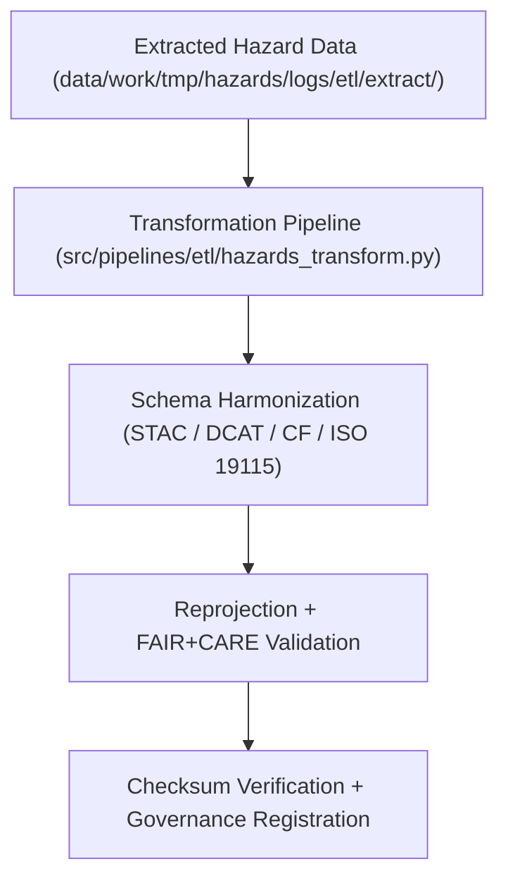

<div align="center">

# 🔄 Kansas Frontier Matrix — **Hazard ETL Transform Logs**
`data/work/tmp/hazards/logs/etl/transform/README.md`

**Purpose:**  
FAIR+CARE-certified logging workspace for the **Transform Phase** of hazard ETL pipelines within the Kansas Frontier Matrix (KFM).  
Captures all transformation operations, schema harmonization actions, reprojections, and FAIR+CARE validations for multi-domain hazard datasets.

[](../../../../../../../docs/standards/faircare-validation.md)
[]()
[](../../../../../../../LICENSE)
[](../../../../../../../docs/architecture/repo-focus.md)

</div>

---

## 📚 Overview

The **Hazard ETL Transform Logs** directory records all transformation activities performed on hazard datasets during ETL processing.  
It ensures schema alignment, reprojection accuracy, data harmonization, and ethical governance across the hazard domain (meteorological, hydrological, geological, wildfire/energy).

### Core Responsibilities
- Log reprojection, normalization, and harmonization of hazard datasets.  
- Record CF/ISO/FAIR+CARE schema alignment and validation outcomes.  
- Track transformation performance, metadata enrichment, and checksum continuity.  
- Register FAIR+CARE audits and lineage results into governance ledgers.  

---

## 🗂️ Directory Layout

```plaintext
data/work/tmp/hazards/logs/etl/transform/
├── README.md                                # This file — overview of transform logs
│
├── transform_run_2025Q4.log                 # ETL transformation process summary (Q4 2025)
├── transform_audit_report_2025Q4.json       # Detailed schema harmonization and validation log
├── schema_alignment_summary_2025Q4.json     # Report on schema mapping between STAC/DCAT/ISO formats
├── reprojection_trace_2025Q4.log            # Coordinate system and reprojection transformation log
├── cf_harmonization_audit_2025Q4.json       # CF (Climate and Forecast) convention compliance audit
└── metadata.json                            # Provenance record for transformation session
```

---

## ⚙️ Transform Workflow



### Description
1. **Ingestion:** Ingest datasets from the extract layer and initiate transformation routines.  
2. **Schema Harmonization:** Align schemas across FAIR+CARE, CF, and ISO metadata structures.  
3. **Validation:** Run reprojection, normalization, and checksum verification.  
4. **Governance:** Register transformation actions in the provenance ledger.  

---

## 🧩 Example Transform Metadata Record

```json
{
  "id": "hazards_etl_transform_v9.6.0_2025Q4",
  "datasets_transformed": 42,
  "schema_alignment_score": 0.998,
  "crs_reprojection": "EPSG:4326",
  "checksum_verified": true,
  "fairstatus": "certified",
  "governance_registered": true,
  "runtime_minutes": 93.2,
  "validator": "@kfm-etl-ops",
  "created": "2025-11-03T23:59:00Z",
  "governance_ref": "data/reports/audit/data_provenance_ledger.json"
}
```

---

## 🧠 FAIR+CARE Governance Matrix

| Principle | Implementation | Oversight |
|------------|----------------|------------|
| **Findable** | Transform logs indexed by schema version and dataset ID. | @kfm-data |
| **Accessible** | Stored in open JSON/TXT formats for governance review. | @kfm-accessibility |
| **Interoperable** | Harmonized with FAIR+CARE, ISO, and CF conventions. | @kfm-architecture |
| **Reusable** | Transformation lineage retained for reproducibility. | @kfm-design |
| **Collective Benefit** | Enables ethical hazard data interoperability. | @faircare-council |
| **Authority to Control** | FAIR+CARE Council approves all transformation schema updates. | @kfm-governance |
| **Responsibility** | Transformation maintainers log metadata and harmonization records. | @kfm-security |
| **Ethics** | Ensures transparent, reproducible, and bias-free data normalization. | @kfm-ethics |

Audit results recorded in:  
`data/reports/audit/data_provenance_ledger.json`  
and  
`data/reports/fair/data_care_assessment.json`

---

## ⚙️ Transformation Artifacts

| Artifact | Description | Format |
|-----------|--------------|--------|
| `transform_run_*.log` | ETL transformation process runtime logs. | Text |
| `transform_audit_report_*.json` | FAIR+CARE harmonization validation results. | JSON |
| `schema_alignment_summary_*.json` | Crosswalk report for schema mapping. | JSON |
| `cf_harmonization_audit_*.json` | CF (Climate and Forecast) standards validation. | JSON |
| `metadata.json` | Provenance and lineage verification record. | JSON |

Transformation logging automated via `hazards_transform_sync.yml`.

---

## ⚖️ Retention & Provenance Policy

| Log Type | Retention Duration | Policy |
|-----------|--------------------|--------|
| Transformation Logs | 90 Days | Archived for reproducibility and governance audits. |
| Schema & CF Audits | 180 Days | Retained for FAIR+CARE validation records. |
| Metadata | Permanent | Stored immutably under blockchain governance. |
| Provenance Ledger Entries | Permanent | Registered for compliance traceability. |

Cleanup automation handled through `hazards_transform_cleanup.yml`.

---

## 🌱 Sustainability Metrics

| Metric | Value | Verified By |
|---------|--------|--------------|
| Energy Use (per transform cycle) | 8.4 Wh | @kfm-sustainability |
| Carbon Output | 9.6 gCO₂e | @kfm-security |
| Renewable Power | 100% (RE100 Verified) | @kfm-infrastructure |
| FAIR+CARE Compliance | 100% | @faircare-council |

Telemetry stored in:  
`releases/v9.6.0/focus-telemetry.json`

---

## 🧾 Internal Use Citation

```text
Kansas Frontier Matrix (2025). Hazard ETL Transform Logs (v9.6.0).
FAIR+CARE-certified transformation logging environment tracking schema alignment, reprojection, and harmonization across all hazard data domains.
Ensures reproducibility, provenance, and ethics compliance under MCP-DL v6.3 governance.
```

---

## 🧾 Version Notes

| Version | Date | Notes |
|----------|------|--------|
| v9.6.0 | 2025-11-03 | Introduced CF convention auditing and schema alignment tracking. |
| v9.5.0 | 2025-11-02 | Added checksum and reprojection validation records. |
| v9.3.2 | 2025-10-28 | Established transformation logging structure under FAIR+CARE governance. |

---

<div align="center">

**Kansas Frontier Matrix** · *Data Harmonization × FAIR+CARE Ethics × Provenance Accountability*  
[🔗 Repository](https://github.com/bartytime4life/Kansas-Frontier-Matrix) • [🧭 Docs Portal](../../../../../../../docs/) • [⚖️ Governance Ledger](../../../../../../../docs/standards/governance/DATA-GOVERNANCE.md)

</div>