<div align="center">

# 🔄 Kansas Frontier Matrix — **Hazard ETL Transform Logs**
`data/work/tmp/hazards/logs/etl/transform/README.md`

**Purpose:**  
FAIR+CARE-certified logging workspace for the **Transform Phase** of hazard ETL pipelines within KFM.  
Captures reprojections, schema harmonization, normalization, and FAIR+CARE validations across meteorological, hydrological, geological, and wildfire/energy datasets.

[](../../../../../../../docs/architecture/repo-focus.md)
[](../../../../../../../docs/standards/faircare-validation.md)
[]()
[](../../../../../../../LICENSE)

</div>

---

## 📘 Overview

The **Hazard ETL Transform Logs** record all transformation activities during ETL processing.  
Ensures schema alignment, reprojection accuracy, harmonization, and ethical governance for multi-domain hazard data.

### Core Responsibilities
- Log reprojection, normalization, and harmonization steps.  
- Record CF/ISO/FAIR+CARE alignment and validation outcomes.  
- Track performance, metadata enrichment, and checksum continuity.  
- Register FAIR+CARE audits and lineage to governance ledgers.  

---

## 🗂️ Directory Layout

```plaintext
data/work/tmp/hazards/logs/etl/transform/
├── README.md
├── transform_run_2025Q4.log
├── transform_audit_report_2025Q4.json
├── schema_alignment_summary_2025Q4.json
├── reprojection_trace_2025Q4.log
├── cf_harmonization_audit_2025Q4.json
└── metadata.json
```

---

## ⚙️ Transform Workflow

```mermaid
flowchart TD
    A["Extracted Hazards (logs/etl/extract/)"] --> B["Transform (src/pipelines/etl/hazards_transform.py)"]
    B --> C["Schema Harmonization (STAC · DCAT · CF · ISO 19115)"]
    C --> D["Reprojection + FAIR + CARE Validation"]
    D --> E["Checksum Verification + Governance Registration"]
```



### Steps
1. **Ingest** — Pull from extract layer and initiate transforms.  
2. **Harmonize** — Align CF/ISO/STAC/DCAT schemas.  
3. **Validate** — Reproject, normalize, and verify checksums.  
4. **Register** — Write lineage to provenance ledger.

---

## 🧩 Example Transform Metadata Record

```json
{
  "id": "hazards_etl_transform_v9.7.0_2025Q4",
  "datasets_transformed": 42,
  "schema_alignment_score": 0.998,
  "crs_reprojection": "EPSG:4326",
  "checksum_verified": true,
  "fairstatus": "certified",
  "governance_registered": true,
  "runtime_minutes": 93.2,
  "validator": "@kfm-etl-ops",
  "created": "2025-11-06T23:59:00Z",
  "governance_ref": "data/reports/audit/data_provenance_ledger.json"
}
```

---

## 🧠 FAIR+CARE Governance Matrix

| Principle | Implementation | Oversight |
|------------|----------------|------------|
| **Findable** | Transform logs indexed by schema version and dataset ID. | @kfm-data |
| **Accessible** | JSON/TXT logs accessible for council review. | @kfm-accessibility |
| **Interoperable** | FAIR+CARE + ISO/CF harmonization. | @kfm-architecture |
| **Reusable** | Transformation lineage retained for reproducibility. | @kfm-design |
| **Collective Benefit** | Enables ethical hazard data interoperability. | @faircare-council |
| **Authority to Control** | Council approves schema updates and harmonization. | @kfm-governance |
| **Responsibility** | ETL team documents all harmonization records. | @kfm-security |
| **Ethics** | Ensures transparent, bias-free data normalization. | @kfm-ethics |

**Audit refs:**  
`data/reports/audit/data_provenance_ledger.json` · `data/reports/fair/data_care_assessment.json`

---

## ⚙️ Transformation Artifacts

| Artifact | Description | Format |
|-----------|--------------|--------|
| `transform_run_*.log` | Process runtime summary | Text |
| `transform_audit_report_*.json` | Harmonization validation results | JSON |
| `schema_alignment_summary_*.json` | STAC/DCAT/ISO/CF mapping | JSON |
| `cf_harmonization_audit_*.json` | CF standards compliance | JSON |
| `metadata.json` | Provenance + lineage verification | JSON |

**Automation:** `hazards_transform_sync.yml`

---

## ⚖️ Retention & Provenance Policy

| Log Type | Retention Duration | Policy |
|-----------|--------------------|--------|
| Transform Logs | 90 Days | Archived for governance audits. |
| Schema & CF Audits | 180 Days | Retained for FAIR+CARE validation. |
| Metadata | Permanent | Immutable under blockchain governance. |
| Ledger Entries | Permanent | Compliance traceability in provenance ledger. |

---

## 🌱 Sustainability Metrics

| Metric | Value | Verified By |
|---------|--------|--------------|
| Energy Use (per transform cycle) | 8.4 Wh | @kfm-sustainability |
| Carbon Output | 9.6 gCO₂e | @kfm-security |
| Renewable Power | 100% (RE100) | @kfm-infrastructure |
| FAIR+CARE Compliance | 100% | @faircare-council |

**Telemetry:** `../../../../../../../releases/v9.7.0/focus-telemetry.json`

---

## 🧾 Citation

```text
Kansas Frontier Matrix (2025). Hazard ETL Transform Logs (v9.7.0).
FAIR+CARE-certified transformation logging environment tracking schema alignment, reprojection, and harmonization across hazard domains—ensuring reproducibility, provenance, and ethics compliance under MCP-DL v6.3.
```

---

<div align="center">

**Kansas Frontier Matrix**  
*Data Harmonization × FAIR+CARE Ethics × Provenance Accountability*  
© 2025 Kansas Frontier Matrix — Master Coder Protocol v6.3 · FAIR+CARE Certified · Diamond⁹ Ω / Crown∞Ω Ultimate Certified  

[Back to ETL Logs](../README.md) · [Governance Charter](../../../../../../../docs/standards/governance/DATA-GOVERNANCE.md)

</div>