<div align="center">

# 🔄 Kansas Frontier Matrix — **Hazard ETL Transform Logs**
`data/work/tmp/hazards/logs/etl/transform/README.md`

**Purpose:**  
FAIR+CARE-certified logging workspace for the **Transform Phase** of hazard ETL pipelines within KFM.  
Captures reprojections, schema harmonization, normalization, and FAIR+CARE validations across meteorological, hydrological, geological, and wildfire/energy datasets.  
Enhanced for telemetry v2, schema crosswalk validation, and blockchain-linked audit traceability.

[](../../../../../../../docs/architecture/repo-focus.md)
[](../../../../../../../docs/standards/faircare-validation.md)
[]()
[](../../../../../../../LICENSE)

</div>

---

## 📘 Overview
The **Hazard ETL Transform Logs** record all transformation and harmonization activities during ETL processing.  
Version 10 introduces telemetry-driven performance tracking and FAIR+CARE governance linkage for explainability and energy audits.

### Core Responsibilities
- Log reprojection, normalization, harmonization, and validation steps.  
- Validate CF/ISO 19115/FAIR+CARE crosswalk alignment.  
- Track metadata enrichment, schema metrics, and checksum continuity.  
- Register FAIR+CARE audits and sustainability data to governance ledgers.  

---

## 🗂️ Directory Layout
```plaintext
data/work/tmp/hazards/logs/etl/transform/
├── README.md
├── transform_run_2025Q4.log
├── transform_audit_report_2025Q4.json
├── schema_alignment_summary_2025Q4.json
├── reprojection_trace_2025Q4.log
├── cf_harmonization_audit_2025Q4.json
├── ai_enhancement_validation_2025Q4.json
└── metadata.json
```

---

## ⚙️ Transform Workflow

```mermaid
flowchart TD
    A["Extracted Hazards (logs/etl/extract/)"] --> B["Transform (src/pipelines/etl/hazards_transform.py)"]
    B --> C["Schema Harmonization (STAC · DCAT · CF · ISO 19115)"]
    C --> D["Reprojection + FAIR + CARE Ethics Validation"]
    D --> E["Telemetry v2 Metrics + Checksum Verification"]
    E --> F["Governance Registration → Blockchain Ledger"]
```


### Steps
1. **Extract Integration** — Read verified extraction outputs.  
2. **Harmonize Schema** — Align datasets to ISO, CF, and KFM FAIR+CARE models.  
3. **Ethical Validation** — Perform accessibility, bias, and inclusion audits.  
4. **Telemetry Capture** — Record energy, performance, and drift metrics.  
5. **Governance Sync** — Log to immutable provenance ledgers.

---

## 🧩 Example Transform Metadata Record
```json
{
  "id": "hazards_etl_transform_v10.0.0_2025Q4",
  "datasets_transformed": 42,
  "schema_alignment_score": 0.998,
  "crs_reprojection": "EPSG:4326",
  "checksum_verified": true,
  "fairstatus": "certified",
  "ai_assist_enabled": true,
  "runtime_minutes": 93.2,
  "telemetry": { "energy_wh": 3.9, "carbon_gco2e": 4.2, "completion_pct": 100 },
  "governance_registered": true,
  "validator": "@kfm-etl-ops",
  "created": "2025-11-09T23:59:00Z",
  "governance_ref": "data/reports/audit/data_provenance_ledger.json"
}
```

---

## 🧠 FAIR+CARE Governance Matrix
| Principle | Implementation | Oversight |
|---|---|---|
| **Findable** | Transform logs indexed by schema version and checksum. | `@kfm-data` |
| **Accessible** | JSON/TXT logs available for FAIR+CARE review. | `@kfm-accessibility` |
| **Interoperable** | Aligns with FAIR+CARE + ISO 19115 + CF 1.10. | `@kfm-architecture` |
| **Reusable** | Harmonization lineage stored for reproducibility. | `@kfm-design` |
| **Collective Benefit** | Enables open, ethical hazard data standardization. | `@faircare-council` |
| **Authority to Control** | Council certifies schema + governance compliance. | `@kfm-governance` |
| **Responsibility** | Operators maintain validation and harmonization audits. | `@kfm-security` |
| **Ethics** | Validates transparency, bias mitigation, and inclusivity. | `@kfm-ethics` |

**Audit refs:**  
`data/reports/audit/data_provenance_ledger.json` · `data/reports/fair/data_care_assessment.json`

---

## ⚙️ Transformation Artifacts
| Artifact | Description | Format |
|---|---|---|
| `transform_run_*.log` | Process runtime and metrics summary | Text |
| `transform_audit_report_*.json` | Harmonization and schema audit record | JSON |
| `schema_alignment_summary_*.json` | FAIR+CARE crosswalk validation | JSON |
| `cf_harmonization_audit_*.json` | CF conventions compliance log | JSON |
| `ai_enhancement_validation_*.json` | AI explainability + bias audit log | JSON |
| `metadata.json` | Provenance + checksum + telemetry v2 record | JSON |

**Automation:** `hazards_transform_sync_v2.yml`

---

## ⚖️ Retention & Provenance Policy
| Log Type | Retention Duration | Policy |
|---|---:|---|
| Transform Logs | 90 Days | Archived after quarterly review. |
| Schema/CF Audits | 365 Days | Retained for FAIR+CARE recertification. |
| AI Explainability Logs | 180 Days | Retained for model bias verification. |
| Metadata & Ledger Entries | Permanent | Immutable governance record. |

---

## 🌱 Sustainability Metrics
| Metric | Value | Verified By |
|---|---:|---|
| Energy Use (per transform cycle) | 3.9 Wh | `@kfm-sustainability` |
| Carbon Output | 4.2 gCO₂e | `@kfm-security` |
| Renewable Power | 100% (RE100 Certified) | `@kfm-infrastructure` |
| FAIR+CARE Compliance | 100% | `@faircare-council` |

**Telemetry:** `../../../../../../../releases/v10.0.0/focus-telemetry.json`

---

## 🧾 Citation
```text
Kansas Frontier Matrix (2025). Hazard ETL Transform Logs (v10.0.0).
Comprehensive FAIR+CARE-certified transformation logging environment with telemetry v2 integration—tracking schema alignment, reprojection, and harmonization for reproducible, ethically governed hazard data pipelines.
```

---

<div align="center">

**Kansas Frontier Matrix**  
*Data Harmonization × FAIR+CARE Ethics × Provenance Accountability*  
© 2025 Kansas Frontier Matrix — Master Coder Protocol v6.3 · FAIR+CARE Certified · Diamond⁹ Ω / Crown∞Ω Ultimate Certified  

[Back to ETL Logs](../README.md) · [Governance Charter](../../../../../../../docs/standards/governance/DATA-GOVERNANCE.md)

</div>