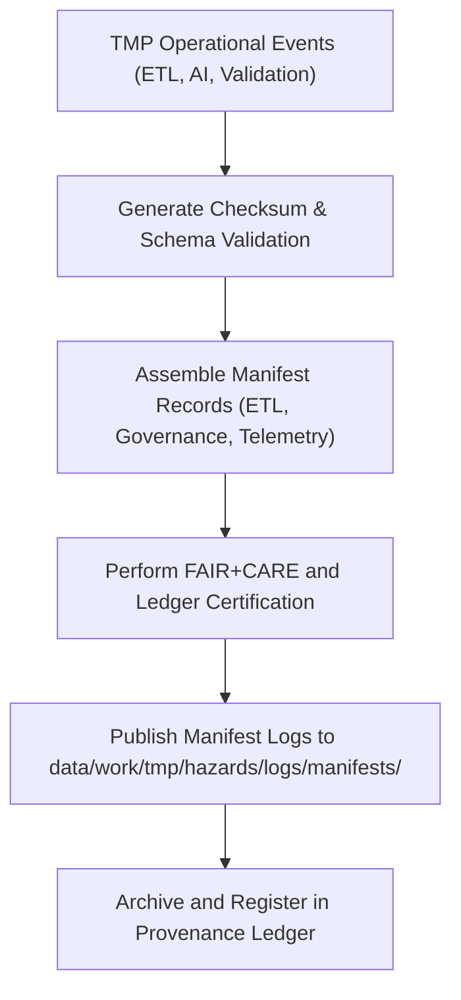

<div align="center">

# 📜 Kansas Frontier Matrix — **Hazard TMP Manifest Logs**
`data/work/tmp/hazards/logs/manifests/README.md`

**Purpose:**  
Central recordkeeping hub for **hazard TMP manifests, validation summaries, and governance lineage registrations** in the Kansas Frontier Matrix (KFM).  
Ensures each TMP workflow (ETL, AI, Validation) maintains a verifiable audit trail with checksum integrity, FAIR+CARE certification, and provenance traceability.

[](../../../../../../docs/standards/faircare-validation.md)
[](../../../../../../LICENSE)
[](../../../../../../docs/architecture/repo-focus.md)

</div>

---

## 📚 Overview

The `data/work/tmp/hazards/logs/manifests/` directory serves as the **governance validation checkpoint** for all TMP hazard operations.  
It captures lifecycle manifests that summarize ETL processes, validation outcomes, and AI audit chains across multiple hazard domains.

### Core Functions
- Consolidate all TMP hazard lifecycle manifests for governance oversight.  
- Validate checksum consistency and schema conformity across manifests.  
- Record FAIR+CARE certification events, telemetry updates, and ledger entries.  
- Provide provenance chain verification for reproducibility and ethical compliance.  

---

## 🗂️ Directory Layout

```plaintext
data/work/tmp/hazards/logs/manifests/
├── README.md                              # This file — overview of hazard TMP manifest logs
│
├── tmp_manifest_log_2025Q4.json           # Combined record of TMP ETL, AI, and validation cycles
├── governance_manifest_log_2025Q4.json    # FAIR+CARE and ledger synchronization audit manifest
├── telemetry_manifest_log_2025Q4.json     # System telemetry summary of TMP operations
├── checksum_manifest_log_2025Q4.json      # SHA-256 registry of TMP artifact integrity
└── metadata.json                          # Provenance metadata and governance linkage
```

---

## ⚙️ Manifest Logging Workflow



### Workflow Description
1. **Event Capture:** Logs from ETL, AI, and validation layers consolidated into manifest summaries.  
2. **Checksum Generation:** Integrity hashes computed and validated.  
3. **FAIR+CARE Audit:** Ethics and accessibility compliance checks executed.  
4. **Ledger Sync:** Governance registration with `ai_hazards_ledger.json`.  
5. **Archival:** Manifest logs preserved for audit and future reproducibility reviews.

---

## 🧩 Example Manifest Log Record

```json
{
  "manifest_log_id": "hazards_tmp_manifest_log_v9.5.0_2025Q4",
  "etl_runs_recorded": 14,
  "ai_audits_registered": 6,
  "validation_reports_linked": 9,
  "checksum_verified": true,
  "governance_registered": true,
  "fairstatus": "certified",
  "records_processed": 421398,
  "telemetry_ref": "releases/v9.5.0/focus-telemetry.json",
  "governance_ref": "reports/audit/ai_hazards_ledger.json",
  "created": "2025-11-02T19:45:00Z",
  "validator": "@kfm-governance"
}
```

---

## 🧠 FAIR+CARE Governance Alignment

| Principle | Implementation |
|------------|----------------|
| **Findable** | Manifest logs indexed by ETL cycle, dataset, and checksum. |
| **Accessible** | JSON-based manifests accessible to governance and validation systems. |
| **Interoperable** | Conforms to DCAT 3.0, STAC 1.0, and ISO 19115 schema standards. |
| **Reusable** | Manifests retain provenance, checksum, and audit lineage metadata. |
| **Collective Benefit** | Enables reproducible hazard science and ethical AI oversight. |
| **Authority to Control** | FAIR+CARE Council reviews manifest certification events. |
| **Responsibility** | ETL and governance maintainers ensure checksum and ethics alignment. |
| **Ethics** | Prevents omission of lineage or manipulation of provenance records. |

Governance summaries stored in:  
`reports/audit/ai_hazards_ledger.json` • `reports/fair/hazards_manifests_logs_summary.json`

---

## ⚙️ Manifest QA & Audit Artifacts

| File | Description | Format |
|------|--------------|--------|
| `tmp_manifest_log_*.json` | Master manifest of all TMP operational activities. | JSON |
| `governance_manifest_log_*.json` | Governance certification and ethics record. | JSON |
| `telemetry_manifest_log_*.json` | TMP telemetry synchronization metadata. | JSON |
| `checksum_manifest_log_*.json` | Cryptographic hash registry for TMP assets. | JSON |
| `metadata.json` | Provenance and governance linkage record. | JSON |

All manifest logs synchronized automatically by `hazards_manifest_log_sync.yml`.

---

## 🧾 Retention Policy

| Manifest Type | Retention Duration | Policy |
|----------------|--------------------|--------|
| TMP Manifest Logs | 365 days | Retained for governance and QA tracking. |
| Governance Manifests | Permanent | Archived for ethics and compliance review. |
| Telemetry Logs | 180 days | Maintained for system reproducibility. |
| Metadata | Permanent | Stored indefinitely for lineage verification. |

Retention governed by `hazards_manifest_log_cleanup.yml`.

---

## 🧾 Internal Use Citation

```text
Kansas Frontier Matrix (2025). Hazard TMP Manifest Logs (v9.5.0).
FAIR+CARE-certified manifest registry documenting TMP ETL, AI, and validation activities.
Maintained for governance synchronization, checksum validation, and reproducible audit assurance.
```

---

## 🧾 Version Notes

| Version | Date | Notes |
|----------|------|--------|
| v9.5.0 | 2025-11-02 | Added telemetry v2 integration, checksum manifest logging, and governance synchronization. |
| v9.3.2 | 2025-10-28 | Introduced consolidated governance manifest and checksum verification module. |
| v9.3.0 | 2025-10-26 | Established TMP manifest log workspace for hazard provenance tracking. |

---

<div align="center">

**Kansas Frontier Matrix** · *Governance Integrity × FAIR+CARE Ethics × Provenance Transparency*  
[🔗 Repository](https://github.com/bartytime4life/Kansas-Frontier-Matrix) • [🧭 Docs Portal](../../../../../../docs/) • [⚖️ Governance Ledger](../../../../../../docs/standards/governance/)

</div>