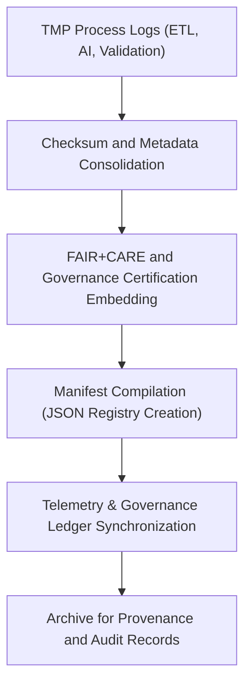

<div align="center">

# 🧾 Kansas Frontier Matrix — **Hazard TMP Manifests**
`data/work/tmp/hazards/logs/manifests/README.md`

**Purpose:**  
Centralized manifest repository tracking **hazard ETL cycles, AI model runs, validation checkpoints, and governance synchronization events**.  
Ensures complete traceability and checksum-verified reporting for every TMP workflow under FAIR+CARE governance and MCP-DL v6.3 compliance.

[](../../../../../../docs/standards/faircare-validation.md)
[](../../../../../../LICENSE)
[](../../../../../../docs/architecture/repo-focus.md)

</div>

---

## 📚 Overview

The `data/work/tmp/hazards/logs/manifests/` directory holds **comprehensive operational manifests** that summarize all ongoing and completed ETL and AI processes for the Hazard TMP environment.  
Each manifest entry documents workflow metadata, runtime telemetry, validation outcomes, and checksum integrity details to ensure **reproducibility, accountability, and audit alignment**.

### Core Functions
- Track all TMP hazard pipeline executions (ETL, AI, Validation).  
- Log runtime metrics, schema versioning, and checksum linkage.  
- Integrate FAIR+CARE certification and governance registration data.  
- Provide consolidated manifests for provenance and dashboard integration.  

---

## 🗂️ Directory Layout

```plaintext
data/work/tmp/hazards/logs/manifests/
├── README.md                               # This file — overview of hazard TMP manifests
│
├── tmp_manifest_cycle_2025Q4.json          # Manifest of TMP hazard pipelines executed during Q4 2025
├── ai_audit_manifest_2025Q4.json           # AI model audit manifest for Focus Mode hazard reasoning
├── governance_manifest_2025Q4.json         # FAIR+CARE governance certification and ledger linkage manifest
├── checksum_registry_2025Q4.json           # Hash verification summary for TMP artifacts
└── metadata.json                           # Provenance and governance metadata for manifest lifecycle
```

---

## ⚙️ Manifest Lifecycle Workflow



### Workflow Description
1. **Collection:** Aggregate all operational logs across ETL, AI, and validation.  
2. **Checksum Validation:** Confirm file integrity and provenance consistency.  
3. **Governance Audit:** Include FAIR+CARE and ledger verification events.  
4. **Compilation:** Generate manifest JSON files linking all TMP outputs.  
5. **Ledger Sync:** Register manifest references in `ai_hazards_ledger.json` and telemetry systems.  

---

## 🧩 Example Manifest Record

```json
{
  "manifest_id": "hazards_tmp_manifest_v9.5.0_2025Q4",
  "etl_runs": 12,
  "ai_models_evaluated": 4,
  "validation_reports_linked": 5,
  "checksum_integrity_verified": true,
  "fairstatus": "certified",
  "governance_registered": true,
  "records_processed": 285000,
  "telemetry_ref": "releases/v9.5.0/focus-telemetry.json",
  "governance_ref": "reports/audit/ai_hazards_ledger.json",
  "timestamp": "2025-11-02T19:00:00Z",
  "validator": "@kfm-governance"
}
```

---

## 🧠 FAIR+CARE Governance Alignment

| Principle | Implementation |
|------------|----------------|
| **Findable** | Manifests indexed by cycle, pipeline ID, and checksum reference. |
| **Accessible** | Stored as JSON and accessible through internal FAIR+CARE APIs. |
| **Interoperable** | Aligns with STAC/DCAT metadata and ISO 19115 provenance structures. |
| **Reusable** | Includes detailed lineage, validation, and checksum metadata. |
| **Collective Benefit** | Promotes transparent tracking of TMP lifecycle events. |
| **Authority to Control** | FAIR+CARE Council authorizes manifest certification. |
| **Responsibility** | Validators maintain manifest accuracy and integrity. |
| **Ethics** | Provides open documentation of data processes for ethical accountability. |

FAIR+CARE audit results recorded in:  
`reports/fair/hazards_manifests_summary.json` • `reports/audit/ai_hazards_ledger.json`

---

## ⚙️ Manifest QA & Audit Artifacts

| File | Description | Format |
|------|--------------|--------|
| `tmp_manifest_cycle_*.json` | Comprehensive TMP process manifest (ETL, AI, Validation). | JSON |
| `ai_audit_manifest_*.json` | AI reasoning and bias audit summary manifest. | JSON |
| `governance_manifest_*.json` | FAIR+CARE governance and ledger registration record. | JSON |
| `checksum_registry_*.json` | Integrity verification report for TMP outputs. | JSON |
| `metadata.json` | Provenance and governance linkage metadata. | JSON |

All manifest creation tasks managed by `hazards_manifest_sync.yml`.

---

## 🧾 Retention Policy

| Manifest Type | Retention Duration | Policy |
|----------------|--------------------|--------|
| TMP Manifests | 365 days | Archived for provenance and reproducibility. |
| AI Audit Manifests | 180 days | Retained for ethics revalidation. |
| Governance Manifests | Permanent | Stored indefinitely under ledger certification. |
| Metadata Records | Permanent | Preserved for lineage and audit continuity. |

Retention automation governed by `hazards_manifest_cleanup.yml`.

---

## 🧾 Internal Use Citation

```text
Kansas Frontier Matrix (2025). Hazard TMP Manifests (v9.5.0).
Consolidated operational manifests summarizing ETL, AI, and validation cycles for hazard data pipelines.
FAIR+CARE-certified and blockchain-registered under MCP-DL v6.3 governance protocols for transparency and reproducibility.
```

---

## 🧾 Version Notes

| Version | Date | Notes |
|----------|------|--------|
| v9.5.0 | 2025-11-02 | Added telemetry v2 integration, governance manifest automation, and checksum registry enhancements. |
| v9.3.2 | 2025-10-28 | Integrated FAIR+CARE dashboard linkage and ledger synchronization. |
| v9.3.0 | 2025-10-26 | Established manifest directory for TMP hazard lifecycle tracking. |

---

<div align="center">

**Kansas Frontier Matrix** · *Provenance Tracking × FAIR+CARE Ethics × Governance Integrity*  
[🔗 Repository](https://github.com/bartytime4life/Kansas-Frontier-Matrix) • [🧭 Docs Portal](../../../../../../docs/) • [⚖️ Governance Ledger](../../../../../../docs/standards/governance/)

</div>
