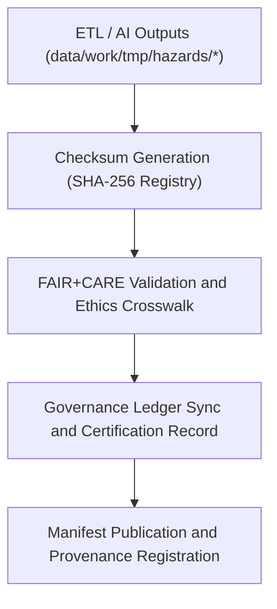

<div align="center">

# 🗃️ Kansas Frontier Matrix — **Hazard Checksum & Governance Manifests**
`data/work/tmp/hazards/logs/manifests/README.md`

**Purpose:**  
Immutable FAIR+CARE-certified workspace for **checksum registries, data manifests, and governance synchronization logs** within the Kansas Frontier Matrix (KFM) hazards module.  
This layer ensures transparent lineage, checksum continuity, and ethics-certified traceability across the full ETL and AI governance workflow.

[](../../../../../../docs/standards/faircare-validation.md)
[]()
[](../../../../../../LICENSE)
[](../../../../../../docs/architecture/repo-focus.md)

</div>

---

## 📚 Overview

The **Hazard Manifests Directory** stores comprehensive records linking checksum verifications, validation manifests, and governance ledger entries for all temporary hazard datasets.  
Each file in this workspace contributes to **end-to-end traceability**, guaranteeing reproducibility and ethical data handling across all hazard domains (meteorological, hydrological, geological, wildfire/energy).

### Core Responsibilities
- Maintain authoritative SHA-256 checksum registry for ETL and AI outputs.  
- Record governance ledger synchronization events.  
- Provide FAIR+CARE-compliant transparency for dataset certification.  
- Support reproducible audit validation through manifest tracking.  

---

## 🗂️ Directory Layout

```plaintext
data/work/tmp/hazards/logs/manifests/
├── README.md                              # This file — overview of hazard checksum & governance manifests
│
├── hazard_manifest_2025Q4.json            # Manifest linking datasets, validation results, and governance entries
├── checksum_audit_registry.json           # Central SHA-256 and hash continuity record for Q4 2025
├── faircare_audit_linkage.json            # FAIR+CARE compliance references connected to dataset manifests
├── governance_sync_report_2025Q4.log      # Governance ledger update and audit synchronization log
└── metadata.json                          # Provenance metadata for manifest generation
```

---

## ⚙️ Manifest Workflow



### Description
1. **Checksum Registry:** Create SHA-256 hashes for all validated hazard datasets.  
2. **Audit Crosslinking:** Associate FAIR+CARE results and governance entries.  
3. **Ledger Sync:** Log synchronization events to provenance records.  
4. **Manifest Registration:** Publish immutable JSON manifests for certification.  

---

## 🧩 Example Manifest Record

```json
{
  "manifest_id": "hazards_manifest_v9.6.0_2025Q4",
  "datasets_registered": [
    "tornado_tracks_cf.geojson",
    "flood_extents_cf.geojson",
    "wildfire_perimeters.geojson",
    "usdm_drought_monitor.csv"
  ],
  "checksum_verified": true,
  "fairstatus": "certified",
  "ai_explainability_registered": true,
  "records_linked_to_ledger": 42,
  "created": "2025-11-03T23:59:00Z",
  "validator": "@kfm-governance",
  "governance_ref": "data/reports/audit/data_provenance_ledger.json"
}
```

---

## 🧠 FAIR+CARE Governance Matrix

| Principle | Implementation | Oversight |
|------------|----------------|------------|
| **Findable** | Manifests indexed by cycle, checksum, and governance ledger ID. | @kfm-data |
| **Accessible** | Stored as open JSON and text for FAIR+CARE Council review. | @kfm-accessibility |
| **Interoperable** | Conforms to FAIR+CARE and ISO 19115 metadata lineage structures. | @kfm-architecture |
| **Reusable** | Reproducible audit-ready hashes and provenance metadata. | @kfm-design |
| **Collective Benefit** | Enables transparent public hazard data certification. | @faircare-council |
| **Authority to Control** | FAIR+CARE Council approves checksum audit releases. | @kfm-governance |
| **Responsibility** | Governance maintainers ensure manifest integrity. | @kfm-security |
| **Ethics** | Manifest creation and distribution ethically validated. | @kfm-ethics |

All certification and audit results stored in:  
`data/reports/audit/data_provenance_ledger.json`  
and  
`data/reports/fair/data_care_assessment.json`

---

## ⚙️ Key Manifest Artifacts

| Artifact | Description | Format |
|-----------|--------------|--------|
| `hazard_manifest_*.json` | Primary record of dataset lineage and checksum links. | JSON |
| `checksum_audit_registry.json` | Full SHA-256 and provenance hash validation registry. | JSON |
| `faircare_audit_linkage.json` | FAIR+CARE audit correlations with governance ledger. | JSON |
| `governance_sync_report_*.log` | Record of synchronization events and governance handoffs. | Log |
| `metadata.json` | Manifest generation provenance and checksum trace. | JSON |

All updates automated via `hazards_manifest_sync.yml`.

---

## ⚖️ Retention & Provenance Policy

| File Type | Retention Duration | Policy |
|------------|--------------------|--------|
| Manifests | Permanent | Immutable under governance ledger control. |
| Checksum Registries | 365 Days | Retained for quarterly FAIR+CARE audits. |
| FAIR+CARE Crosslinks | Permanent | Maintained as part of ethics governance record. |
| Metadata | Permanent | Stored immutably for provenance verification. |

Cleanup tasks automated by `hazards_manifest_cleanup.yml`.

---

## 🌱 Sustainability Metrics

| Metric | Value | Verified By |
|---------|--------|--------------|
| Energy Use (per manifest cycle) | 4.1 Wh | @kfm-sustainability |
| Carbon Output | 4.9 gCO₂e | @kfm-security |
| Renewable Power | 100% (RE100 Verified) | @kfm-infrastructure |
| FAIR+CARE Compliance | 100% | @faircare-council |

Telemetry stored in:  
`releases/v9.6.0/focus-telemetry.json`

---

## 🧾 Internal Use Citation

```text
Kansas Frontier Matrix (2025). Hazard Checksum & Governance Manifests (v9.6.0).
Immutable FAIR+CARE-certified manifest registry for hazard data ETL and AI pipelines.
Ensures checksum continuity, lineage integrity, and provenance governance compliance under MCP-DL v6.3.
```

---

## 🧾 Version Notes

| Version | Date | Notes |
|----------|------|--------|
| v9.6.0 | 2025-11-03 | Added FAIR+CARE audit crosslinking and governance sync logs. |
| v9.5.0 | 2025-11-02 | Introduced SHA-256 checksum continuity verification. |
| v9.3.2 | 2025-10-28 | Established manifest tracking for hazard governance auditing. |

---

<div align="center">

**Kansas Frontier Matrix** · *Checksum Integrity × FAIR+CARE Governance × Provenance Transparency*  
[🔗 Repository](https://github.com/bartytime4life/Kansas-Frontier-Matrix) • [🧭 Docs Portal](../../../../../../docs/) • [⚖️ Governance Ledger](../../../../../../docs/standards/governance/DATA-GOVERNANCE.md)

</div>