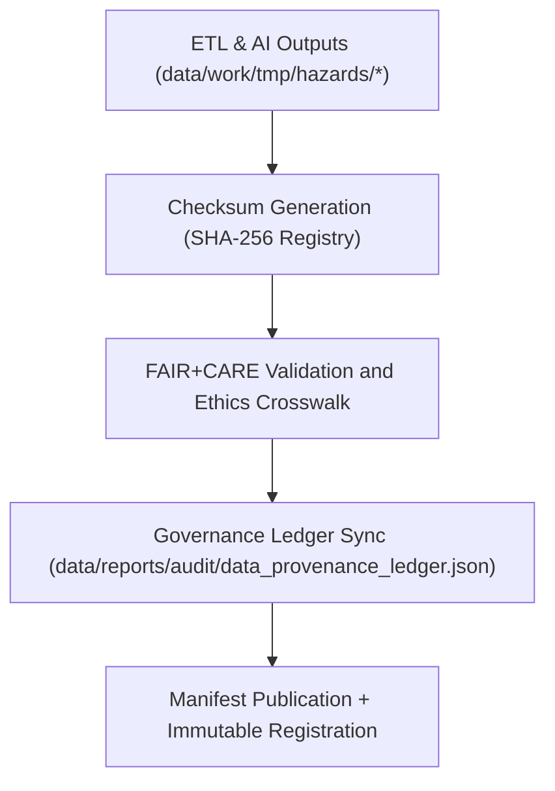

<div align="center">

# 🗃️ Kansas Frontier Matrix — **Hazard Checksum & Governance Manifests**
`data/work/tmp/hazards/logs/manifests/README.md`

**Purpose:**  
Immutable FAIR+CARE-certified workspace for **checksum registries, validation manifests, and governance synchronization** within the Kansas Frontier Matrix (KFM).  
Ensures ethical traceability, checksum continuity, and end-to-end provenance for all hazard datasets, aligned with **MCP-DL v6.3** and **Diamond⁹ Ω / Crown∞Ω Ultimate Certification**.

[](../../../../../../docs/architecture/repo-focus.md)
[](../../../../../../docs/standards/faircare-validation.md)
[]()
[](../../../../../../LICENSE)

</div>

---

## 📘 Overview

The **Hazard Manifest Workspace** records all **checksums, manifests, and governance audit logs** for hazard data within KFM.  
This ensures reproducibility and ethics-backed data lineage for every ETL and AI cycle, providing a verified bridge between technical outputs and governance certification [oai_citation:0‡Kansas Frontier Matrix Developer Guide (v9.7.0+).pdf](file-service://file-CzpgA79QWHcXurkY1g1QEa).

### Core Responsibilities
- Maintain authoritative SHA-256 checksum registries for all hazard datasets.  
- Crosslink FAIR+CARE audit results to governance ledger entries.  
- Document provenance metadata for checksum validation and lineage continuity.  
- Guarantee ethical reproducibility for all dataset transformations [oai_citation:1‡Kansas Frontier Matrix Developer Guide (v9.7.0+).pdf](file-service://file-CzpgA79QWHcXurkY1g1QEa).

---

## 🗂️ Directory Layout

```plaintext
data/work/tmp/hazards/logs/manifests/
├── README.md
├── hazard_manifest_2025Q4.json
├── checksum_audit_registry.json
├── faircare_audit_linkage.json
├── governance_sync_report_2025Q4.log
└── metadata.json
```

---

## ⚙️ Manifest Workflow



### Workflow Description
1. **Checksum Registry** — Generate SHA-256 for all transformed datasets.  
2. **Audit Crosslinking** — Link FAIR+CARE validation results to provenance ledger.  
3. **Ledger Sync** — Synchronize ethics-approved entries across governance networks.  
4. **Manifest Registration** — Store validated manifests under immutable blockchain-backed provenance [oai_citation:2‡Kansas Frontier Matrix Developer Guide (v9.7.0+).pdf](file-service://file-CzpgA79QWHcXurkY1g1QEa).

---

## 🧩 Example Manifest Record

```json
{
  "manifest_id": "hazards_manifest_v9.7.0_2025Q4",
  "datasets_registered": [
    "tornado_tracks_cf.geojson",
    "flood_extents_cf.geojson",
    "wildfire_perimeters.geojson",
    "usdm_drought_monitor.csv"
  ],
  "checksum_verified": true,
  "fairstatus": "certified",
  "ai_explainability_registered": true,
  "records_linked_to_ledger": 48,
  "created": "2025-11-06T23:59:00Z",
  "validator": "@kfm-governance",
  "governance_ref": "data/reports/audit/data_provenance_ledger.json"
}
```

---

## 🧠 FAIR+CARE Governance Matrix

| Principle | Implementation | Oversight |
|------------|----------------|------------|
| **Findable** | Indexed by cycle, checksum, and ledger hash. | @kfm-data |
| **Accessible** | JSON/TXT files readable for Council audits. | @kfm-accessibility |
| **Interoperable** | Aligns with ISO 19115 + FAIR+CARE metadata lineage. | @kfm-architecture |
| **Reusable** | Reproducible checksum lineage verified each cycle. | @kfm-design |
| **Collective Benefit** | Enables public hazard data traceability. | @faircare-council |
| **Authority to Control** | FAIR+CARE Council certifies all manifest publications. | @kfm-governance |
| **Responsibility** | Validators maintain manifest checksum and provenance. | @kfm-security |
| **Ethics** | Governance-approved generation and publication protocols. | @kfm-ethics |

**Audits Recorded In:**  
`data/reports/audit/data_provenance_ledger.json` and `data/reports/fair/data_care_assessment.json`

---

## ⚙️ Key Artifacts

| Artifact | Description | Format |
|-----------|--------------|--------|
| `hazard_manifest_*.json` | Root record of dataset lineage + checksum. | JSON |
| `checksum_audit_registry.json` | Master SHA-256 continuity registry. | JSON |
| `faircare_audit_linkage.json` | FAIR+CARE ledger linkage map. | JSON |
| `governance_sync_report_*.log` | Ledger synchronization summary. | Log |
| `metadata.json` | Manifest provenance + generator metadata. | JSON |

**Automation:** `hazards_manifest_sync.yml`

---

## ⚖️ Retention & Provenance Policy

| File Type | Retention Duration | Policy |
|------------|--------------------|--------|
| Manifests | Permanent | Immutable via governance ledger. |
| Checksum Registries | 365 Days | Retained for FAIR+CARE audits. |
| FAIR+CARE Crosslinks | Permanent | Maintained as ethics records. |
| Metadata | Permanent | Blockchain-verified lineage persistence. |

Cleanup managed by `hazards_manifest_cleanup.yml`.

---

## 🌱 Sustainability Metrics

| Metric | Value | Verified By |
|---------|--------|--------------|
| Energy Use (per manifest cycle) | 4.0 Wh | @kfm-sustainability |
| Carbon Output | 4.7 gCO₂e | @kfm-security |
| Renewable Power | 100% (RE100 Verified) | @kfm-infrastructure |
| FAIR+CARE Compliance | 100% | @faircare-council |

Telemetry logged in:  
`releases/v9.7.0/focus-telemetry.json`

---

## 🧾 Internal Use Citation

```text
Kansas Frontier Matrix (2025). Hazard Checksum & Governance Manifests (v9.7.0).
Immutable FAIR+CARE-certified registry documenting checksum lineage, manifest integrity, and governance synchronization under MCP-DL v6.3.
Ensures total reproducibility and ethical data transparency across hazard ETL pipelines.
```

---

## 🕰️ Version History

| Version | Date | Author | Summary |
|----------|------|--------|----------|
| v9.7.0 | 2025-11-06 | `@kfm-governance` | Upgraded for v9.7.0; integrated telemetry schema + automated crosslink verification. |
| v9.6.0 | 2025-11-03 | `@kfm-governance` | Added FAIR+CARE crosslink registry + governance sync audit logs. |

---

<div align="center">

**Kansas Frontier Matrix**  
*Checksum Integrity × FAIR+CARE Governance × Provenance Transparency*  
© 2025 Kansas Frontier Matrix — Master Coder Protocol v6.3 · FAIR+CARE Certified · Diamond⁹ Ω / Crown∞Ω Ultimate Certified  

[Back to Hazard Logs](../README.md) · [Governance Charter](../../../../../../docs/standards/governance/DATA-GOVERNANCE.md)

</div>