<div align="center">

# 📜 Kansas Frontier Matrix — **Hazards Manifest Logs**
`data/work/tmp/hazards/logs/manifests/README.md`

**Purpose:** Central manifest registry documenting all hazard-related datasets, versions, and digital artifacts within the ETL and AI pipeline.  
Provides traceable linkage between data sources, transformations, and their corresponding STAC-indexed outputs.

[](../../../../../docs/architecture/repo-focus.md)
[](../../../../../LICENSE)
[](../../../../../data/work/tmp/hazards/)
[](../../../../../reports/checksums/)
[](../../../../../docs/standards/governance/)
</div>

---

## 📚 Overview

The **Hazards Manifest Logs** directory serves as the authoritative index of all processed and validated hazard data assets.  
Each manifest captures metadata for data lineage, file integrity, schema version, and governance approval status — enabling complete transparency and reproducibility under the **Master Coder Protocol (MCP-DL v6.3)**.

Functions:
- Tracks dataset lineage through ETL → Validation → AI → Archive.
- Verifies file integrity via SHA-256 and STAC metadata alignment.
- Binds dataset versions to AI and FAIR+CARE audit records.
- Links dataset artifacts with their Neo4j Knowledge Graph nodes.
- Ensures public accountability and reproducibility of all hazard data layers.

---

## 🗂 Directory Layout

```plaintext
data/work/tmp/hazards/logs/manifests/
├── README.md
├── current/
│   ├── hazards_manifest_v9.3.2.json
│   ├── manifest_checksums.sha256
│   └── provenance_chain.json
├── archive/
│   ├── hazards_manifest_v9.3.1.json
│   ├── hazards_manifest_v9.3.0.json
│   └── archived_checksums.sha256
├── diffs/
│   ├── delta_v9.3.1_to_v9.3.2.json
│   └── lineage_drift_analysis.md
├── validation/
│   ├── stac_manifest_validation.json
│   └── schema_manifest_check.json
└── reports/
    ├── hazards_manifest_audit.json
    └── manifest_summary_table.csv
```

> **Note:** Each manifest file is automatically generated and versioned during ETL runs.  
> Old manifests are retained under `archive/` and referenced in `data/stac/hazards_catalog.json`.

---

## 🧩 Workflow Integration

```mermaid
flowchart TD
A[ETL Process Complete] --> B[STAC Catalog Generation]
B --> C[Checksum Creation · sha256sum]
C --> D[Manifest Assembly · JSON Schema v14]
D --> E[Governance Sign-Off · FAIR+CARE Validation]
E --> F[Manifest Logs Published Here]
F --> G[Focus Mode / Neo4j Link Update]
G --> H[STAC & Ledger Registration]
```



Each new ETL batch triggers manifest generation via `tools/generate_manifest.py`, which:
1. Collects dataset metadata and file paths.  
2. Generates a `manifest_checksums.sha256` file for all processed artifacts.  
3. Appends dataset-level metadata to `releases/v9.3.2/manifest.zip`.  
4. Updates the **Governance Ledger** and FAIR audit records.

---

## 🧠 Manifest Schema Overview

The manifest schema defines essential fields for hazard datasets:
| Field | Description | Example |
|--------|--------------|----------|
| `id` | Unique dataset ID | `"hazards_flood_2025-10"` |
| `title` | Descriptive dataset title | `"Kansas Flood Hazard Zones (2025 Update)"` |
| `type` | Data type (vector/raster/tabular) | `"vector"` |
| `path` | Relative file path | `"data/work/tmp/hazards/processed/flood_zones.geojson"` |
| `sha256` | File integrity checksum | `"f5d2b89a4c9b..."` |
| `stac_ref` | Linked STAC Item URL | `"data/stac/items/hazards_flood_2025.json"` |
| `temporal` | Time coverage | `"2025-01-01/2025-12-31"` |
| `spatial` | Bounding box coordinates | `[-102.05, 36.99, -94.60, 40.00]` |
| `governance` | Sign-off and validation record | `"reports/audit/hazards_manifest_audit.json"` |

---

## 🔍 Focus Mode Integration

**Focus Mode** references these manifests to dynamically verify data lineage before rendering:
- Loads **checksum records** to confirm asset integrity at runtime.  
- Displays **version and provenance metadata** in the user interface.  
- Enables time-based manifest filtering (show only datasets valid for selected timeline year).  
- Cross-links AI summaries and hazard models to their originating datasets for explainability.

---

## 🧩 FAIR+CARE Compliance

FAIR:
- **Findable:** Indexed through STAC and FAIR metadata records.  
- **Accessible:** Available via repository release and API export.  
- **Interoperable:** Compliant with ISO 19115 and DCAT dataset descriptors.  
- **Reusable:** Fully documented provenance and lineage for reproducibility.  

CARE:
- **Collective Benefit:** Promotes transparent access to hazard data assets.  
- **Authority to Control:** Communities retain oversight on sensitive data.  
- **Responsibility:** Provenance logs prevent misuse or misrepresentation.  
- **Ethics:** Manifest entries undergo review by FAIR+CARE governance board.

---

## 🧾 Version History

| Version | Date       | Author             | Summary                                     |
|----------|------------|--------------------|---------------------------------------------|
| v9.3.2   | 2025-10-28 | @kfm-data-lab      | Initial manifest directory implementation.  |
| v9.3.1   | 2025-10-27 | @bartytime4life    | Added delta tracking and checksum diff logs. |
| v9.3.0   | 2025-10-26 | @kfm-etl-ops       | Integrated STAC and governance linkage.     |

---

<div align="center">

**Kansas Frontier Matrix** · *Data Lineage × Integrity × Transparency*  
[🔗 Project Repository](https://github.com/bartytime4life/Kansas-Frontier-Matrix) • [🧭 Docs Portal](../../../../../docs/)

</div>