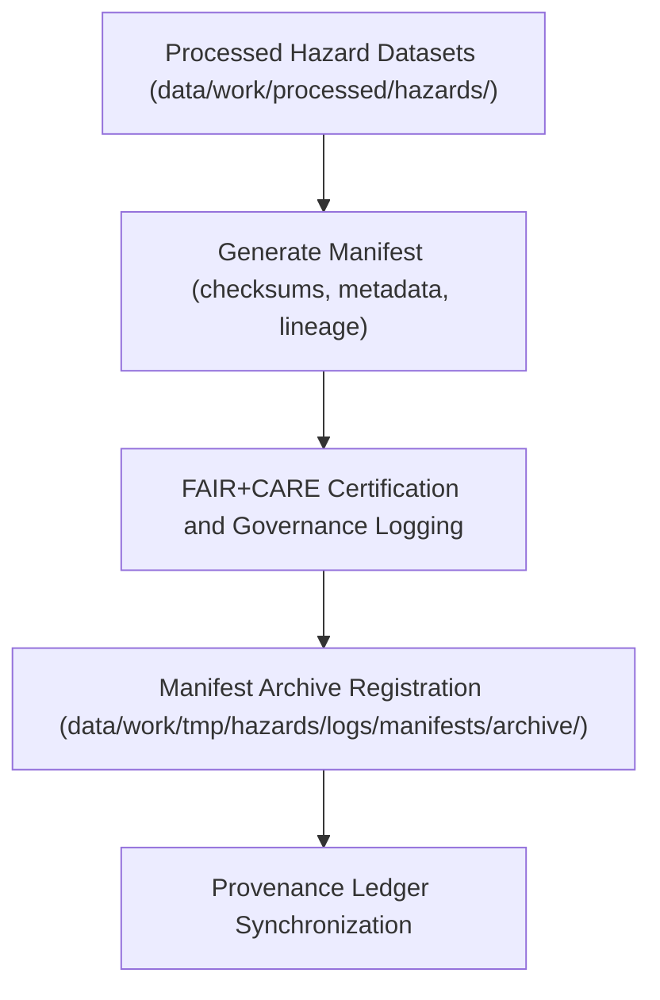

<div align="center">

# 📦 Kansas Frontier Matrix — **Hazard Manifest Archives**
`data/work/tmp/hazards/logs/manifests/archive/README.md`

**Purpose:** Repository for archived dataset manifests, checksums, and governance registration records generated by hazard data pipelines within the Kansas Frontier Matrix (KFM).  
These manifests capture dataset composition, file lineage, and validation status for long-term FAIR+CARE-certified traceability and reproducibility.

[](../../../../../../docs/standards/faircare-validation.md)
[](../../../../../../LICENSE)
[](../../../../../../docs/architecture/repo-focus.md)

</div>

---

## 📚 Overview

The `data/work/tmp/hazards/logs/manifests/archive/` directory contains **archived manifest files** documenting the structure, lineage, and validation outcomes for hazard datasets processed through the KFM ETL system.  
Each manifest links dataset versions to checksums, schema contracts, and governance audits under FAIR+CARE data ethics protocols.

### Core Functions:
- Preserve historical manifests summarizing hazard dataset composition.  
- Record dataset-level metadata, checksums, and FAIR+CARE audit linkage.  
- Ensure transparency and reproducibility across data publication cycles.  
- Provide long-term archival records for governance and provenance audits.  

All manifests in this directory are immutable and cryptographically signed for provenance continuity.

---

## 🗂️ Directory Layout

```plaintext
data/work/tmp/hazards/logs/manifests/archive/
├── README.md                                   # This file — overview of hazard manifest archives
│
├── hazard_manifest_archive_2024Q4.json         # Archived dataset manifest for hazard release Q4 2024
├── checksum_registry_2024Q4.csv                # Dataset-level checksum list for archived assets
├── governance_registration_log_2024Q4.log      # Record of governance and ledger synchronization
├── faircare_manifest_audit_2024Q4.json         # FAIR+CARE certification audit for archived manifest
└── metadata.json                               # Provenance metadata and checksum reference for archive
```

---

## ⚙️ Manifest Archival Workflow



### Workflow Description:
1. **Manifest Generation:** Collect metadata, file paths, schema links, and checksums for hazard datasets.  
2. **FAIR+CARE Validation:** Verify metadata completeness, accessibility, and ethics compliance.  
3. **Archival:** Store validated manifest files and governance logs in archive directory.  
4. **Governance Sync:** Register archival events in provenance ledger for certification tracking.  
5. **Publication:** Manifests contribute to official releases under FAIR+CARE certification.

---

## 🧩 Example Metadata Record

```json
{
  "id": "hazard_manifest_archive_v9.3.2_2024Q4",
  "dataset_group": "hazards",
  "manifest_file": "hazard_manifest_archive_2024Q4.json",
  "files_included": 14,
  "checksums_verified": true,
  "fairstatus": "certified",
  "audited_by": "@kfm-governance",
  "archival_date": "2025-10-28T17:12:00Z",
  "checksum": "sha256:7c5fba9c9d82c416d93e37a9e56cb75f4b9b6ec9...",
  "governance_ref": "data/reports/audit/data_provenance_ledger.json"
}
```

---

## 🧠 FAIR+CARE Governance Alignment

| Principle | Implementation |
|------------|----------------|
| **Findable** | Manifest archives indexed by dataset ID, ETL cycle, and version. |
| **Accessible** | Open JSON, CSV, and log formats accessible for governance and audit review. |
| **Interoperable** | Metadata harmonized with FAIR+CARE and DCAT manifest standards. |
| **Reusable** | Provides versioned records for reproducibility and lineage validation. |
| **Collective Benefit** | Supports open, ethical data stewardship for hazard transparency. |
| **Authority to Control** | FAIR+CARE Council validates archival authenticity and governance compliance. |
| **Responsibility** | ETL maintainers document and register all manifest updates. |
| **Ethics** | Guarantees transparent, ethical handling of all hazard datasets. |

Certification and lineage recorded in:  
`data/reports/audit/data_provenance_ledger.json` and  
`data/reports/fair/data_care_assessment.json`.

---

## ⚙️ Manifest Artifacts

| File | Description | Format |
|------|--------------|--------|
| `hazard_manifest_archive_*.json` | Full manifest of dataset assets and schema contracts. | JSON |
| `checksum_registry_*.csv` | Comprehensive list of checksums for archived hazard data files. | CSV |
| `governance_registration_log_*.log` | Record of manifest synchronization with governance ledger. | Text |
| `faircare_manifest_audit_*.json` | FAIR+CARE certification results for the archived manifest. | JSON |
| `metadata.json` | Tracks governance lineage and checksum registration. | JSON |

All archival processes automated by `manifest_archive_sync.yml`.

---

## ⚖️ Governance & Provenance Integration

| Record | Description |
|---------|-------------|
| `metadata.json` | Records manifest provenance, checksum validation, and FAIR+CARE linkage. |
| `data/reports/audit/data_provenance_ledger.json` | Logs archival lineage and governance events. |
| `data/reports/fair/data_care_assessment.json` | Stores FAIR+CARE ethics validation results for archived manifests. |
| `releases/v9.3.2/manifest.zip` | Contains checksum registry and versioned manifest files. |

Governance synchronization managed by CI/CD pipelines under FAIR+CARE validation.

---

## 🧾 Retention & Certification Policy

| Record Type | Retention Duration | Policy |
|--------------|--------------------|--------|
| Manifests | Permanent | Archived indefinitely for provenance and reproducibility. |
| FAIR+CARE Audits | Permanent | Retained for ethical certification continuity. |
| Governance Logs | 365 days | Archived after ledger synchronization. |
| Metadata | Permanent | Maintained as part of lineage and certification record. |

Automated retention handled by `manifest_archive_cleanup.yml`.

---

## 🧾 Internal Use Citation

```text
Kansas Frontier Matrix (2025). Hazard Manifest Archives (v9.3.2).
Certified archival manifests capturing hazard dataset composition, checksums, and governance metadata for provenance verification.
Maintained under MCP-DL v6.3 and FAIR+CARE ethics compliance frameworks for open reproducibility.
```

---

## 🧾 Version Notes

| Version | Date | Notes |
|----------|------|--------|
| v9.3.2 | 2025-10-28 | Added FAIR+CARE certification tracking and checksum registry verification. |
| v9.2.0 | 2024-07-15 | Introduced automated manifest archival and governance synchronization. |
| v9.0.0 | 2023-01-10 | Established hazard manifest archival structure under FAIR+CARE governance. |

---

<div align="center">

**Kansas Frontier Matrix** · *Data Integrity × FAIR+CARE Governance × Provenance Transparency*  
[🔗 Repository](https://github.com/bartytime4life/Kansas-Frontier-Matrix) • [🧭 Docs Portal](../../../../../../docs/) • [⚖️ Governance Ledger](../../../../../../docs/standards/governance/)

</div>