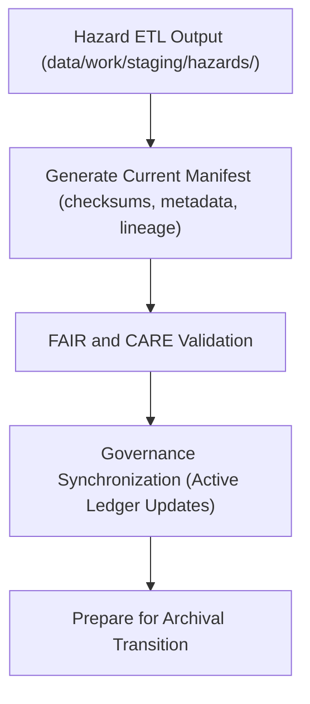

<div align="center">

# 🧾 Kansas Frontier Matrix — **Current Hazard Manifests**
`data/work/tmp/hazards/logs/manifests/current/README.md`

**Purpose:** Active workspace for current hazard dataset manifests and checksum registries generated during ongoing ETL, validation, and governance workflows in the Kansas Frontier Matrix (KFM).  
These manifests ensure real-time lineage tracking, reproducibility, and FAIR+CARE compliance for hazard data pipelines before archival and certification.

[](../../../../../../docs/standards/faircare-validation.md)
[](../../../../../../LICENSE)
[](../../../../../../docs/architecture/repo-focus.md)

</div>

---

## 📚 Overview

The `data/work/tmp/hazards/logs/manifests/current/` directory stores **active dataset manifests and governance-linked checksum registries** produced during hazard ETL and AI workflows.  
These manifests document the latest state of hazard datasets prior to their transfer into archival repositories.

### Core Functions:
- Maintain current manifests for active hazard datasets and transformations.  
- Record schema linkage, dataset version metadata, and governance verification results.  
- Enable real-time reproducibility and validation before FAIR+CARE archival.  
- Provide provenance assurance for ongoing ETL and AI hazard analytics workflows.  

All manifest files are updated automatically through ETL pipelines and linked to the KFM **Provenance Ledger** for audit integrity.

---

## 🗂️ Directory Layout

```plaintext
data/work/tmp/hazards/logs/manifests/current/
├── README.md                                   # This file — documentation for current hazard manifests
│
├── hazard_manifest_current_v9.3.2.json         # Active manifest file for the current hazard data release
├── checksum_registry_current_v9.3.2.csv        # File integrity and checksum registry for current assets
├── governance_registration_current.log         # Governance sync log for current ETL and FAIR+CARE validation
├── faircare_manifest_validation.json           # FAIR+CARE ethics and accessibility validation results
└── metadata.json                               # Provenance and governance linkage metadata
```

---

## ⚙️ Manifest Generation Workflow



### Workflow Description:
1. **Manifest Compilation:** Aggregate dataset file listings, schema references, and version metadata.  
2. **Validation:** Perform checksum verification and FAIR+CARE ethical audits.  
3. **Governance Sync:** Register current manifest events in governance ledger for transparency.  
4. **Stabilization:** Maintain manifest as the authoritative reference until next certification cycle.  
5. **Archival Prep:** Transition manifests to `data/work/tmp/hazards/logs/manifests/archive/` after cycle closure.

---

## 🧩 Example Metadata Record

```json
{
  "id": "hazard_manifest_current_v9.3.2",
  "dataset_group": "hazards",
  "manifest_version": "v9.3.2",
  "files_included": 17,
  "checksums_verified": true,
  "governance_registered": true,
  "fairstatus": "in_review",
  "updated_by": "@kfm-etl-system",
  "updated": "2025-10-28T17:20:00Z",
  "checksum": "sha256:ad47bc9e7baf38c193a40a9e51b2c372b8f1a74c...",
  "governance_ref": "data/reports/audit/data_provenance_ledger.json"
}
```

---

## 🧠 FAIR+CARE Governance Alignment

| Principle | Implementation |
|------------|----------------|
| **Findable** | Current manifests indexed by dataset version and ETL cycle. |
| **Accessible** | Stored in open formats (JSON, CSV, log) for internal governance. |
| **Interoperable** | Conforms to DCAT, STAC, and KFM metadata standards. |
| **Reusable** | Includes schema, provenance, and checksum lineage metadata. |
| **Collective Benefit** | Enables transparent, real-time monitoring of hazard data readiness. |
| **Authority to Control** | FAIR+CARE Council reviews current manifest state before archival. |
| **Responsibility** | ETL maintainers ensure validation accuracy and reproducibility. |
| **Ethics** | Ensures open, equitable access and compliance with FAIR+CARE data ethics. |

Governance results referenced in:  
`data/reports/audit/data_provenance_ledger.json`  
and `data/reports/fair/data_care_assessment.json`.

---

## ⚙️ Manifest Artifacts

| File | Description | Format |
|------|--------------|--------|
| `hazard_manifest_current_*.json` | Manifest defining current dataset composition and schema. | JSON |
| `checksum_registry_current_*.csv` | File-level hash and integrity registry. | CSV |
| `governance_registration_current.log` | Real-time governance sync events. | Text |
| `faircare_manifest_validation.json` | FAIR+CARE ethics audit for ongoing data operations. | JSON |
| `metadata.json` | Tracks provenance, checksum validation, and governance linkage. | JSON |

All manifest updates automated via `manifest_current_sync.yml`.

---

## ⚖️ Governance & Provenance Integration

| Record | Description |
|---------|-------------|
| `metadata.json` | Captures governance linkage, checksum registry, and manifest lineage. |
| `data/reports/audit/data_provenance_ledger.json` | Logs ongoing manifest updates and ethics review events. |
| `data/reports/fair/data_care_assessment.json` | FAIR+CARE audit metrics and governance validation outcomes. |
| `releases/v9.3.2/manifest.zip` | Includes verified manifest files for current release cycle. |

Governance synchronization occurs automatically via CI/CD pipelines during ETL operations.

---

## 🧾 Retention & Version Policy

| Manifest Type | Retention Duration | Policy |
|----------------|--------------------|--------|
| Current Manifests | Active cycle only | Replaced after archival registration. |
| FAIR+CARE Reports | 90 days | Archived to manifest archive after certification. |
| Governance Logs | 90 days | Retained until next synchronization cycle. |
| Metadata | Permanent | Maintained for lineage and provenance continuity. |

Retention governed by `manifest_current_cleanup.yml`.

---

## 🧾 Internal Use Citation

```text
Kansas Frontier Matrix (2025). Current Hazard Manifests (v9.3.2).
Active FAIR+CARE-compliant manifest records capturing dataset structure, lineage, and checksum verification for ongoing hazard data workflows.
Maintained under MCP-DL v6.3 FAIR+CARE governance protocols.
```

---

## 🧾 Version Notes

| Version | Date | Notes |
|----------|------|--------|
| v9.3.2 | 2025-10-28 | Added FAIR+CARE ethics validation and governance registration features. |
| v9.2.0 | 2024-07-15 | Enhanced real-time manifest synchronization and audit logging. |
| v9.0.0 | 2023-01-10 | Established current manifest logging workspace for hazard data pipelines. |

---

<div align="center">

**Kansas Frontier Matrix** · *Data Provenance × FAIR+CARE Ethics × Continuous Governance*  
[🔗 Repository](https://github.com/bartytime4life/Kansas-Frontier-Matrix) • [🧭 Docs Portal](../../../../../../docs/) • [⚖️ Governance Ledger](../../../../../../docs/standards/governance/)

</div>