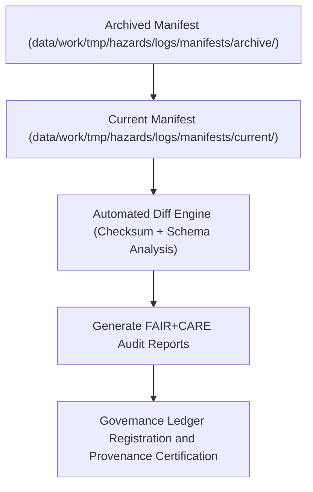

<div align="center">

# 🧮 Kansas Frontier Matrix — **Hazard Manifest Diffs**
`data/work/tmp/hazards/logs/manifests/diffs/README.md`

**Purpose:** Repository for manifest comparison reports and checksum deltas that document differences between hazard dataset versions in the Kansas Frontier Matrix (KFM).  
These logs ensure transparent lineage tracking, dataset version control, and FAIR+CARE-certified reproducibility of hazard data updates.

[](../../../../../../docs/standards/faircare-validation.md)
[](../../../../../../LICENSE)
[](../../../../../../docs/architecture/repo-focus.md)

</div>

---

## 📚 Overview

The `data/work/tmp/hazards/logs/manifests/diffs/` directory captures **manifest version comparisons and delta analyses** generated when hazard datasets are updated, validated, or re-certified.  
Each diff log provides a forensic record of dataset changes—file additions, removals, or checksum modifications—maintained under FAIR+CARE governance for reproducibility.

### Core Functions:
- Track version-to-version differences in hazard manifests and associated datasets.  
- Record checksum and schema deltas for data lineage and validation transparency.  
- Support FAIR+CARE audit readiness and provenance verification.  
- Provide governance-linked documentation for dataset change management.  

All diff reports are checksum-verified and recorded in the **KFM Provenance Ledger** to maintain immutable version traceability.

---

## 🗂️ Directory Layout

```plaintext
data/work/tmp/hazards/logs/manifests/diffs/
├── README.md                                # This file — overview of hazard manifest diffs
│
├── manifest_diff_report_2024Q3_to_2024Q4.json   # Version comparison between Q3 and Q4 manifests
├── checksum_delta_2024Q3_to_2024Q4.csv          # File-level hash changes between releases
├── schema_field_changes_2024Q3_to_2024Q4.json   # Field additions, removals, or type changes
├── governance_diff_audit_2024Q4.log             # Governance log of manifest comparison validation
└── metadata.json                               # Provenance, checksum, and governance linkage
```

---

## ⚙️ Manifest Diff Workflow



### Workflow Description:
1. **Source Comparison:** Compare current manifests with archived ones to detect differences in data content and structure.  
2. **Checksum Analysis:** Identify file-level hash discrepancies indicating content updates or changes.  
3. **Schema Evaluation:** Highlight field changes, added or deprecated schema elements, and renamed fields.  
4. **Audit Review:** Conduct FAIR+CARE compliance verification for modified datasets.  
5. **Governance Sync:** Log version changes in the provenance ledger for transparent lineage tracking.

---

## 🧩 Example Metadata Record

```json
{
  "id": "manifest_diff_hazards_v9.3.2_Q3_Q4_2024",
  "base_manifest": "hazard_manifest_archive_2024Q3.json",
  "target_manifest": "hazard_manifest_current_v9.3.2.json",
  "files_changed": 7,
  "checksums_updated": 5,
  "schema_fields_modified": 3,
  "fairstatus": "certified",
  "audited_by": "@kfm-governance",
  "created": "2025-10-28T17:25:00Z",
  "checksum": "sha256:0a58b7d9f32e7cd14641c573d8c9ebf2bfa902a5...",
  "governance_ref": "data/reports/audit/data_provenance_ledger.json"
}
```

---

## 🧠 FAIR+CARE Governance Alignment

| Principle | Implementation |
|------------|----------------|
| **Findable** | Manifest diffs indexed by source and target versions in governance ledger. |
| **Accessible** | Diff reports stored in open JSON, CSV, and text formats. |
| **Interoperable** | Structured according to FAIR+CARE diff schema and DCAT lineage standards. |
| **Reusable** | Each diff includes checksums, schema deltas, and provenance references. |
| **Collective Benefit** | Ensures open, transparent evolution of hazard data. |
| **Authority to Control** | FAIR+CARE Council reviews and certifies manifest version changes. |
| **Responsibility** | ETL maintainers document changes and governance synchronization. |
| **Ethics** | Guarantees ethical stewardship of data versioning and reproducibility. |

All governance and audit references stored in:  
`data/reports/audit/data_provenance_ledger.json` and  
`data/reports/fair/data_care_assessment.json`.

---

## ⚙️ Diff Artifacts

| File | Description | Format |
|------|--------------|--------|
| `manifest_diff_report_*.json` | Comprehensive comparison report between manifests. | JSON |
| `checksum_delta_*.csv` | Lists all file-level checksum differences. | CSV |
| `schema_field_changes_*.json` | Details schema attribute and structure changes. | JSON |
| `governance_diff_audit_*.log` | Governance and FAIR+CARE audit trace for diff operation. | Text |
| `metadata.json` | Captures lineage, checksum, and governance linkage. | JSON |

Diff generation and audit validation managed by `manifest_diff_sync.yml`.

---

## ⚖️ Governance & Provenance Integration

| Record | Description |
|---------|-------------|
| `metadata.json` | Captures governance linkage and checksum registry for diff results. |
| `data/reports/audit/data_provenance_ledger.json` | Logs manifest version lineage and FAIR+CARE certification. |
| `data/reports/fair/data_care_assessment.json` | Contains FAIR+CARE audit results for manifest differences. |
| `releases/v9.3.2/manifest.zip` | Registry of manifests included in diff verification. |

All governance synchronization automated through FAIR+CARE pipeline checks.

---

## 🧾 Retention & Certification Policy

| Diff Record Type | Retention Duration | Policy |
|------------------|--------------------|--------|
| Manifest Diff Reports | Permanent | Retained indefinitely for lineage continuity. |
| Checksum Deltas | 365 days | Archived annually with provenance ledger. |
| Governance Audits | 180 days | Maintained for FAIR+CARE re-certification cycles. |
| Metadata | Permanent | Preserved as part of certification and reproducibility chain. |

Retention handled automatically via `manifest_diff_cleanup.yml`.

---

## 🧾 Internal Use Citation

```text
Kansas Frontier Matrix (2025). Hazard Manifest Diffs (v9.3.2).
Version-to-version manifest comparison logs documenting dataset deltas, checksums, and schema evolution under FAIR+CARE governance protocols.
Maintained under MCP-DL v6.3 for reproducibility, transparency, and ethical data lineage.
```

---

## 🧾 Version Notes

| Version | Date | Notes |
|----------|------|--------|
| v9.3.2 | 2025-10-28 | Added FAIR+CARE certification and governance audit integration. |
| v9.2.0 | 2024-07-15 | Introduced schema field comparison and checksum delta automation. |
| v9.0.0 | 2023-01-10 | Established manifest diff tracking directory for hazard dataset versioning. |

---

<div align="center">

**Kansas Frontier Matrix** · *Version Control × FAIR+CARE Governance × Provenance Accuracy*  
[🔗 Repository](https://github.com/bartytime4life/Kansas-Frontier-Matrix) • [🧭 Docs Portal](../../../../../../docs/) • [⚖️ Governance Ledger](../../../../../../docs/standards/governance/)

</div>