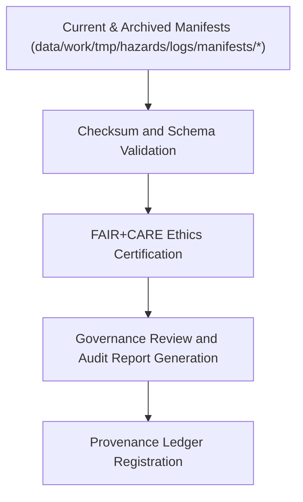

<div align="center">

# 📑 Kansas Frontier Matrix — **Hazard Manifest Reports**
`data/work/tmp/hazards/logs/manifests/reports/README.md`

**Purpose:** Repository for manifest audit reports, FAIR+CARE certification summaries, and governance validation records related to hazard data manifests within the Kansas Frontier Matrix (KFM).  
These reports consolidate metadata lineage, checksum integrity, and ethical governance assessments for each certified hazard dataset version.

[](../../../../../../docs/standards/faircare-validation.md)
[](../../../../../../LICENSE)
[](../../../../../../docs/architecture/repo-focus.md)

</div>

---

## 📚 Overview

The `data/work/tmp/hazards/logs/manifests/reports/` directory stores **manifest-level audit and certification reports** for all hazard datasets processed within KFM.  
These files summarize validation results, checksum audits, and FAIR+CARE ethics compliance, linking all governance records across the hazard data lifecycle.

### Core Functions:
- Consolidate validation results from current and archived manifests.  
- Record checksum verification and schema consistency audits.  
- Provide FAIR+CARE certification results for hazard data collections.  
- Maintain lineage across versions for reproducibility and governance integrity.  

All manifest reports are checksum-verified, FAIR+CARE-certified, and permanently logged in the **KFM Governance Ledger**.

---

## 🗂️ Directory Layout

```plaintext
data/work/tmp/hazards/logs/manifests/reports/
├── README.md                                 # This file — overview of hazard manifest reports
│
├── manifest_audit_report_2024Q4.json         # Comprehensive validation and audit report for Q4 2024
├── faircare_certification_report_2024Q4.json # FAIR+CARE compliance summary for current hazard manifests
├── checksum_audit_results_2024Q4.csv         # File-level checksum validation summary
├── governance_review_snapshot_2024Q4.md      # Governance review digest and audit notes
└── metadata.json                             # Provenance and governance linkage record
```

---

## ⚙️ Manifest Reporting Workflow



### Workflow Description:
1. **Audit Input:** Gather manifests from current and archive directories for analysis.  
2. **Checksum Verification:** Validate file integrity across versions.  
3. **FAIR+CARE Certification:** Perform ethical, reproducible compliance audit.  
4. **Governance Review:** Generate certification summary and compliance dashboard.  
5. **Registration:** Log certification event in provenance ledger for full traceability.

---

## 🧩 Example Metadata Record

```json
{
  "id": "manifest_report_hazards_v9.3.2_2024Q4",
  "report_type": "audit + certification",
  "etl_cycle": "Q4 2024",
  "manifests_reviewed": 2,
  "files_verified": 87,
  "checksum_anomalies": 0,
  "fairstatus": "certified",
  "audited_by": "@kfm-governance",
  "created": "2025-10-28T17:30:00Z",
  "checksum": "sha256:6e9d33f8aab79f41da0b7a52e8a0c60d87b9cd7d...",
  "governance_ref": "data/reports/audit/data_provenance_ledger.json"
}
```

---

## 🧠 FAIR+CARE Governance Alignment

| Principle | Implementation |
|------------|----------------|
| **Findable** | Manifest reports indexed by ETL cycle, dataset, and governance ID. |
| **Accessible** | Reports stored in open JSON, CSV, and Markdown formats. |
| **Interoperable** | Aligned with DCAT and FAIR+CARE governance schemas. |
| **Reusable** | Includes metadata, lineage, and audit provenance for reproducibility. |
| **Collective Benefit** | Promotes transparent data validation and open science practices. |
| **Authority to Control** | FAIR+CARE Council validates all certification reports. |
| **Responsibility** | Data governance team maintains certification logs and provenance records. |
| **Ethics** | Ensures transparency and ethical documentation across all data lifecycle phases. |

All governance references maintained in:  
`data/reports/audit/data_provenance_ledger.json` and  
`data/reports/fair/data_care_assessment.json`.

---

## ⚙️ Report Artifacts

| File | Description | Format |
|------|--------------|--------|
| `manifest_audit_report_*.json` | Full validation and checksum audit summary. | JSON |
| `faircare_certification_report_*.json` | FAIR+CARE compliance and certification record. | JSON |
| `checksum_audit_results_*.csv` | Summary of file-level hash validations. | CSV |
| `governance_review_snapshot_*.md` | Human-readable digest of governance review notes. | Markdown |
| `metadata.json` | Records lineage, certification, and governance linkage. | JSON |

All reporting processes automated by `manifest_report_sync.yml`.

---

## ⚖️ Governance & Provenance Integration

| Record | Description |
|---------|-------------|
| `metadata.json` | Captures checksum lineage, certification status, and governance linkage. |
| `data/reports/audit/data_provenance_ledger.json` | Logs all manifest report publications and ethics certifications. |
| `data/reports/fair/data_care_assessment.json` | FAIR+CARE compliance record for manifest governance. |
| `releases/v9.3.2/manifest.zip` | Centralized registry for manifest report checksums. |

Governance synchronization handled through CI/CD validation pipelines under FAIR+CARE supervision.

---

## 🧾 Retention & Certification Policy

| Report Type | Retention Duration | Policy |
|--------------|--------------------|--------|
| Manifest Audit Reports | Permanent | Stored for provenance and compliance verification. |
| FAIR+CARE Certifications | Permanent | Maintained indefinitely for ethics and governance traceability. |
| Checksum Reports | 365 days | Archived for reproducibility validation. |
| Governance Reviews | 180 days | Retained for FAIR+CARE council oversight. |

Retention and cleanup automated by `manifest_report_cleanup.yml`.

---

## 🧾 Internal Use Citation

```text
Kansas Frontier Matrix (2025). Hazard Manifest Reports (v9.3.2).
Governance-certified audit and FAIR+CARE compliance reports documenting hazard manifest lineage, validation results, and ethics certification under MCP-DL v6.3.
Maintained for provenance integrity and reproducible data management.
```

---

## 🧾 Version Notes

| Version | Date | Notes |
|----------|------|--------|
| v9.3.2 | 2025-10-28 | Added FAIR+CARE ethics audit and checksum verification integration. |
| v9.2.0 | 2024-07-15 | Introduced governance snapshot dashboards and manifest validation metrics. |
| v9.0.0 | 2023-01-10 | Established manifest reporting workspace for hazard data pipelines. |

---

<div align="center">

**Kansas Frontier Matrix** · *Data Reporting × FAIR+CARE Governance × Provenance Certification*  
[🔗 Repository](https://github.com/bartytime4life/Kansas-Frontier-Matrix) • [🧭 Docs Portal](../../../../../../docs/) • [⚖️ Governance Ledger](../../../../../../docs/standards/governance/)

</div>