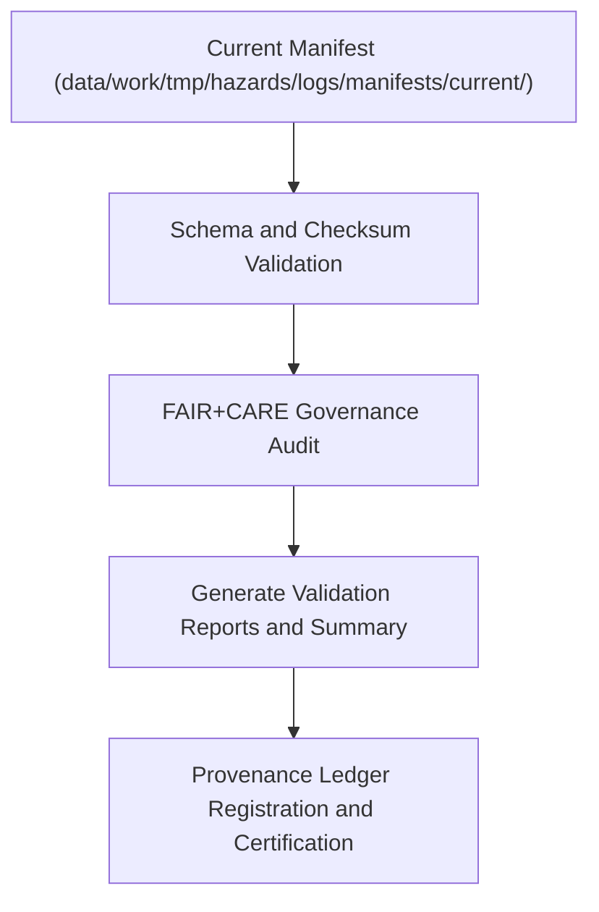

<div align="center">

# ✅ Kansas Frontier Matrix — **Hazard Manifest Validation Logs**
`data/work/tmp/hazards/logs/manifests/validation/README.md`

**Purpose:** Repository for validation reports, schema audits, and FAIR+CARE governance records confirming the accuracy and ethical compliance of hazard manifests in the Kansas Frontier Matrix (KFM).  
This workspace ensures all manifests meet structural, provenance, and ethical standards under MCP-DL v6.3 and FAIR+CARE governance.

[](../../../../../../docs/standards/faircare-validation.md)
[](../../../../../../LICENSE)
[](../../../../../../docs/architecture/repo-focus.md)

</div>

---

## 📚 Overview

The `data/work/tmp/hazards/logs/manifests/validation/` directory contains **validation outputs** for all hazard dataset manifests generated during ETL cycles.  
Each log records schema verification, checksum validation, and FAIR+CARE ethics audit results prior to archival or certification publication.

### Core Functions:
- Validate the structure and completeness of hazard manifests.  
- Verify file integrity through checksum comparison and lineage confirmation.  
- Record FAIR+CARE ethics compliance and audit outcomes.  
- Maintain reproducible validation metadata linked to the governance ledger.  

All validation artifacts are checksum-verified, timestamped, and FAIR+CARE-certified to ensure long-term reproducibility and provenance traceability.

---

## 🗂️ Directory Layout

```plaintext
data/work/tmp/hazards/logs/manifests/validation/
├── README.md                                   # This file — documentation for manifest validation logs
│
├── manifest_validation_report_2024Q4.json      # Schema and checksum validation summary for Q4 2024
├── faircare_manifest_audit_2024Q4.json         # FAIR+CARE ethics and governance validation results
├── schema_contract_comparison_2024Q4.csv       # Schema contract comparison and compliance metrics
├── validation_summary_2024Q4.md                # Human-readable FAIR+CARE and schema validation overview
└── metadata.json                               # Provenance linkage, checksum, and governance record
```

---

## ⚙️ Manifest Validation Workflow



### Workflow Description:
1. **Validation:** Validate the current manifest structure and schema integrity.  
2. **Checksum Verification:** Compare computed hashes with expected registry entries.  
3. **Ethics Audit:** Perform FAIR+CARE certification review for data transparency and accessibility.  
4. **Governance Registration:** Record results in the KFM Provenance Ledger.  
5. **Certification:** Confirm manifest readiness for public dataset publication or archival.

---

## 🧩 Example Metadata Record

```json
{
  "id": "manifest_validation_hazards_v9.3.2_2024Q4",
  "etl_cycle": "Q4 2024",
  "manifest_file": "hazard_manifest_current_v9.3.2.json",
  "files_validated": 17,
  "checksum_integrity": "verified",
  "schema_compliance": "pass",
  "fairstatus": "certified",
  "audited_by": "@kfm-manifest-validation",
  "created": "2025-10-28T17:35:00Z",
  "checksum": "sha256:ad7c4b993a15cfdaee14c28b94c3a77c2e19f33b...",
  "governance_ref": "data/reports/audit/data_provenance_ledger.json"
}
```

---

## 🧠 FAIR+CARE Governance Alignment

| Principle | Implementation |
|------------|----------------|
| **Findable** | All validation reports indexed by ETL cycle and manifest version. |
| **Accessible** | Stored in open formats (JSON, CSV, Markdown) for audit accessibility. |
| **Interoperable** | Schema contracts aligned with FAIR+CARE and DCAT standards. |
| **Reusable** | Metadata includes checksums, lineage, and validation context. |
| **Collective Benefit** | Enables transparent validation and ethical data management. |
| **Authority to Control** | FAIR+CARE Council reviews and certifies validation outcomes. |
| **Responsibility** | Validation engineers maintain governance synchronization and documentation. |
| **Ethics** | Ensures all published manifests meet ethical stewardship principles. |

Governance data and certifications stored in:  
`data/reports/audit/data_provenance_ledger.json`  
and `data/reports/fair/data_care_assessment.json`.

---

## ⚙️ Validation Artifacts

| File | Description | Format |
|------|--------------|--------|
| `manifest_validation_report_*.json` | Summarizes validation of schema, fields, and metadata completeness. | JSON |
| `faircare_manifest_audit_*.json` | FAIR+CARE ethics validation and compliance summary. | JSON |
| `schema_contract_comparison_*.csv` | Cross-reference of manifest schema vs. data contract. | CSV |
| `validation_summary_*.md` | Governance review and certification digest. | Markdown |
| `metadata.json` | Captures lineage, checksum, and certification linkage. | JSON |

All validation tasks automated via `manifest_validation_sync.yml`.

---

## ⚖️ Governance & Provenance Integration

| Record | Description |
|---------|-------------|
| `metadata.json` | Captures validation lineage, schema compliance, and governance linkage. |
| `data/reports/audit/data_provenance_ledger.json` | Logs validation lineage and FAIR+CARE certification results. |
| `data/reports/fair/data_care_assessment.json` | Stores ethics assessment and FAIR+CARE certification logs. |
| `releases/v9.3.2/manifest.zip` | Contains validated manifests and checksum registry. |

Governance synchronization automated through FAIR+CARE compliance CI/CD workflows.

---

## 🧾 Retention & Certification Policy

| Validation Type | Retention Duration | Policy |
|------------------|--------------------|--------|
| Manifest Validation Reports | 365 days | Retained for re-audit and certification review. |
| FAIR+CARE Audits | Permanent | Archived for governance integrity and traceability. |
| Schema Comparisons | 180 days | Maintained for schema evolution and QA verification. |
| Metadata | Permanent | Preserved in provenance registry for reproducibility. |

Lifecycle and archival handled through `manifest_validation_cleanup.yml`.

---

## 🧾 Internal Use Citation

```text
Kansas Frontier Matrix (2025). Hazard Manifest Validation Logs (v9.3.2).
Comprehensive schema, checksum, and ethics validation records for hazard manifests governed under FAIR+CARE and MCP-DL v6.3 standards.
Maintained for reproducibility, transparency, and ethical governance certification.
```

---

## 🧾 Version Notes

| Version | Date | Notes |
|----------|------|--------|
| v9.3.2 | 2025-10-28 | Added FAIR+CARE certification linkage and governance integration. |
| v9.2.0 | 2024-07-15 | Expanded validation pipeline to include schema comparison automation. |
| v9.0.0 | 2023-01-10 | Established manifest validation log directory for hazard pipelines. |

---

<div align="center">

**Kansas Frontier Matrix** · *Validation Integrity × FAIR+CARE Governance × Provenance Certification*  
[🔗 Repository](https://github.com/bartytime4life/Kansas-Frontier-Matrix) • [🧭 Docs Portal](../../../../../../docs/) • [⚖️ Governance Ledger](../../../../../../docs/standards/governance/)

</div>