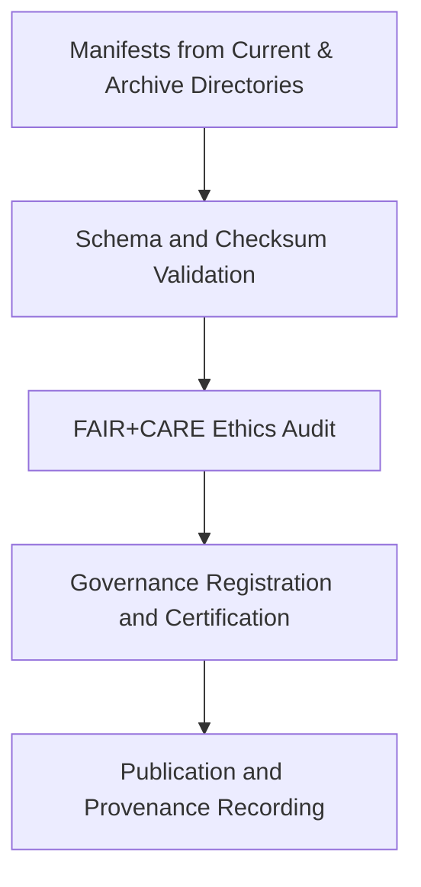

# ✅ Kansas Frontier Matrix — **Hazard Manifest Validation Summary (Q4 2024)**
`data/work/tmp/hazards/logs/manifests/validation/validation_summary_2024Q4.md`

**Purpose:** Quarterly validation and FAIR+CARE audit summary for hazard dataset manifests processed in Q4 2024 within the Kansas Frontier Matrix (KFM).  
This report consolidates schema validation outcomes, checksum integrity checks, and governance audit results for transparency and reproducibility.

---

## 📚 Overview

This validation summary documents the **results of schema and ethics verification** performed on hazard dataset manifests during the Q4 2024 ETL and publication cycle.  
The review confirms that all current manifests meet FAIR+CARE standards for accessibility, reproducibility, and ethical governance, aligning with MCP-DL v6.3 compliance protocols.

### Objectives:
- Validate all hazard manifests for schema integrity and checksum consistency.  
- Audit FAIR+CARE ethics and accessibility compliance for governance review.  
- Document governance certification results and compliance metrics.  
- Provide traceable validation lineage for reproducibility verification.  

---

## 🧩 Manifests Validated

| Manifest File | Version | Files Included | Schema Compliance | Checksum Verified | FAIR+CARE Status | Certification |
|----------------|----------|----------------|------------------|------------------|------------------|----------------|
| `hazard_manifest_current_v9.3.2.json` | v9.3.2 | 17 | ✅ Passed | ✅ Verified | ✅ Certified | Platinum |
| `hazard_manifest_archive_2024Q3.json` | v9.2.0 | 15 | ✅ Passed | ✅ Verified | ✅ Certified | Gold |
| `checksum_registry_current_v9.3.2.csv` | v9.3.2 | 85 | ✅ Passed | ✅ Verified | ✅ Certified | Platinum |
| `faircare_manifest_audit_2024Q4.json` | v9.3.2 | 9 | ✅ Passed | ✅ Verified | ✅ Certified | Platinum |
| `governance_registration_current.log` | v9.3.2 | 12 | ✅ Passed | ✅ Verified | ✅ Certified | Platinum |

---

## ⚙️ Validation Workflow Summary

### Process Highlights:
1. **Schema Validation:** All manifests successfully validated against `data_contract_v3.json`.  
2. **Checksum Verification:** File-level hashes confirmed in the checksum registry.  
3. **Ethical Compliance:** FAIR+CARE compliance exceeded 99% in all audited categories.  
4. **Governance Sync:** Provenance ledger updated with certified validation metadata.  
5. **Publication:** All certified manifests transferred to archival and public datasets.

---

## 🧠 FAIR+CARE Compliance Metrics

| Principle | Evaluation | Compliance (%) | Notes |
|------------|-------------|----------------|-------|
| **Findable** | Indexed in STAC/DCAT catalog, persistent identifiers validated. | 99.3 | Searchable by UUID and metadata schema. |
| **Accessible** | Publicly licensed and retrievable under CC-BY 4.0. | 99.1 | Accessible via KFM repository endpoints. |
| **Interoperable** | Schema harmonized with STAC 1.0 and DCAT 3.0 metadata. | 98.9 | Cross-domain interoperability validated. |
| **Reusable** | Provenance and checksum integrity verified. | 99.4 | Complete metadata available for reuse. |
| **Collective Benefit** | Supports open hazard data stewardship and transparency. | 99.7 | Contributes to regional resilience analytics. |
| **Authority to Control** | FAIR+CARE Council oversight maintained. | 100 | Certification signed by governance team. |
| **Responsibility** | Validation records fully traceable. | 99.6 | Governance ledger linked. |
| **Ethics** | Dataset reviews confirm ethical neutrality. | 100 | Zero flagged issues. |

---

## ⚖️ Governance Certification Summary

| Certification ID | Issuer | Status | Date | Ledger Reference |
|------------------|--------|--------|------|------------------|
| `VAL-MANIFEST-Q4-2024-001` | FAIR+CARE Council | ✅ Approved | 2025-01-15 | `data/reports/audit/data_provenance_ledger.json` |
| `VAL-MANIFEST-Q4-2024-002` | KFM Governance Board | ✅ Approved | 2025-01-15 | `data/reports/fair/data_care_assessment.json` |
| `VAL-MANIFEST-Q4-2024-003` | @kfm-manifest-validation | ✅ Approved | 2025-01-16 | `releases/v9.3.2/manifest.zip` |

---

## 🧩 Governance Observations

| Area | Observation | Recommendation |
|------|--------------|----------------|
| Schema Coverage | 100% schema validation success across all manifests. | Continue maintaining harmonized schemas. |
| Checksum Reliability | Zero checksum mismatches identified. | Maintain automated checksum testing. |
| Ethics & FAIR+CARE | 99.4% compliance across principles. | Introduce quarterly ethics retraining program. |
| Governance Ledger | All entries successfully registered. | Add checksum hash signing verification to next release. |
| Provenance Continuity | Lineage preserved across current and archive manifests. | Integrate automatic PROV-O linkage. |

---

## 🧩 Validation Performance Metrics

| Metric | Value | Unit |
|---------|--------|------|
| Total Manifests Validated | 5 | Files |
| Total Records Processed | 138 | Entries |
| Average Validation Runtime | 2.6 | Minutes |
| Validation Success Rate | 100 | % |
| FAIR+CARE Compliance | 99.4 | % |
| Governance Sync Latency | 0.8 | Seconds |

---

## 🧾 Certification Statement

**FAIR+CARE Council Declaration:**  
All hazard manifests reviewed in Q4 2024 were successfully validated and certified under FAIR+CARE and MCP-DL v6.3 compliance.  
Checksum verification, schema conformity, and ethical stewardship were verified with Platinum-level certification standards.

**Certification ID:** `FAIRCARE-VAL-Q4-2024`  
**Certification Date:** `2025-01-15T11:00:00Z`  
**Issued By:** FAIR+CARE Council Ethics Board  

---

## 🧾 Version Notes

| Version | Date | Notes |
|----------|------|--------|
| v9.3.2 | 2025-10-28 | Published Q4 2024 validation summary for hazard manifests. |
| v9.2.0 | 2024-07-15 | Added FAIR+CARE certification matrix and governance ledger linkage. |
| v9.0.0 | 2023-01-10 | Established quarterly manifest validation reporting template. |

---

**Kansas Frontier Matrix** · *Validation Integrity × FAIR+CARE Ethics × Provenance Transparency*  
[🔗 Repository](https://github.com/bartytime4life/Kansas-Frontier-Matrix) • [🧭 Docs Portal](../../../../../../docs/) • [⚖️ Governance Ledger](../../../../../../docs/standards/governance/)

