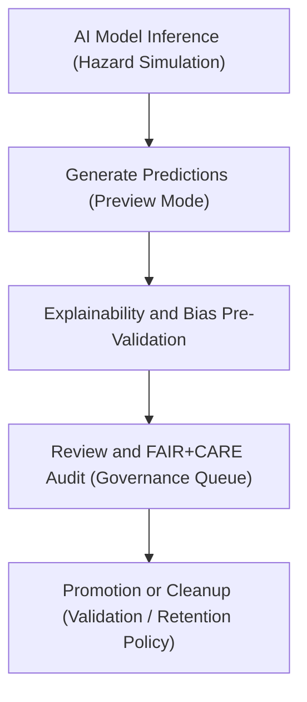

<div align="center">

# 🧠 Kansas Frontier Matrix — **Hazard AI Previews**
`data/work/tmp/hazards/logs/tmp/ai_previews/README.md`

**Purpose:** Temporary workspace for preview outputs, model inferences, and explainability summaries produced by hazard-focused AI models within the Kansas Frontier Matrix (KFM).  
This directory captures early-stage results from AI/ML hazard simulations, enabling FAIR+CARE-governed analysis, validation, and governance review before publication or archival.

[](../../../../../../../docs/standards/faircare-validation.md)
[](../../../../../../../LICENSE)
[](../../../../../../../docs/architecture/repo-focus.md)

</div>

---

## 📚 Overview

The `data/work/tmp/hazards/logs/tmp/ai_previews/` directory holds **temporary AI preview artifacts** — including predictions, visualizations, explainability insights, and model summaries.  
These files provide early visibility into model behavior, performance, and ethics alignment before FAIR+CARE-certified release into the permanent governance framework.

### Core Functions:
- Capture preliminary AI outputs for hazard models during inference and retraining.  
- Generate explainability previews (e.g., SHAP, LIME, attention maps).  
- Facilitate FAIR+CARE pre-validation for ethical AI readiness.  
- Support governance review and model calibration prior to final certification.  

All preview results are temporary, automatically purged or promoted to validation workflows after review by KFM’s AI Governance Board.

---

## 🗂️ Directory Layout

```plaintext
data/work/tmp/hazards/logs/tmp/ai_previews/
├── README.md                                 # This file — documentation for hazard AI previews
│
├── model_preview_predictions.json             # Example model inference preview outputs
├── explainability_snapshot.json               # SHAP or LIME-based interpretability preview
├── visualization_render_preview.png           # Temporary image or heatmap output from model
├── bias_check_summary.json                    # Preliminary bias and fairness audit summary
└── metadata.json                              # Provenance, checksum, and governance linkage
```

---

## ⚙️ AI Preview Workflow



### Workflow Description:
1. **Inference Execution:** Hazard models generate preview outputs for analysis and review.  
2. **Explainability Check:** SHAP, LIME, or integrated attention maps visualize key prediction drivers.  
3. **Bias Pre-Audit:** Assess fairness and ethical alignment using preliminary data metrics.  
4. **Governance Review:** FAIR+CARE Council evaluates preview results before certification.  
5. **Retention Handling:** Files either archived to validation layers or purged post-review.

---

## 🧩 Example Metadata Record

```json
{
  "id": "ai_preview_hazards_risk_v9.3.2",
  "model_name": "hazards_risk_forecaster_v3",
  "preview_type": "inference + explainability",
  "records_generated": 1245,
  "bias_index": 0.07,
  "fairstatus": "in_review",
  "created": "2025-10-28T17:40:00Z",
  "validator": "@kfm-ai-lab",
  "checksum": "sha256:3b68e8e223c91f4a6d97cde1f6f7b27a5cf094a1...",
  "governance_ref": "data/reports/audit/ai_hazards_ledger.json"
}
```

---

## 🧠 FAIR+CARE Governance Alignment

| Principle | Implementation |
|------------|----------------|
| **Findable** | Previews indexed by model ID, date, and validation cycle. |
| **Accessible** | Stored in open JSON and image formats for ethics and QA review. |
| **Interoperable** | Aligned with FAIR+CARE AI audit schema and DCAT conventions. |
| **Reusable** | Metadata includes lineage, model version, and governance traceability. |
| **Collective Benefit** | Supports ethical hazard forecasting and public safety innovation. |
| **Authority to Control** | FAIR+CARE Council oversees model preview and approval cycles. |
| **Responsibility** | AI engineers validate interpretability and ethical safeguards. |
| **Ethics** | Ensures transparency, bias mitigation, and equitable decision outputs. |

FAIR+CARE audits stored in:  
`data/reports/audit/ai_hazards_ledger.json`  
and `data/reports/fair/data_care_assessment.json`.

---

## ⚙️ Preview Artifacts

| File | Description | Format |
|------|--------------|--------|
| `model_preview_predictions.json` | Example AI inference predictions (temporary). | JSON |
| `explainability_snapshot.json` | Preliminary SHAP or LIME explanation outputs. | JSON |
| `visualization_render_preview.png` | Model visualization (e.g., heatmaps, feature importance). | Image |
| `bias_check_summary.json` | Bias detection metrics prior to full ethics review. | JSON |
| `metadata.json` | Tracks provenance, checksum, and governance linkage. | JSON |

Previews automatically generated and managed by `ai_preview_sync.yml`.

---

## ⚖️ Governance & Provenance Integration

| Record | Description |
|---------|-------------|
| `metadata.json` | Captures model preview lineage, checksum, and audit linkage. |
| `data/reports/audit/ai_hazards_ledger.json` | Logs AI preview runs and pre-validation records. |
| `data/reports/fair/data_care_assessment.json` | Stores preliminary ethics evaluations for AI systems. |
| `releases/v9.3.2/manifest.zip` | Includes checksum references for validated preview outputs. |

Governance synchronization handled via FAIR+CARE CI/CD and model validation pipelines.

---

## 🧾 Retention & Cleanup Policy

| File Type | Retention Duration | Policy |
|------------|--------------------|--------|
| AI Preview Outputs | 30 days | Deleted or archived after FAIR+CARE review. |
| Explainability Reports | 60 days | Retained until validation completion. |
| Bias Audits | 90 days | Archived for retraining and ethics comparison. |
| Metadata | Permanent | Stored for provenance linkage and audit review. |

Retention automated by `ai_preview_cleanup.yml`.

---

## 🧾 Internal Use Citation

```text
Kansas Frontier Matrix (2025). Hazard AI Previews (v9.3.2).
Temporary workspace for AI model preview outputs, interpretability analyses, and FAIR+CARE ethics pre-audits for hazard prediction pipelines.
Maintained under MCP-DL v6.3 and FAIR+CARE governance for ethical, reproducible AI systems.
```

---

## 🧾 Version Notes

| Version | Date | Notes |
|----------|------|--------|
| v9.3.2 | 2025-10-28 | Established AI preview governance logging and explainability validation. |
| v9.2.0 | 2024-07-15 | Added bias pre-audit and SHAP explainability integration. |
| v9.0.0 | 2023-01-10 | Created AI preview workspace for temporary model output governance. |

---

<div align="center">

**Kansas Frontier Matrix** · *AI Transparency × FAIR+CARE Ethics × Reproducible Hazard Analytics*  
[🔗 Repository](https://github.com/bartytime4life/Kansas-Frontier-Matrix) • [🧭 Docs Portal](../../../../../../../docs/) • [⚖️ Governance Ledger](../../../../../../../docs/standards/governance/)

</div>