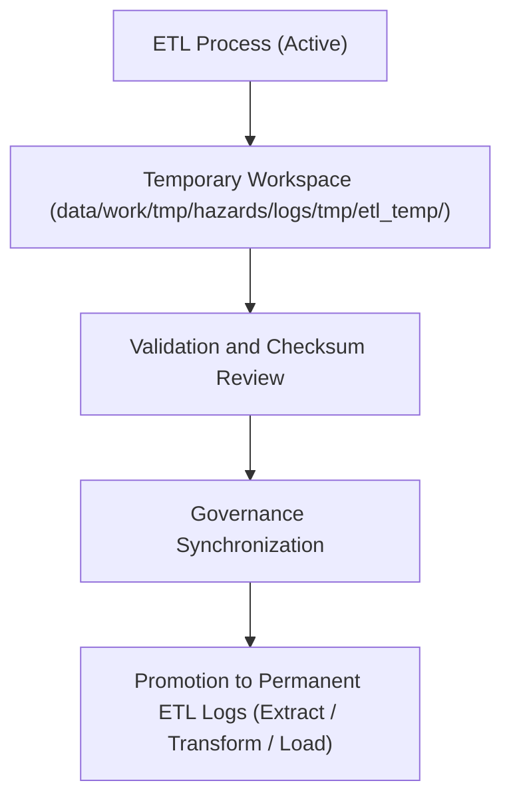

<div align="center">

# ⚙️ Kansas Frontier Matrix — **Hazard ETL Temporary Logs**
`data/work/tmp/hazards/logs/tmp/etl_temp/README.md`

**Purpose:** Temporary workspace for intermediate ETL (Extract, Transform, Load) processing logs, diagnostic traces, and FAIR+CARE pre-validation outputs used in hazard data pipelines of the Kansas Frontier Matrix (KFM).  
This directory provides a controlled sandbox for transient ETL operations prior to governance synchronization and certification.

[](../../../../../../../docs/standards/faircare-validation.md)
[](../../../../../../../LICENSE)
[](../../../../../../../docs/architecture/repo-focus.md)

</div>

---

## 📚 Overview

The `data/work/tmp/hazards/logs/tmp/etl_temp/` directory contains **temporary ETL artifacts** generated during ongoing data processing for hazard workflows.  
These include partially completed extract, transform, and load logs, diagnostics, and integrity checks.  
Once validated and synchronized with the provenance ledger, these temporary files are moved into permanent directories (`etl/extract/`, `etl/transform/`, or `etl/load/`).

### Core Functions:
- Store transient ETL logs for debugging and intermediate validation.  
- Capture schema evolution details and transformation results under FAIR+CARE rules.  
- Facilitate integrity and checksum verification during pipeline development.  
- Provide short-lived workspace for audit readiness before ledger integration.  

All logs in this workspace are auto-managed and purged according to retention policies.

---

## 🗂️ Directory Layout

```plaintext
data/work/tmp/hazards/logs/tmp/etl_temp/
├── README.md                               # This file — documentation for hazard ETL temp logs
│
├── etl_temp_extract_log.log                # Temporary extract process output and diagnostics
├── etl_temp_transform_report.json          # Transformation validation and harmonization summary
├── etl_temp_load_trace.json                # Temporary load and checksum tracking record
├── error_diagnostics_etl_temp.log          # Temporary log for ETL errors and recovery notes
└── metadata.json                           # Provenance, checksum, and governance linkage
```

---

## ⚙️ Temporary ETL Workflow



### Workflow Description:
1. **Capture:** All ETL subprocesses write temporary logs here during execution.  
2. **Validation:** Logs undergo schema and checksum checks for accuracy.  
3. **Audit Prep:** FAIR+CARE compliance confirmed before ledger integration.  
4. **Governance Sync:** Certified logs moved to permanent directories.  
5. **Cleanup:** Temporary files purged automatically after 7 days.

---

## 🧩 Example Metadata Record

```json
{
  "id": "etl_temp_hazards_v9.3.2_2024Q4",
  "etl_phase": "transform",
  "records_processed": 124560,
  "errors_detected": 2,
  "fairstatus": "in_review",
  "validator": "@kfm-etl-ops",
  "created": "2025-10-28T17:42:00Z",
  "checksum": "sha256:f2cb9cda9f3b48c431c0fbd7dfb9d51a81964b8a...",
  "governance_ref": "data/reports/audit/data_provenance_ledger.json"
}
```

---

## 🧠 FAIR+CARE Governance Alignment

| Principle | Implementation |
|------------|----------------|
| **Findable** | Temporary ETL logs indexed by pipeline phase and execution timestamp. |
| **Accessible** | Stored in open text and JSON formats for troubleshooting. |
| **Interoperable** | Uses FAIR+CARE metadata structure aligned with MCP-DL v6.3 schema. |
| **Reusable** | All logs retain provenance, checksums, and metadata for reproducibility. |
| **Collective Benefit** | Improves auditability and transparency of hazard data workflows. |
| **Authority to Control** | FAIR+CARE Council reviews retained logs for certification. |
| **Responsibility** | ETL maintainers ensure logs comply with schema validation standards. |
| **Ethics** | Logs anonymized and secured to prevent sensitive data exposure. |

All governance events registered in:  
`data/reports/audit/data_provenance_ledger.json`  
and `data/reports/fair/data_care_assessment.json`.

---

## ⚙️ Temporary ETL Artifacts

| File | Description | Format |
|------|--------------|--------|
| `etl_temp_extract_log.log` | Temporary extract log for data sourcing. | Text |
| `etl_temp_transform_report.json` | Schema validation and transformation audit record. | JSON |
| `etl_temp_load_trace.json` | Load-phase checksum and data integrity summary. | JSON |
| `error_diagnostics_etl_temp.log` | Error handling and recovery diagnostics. | Text |
| `metadata.json` | Records provenance and checksum lineage. | JSON |

All temporary ETL logs generated by `etl_temp_sync.yml`.

---

## ⚖️ Governance & Provenance Integration

| Record | Description |
|---------|-------------|
| `metadata.json` | Tracks lineage, validation status, and checksum results. |
| `data/reports/audit/data_provenance_ledger.json` | Logs ETL temporary validation events and certification prep. |
| `data/reports/fair/data_care_assessment.json` | FAIR+CARE ethics assessment for temporary ETL activities. |
| `releases/v9.3.2/manifest.zip` | Includes validated checksum data for temporary ETL outputs. |

Governance synchronization occurs automatically through CI/CD pre-validation pipelines.

---

## 🧾 Retention & Cleanup Policy

| Log Type | Retention Duration | Policy |
|-----------|--------------------|--------|
| Temporary ETL Logs | 7 days | Purged automatically post-pipeline certification. |
| Validation Reports | 14 days | Archived if audit fails; otherwise deleted. |
| Error Diagnostics | 30 days | Retained for governance troubleshooting. |
| Metadata | Permanent | Maintained for provenance and checksum integrity. |

Retention automated through `etl_temp_cleanup.yml`.

---

## 🧾 Internal Use Citation

```text
Kansas Frontier Matrix (2025). Hazard ETL Temporary Logs (v9.3.2).
Temporary workspace for ETL diagnostic and governance pre-validation logs under FAIR+CARE and MCP-DL v6.3.
Maintained for reproducibility and ethical transparency in hazard data workflows.
```

---

## 🧾 Version Notes

| Version | Date | Notes |
|----------|------|--------|
| v9.3.2 | 2025-10-28 | Added FAIR+CARE validation structure and automated cleanup workflow. |
| v9.2.0 | 2024-07-15 | Introduced metadata integration for temporary ETL records. |
| v9.0.0 | 2023-01-10 | Established ETL temporary workspace for hazard data debugging. |

---

<div align="center">

**Kansas Frontier Matrix** · *ETL Validation × FAIR+CARE Governance × Provenance Continuity*  
[🔗 Repository](https://github.com/bartytime4life/Kansas-Frontier-Matrix) • [🧭 Docs Portal](../../../../../../../docs/) • [⚖️ Governance Ledger](../../../../../../../docs/standards/governance/)

</div>