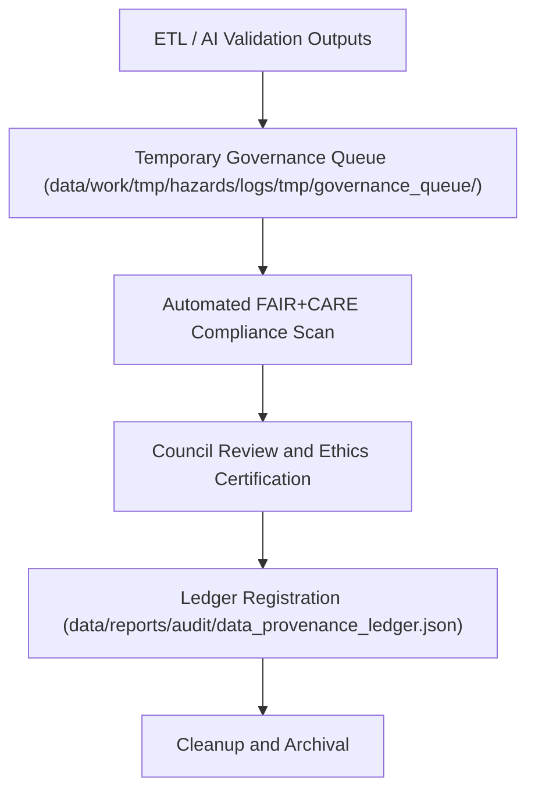

<div align="center">

# ⚖️ Kansas Frontier Matrix — **Hazard Governance Queue**
`data/work/tmp/hazards/logs/tmp/governance_queue/README.md`

**Purpose:** Temporary workspace for pending governance validation events, FAIR+CARE audits, and certification reviews for hazard data pipelines within the Kansas Frontier Matrix (KFM).  
This directory serves as the intermediate holding area for logs, manifests, and AI governance reports awaiting FAIR+CARE Council verification and official ledger registration.

[](../../../../../../../docs/standards/faircare-validation.md)
[](../../../../../../../LICENSE)
[](../../../../../../../docs/architecture/repo-focus.md)

</div>

---

## 📚 Overview

The `data/work/tmp/hazards/logs/tmp/governance_queue/` directory acts as a **temporary staging environment** for governance-related tasks awaiting FAIR+CARE Council approval and provenance certification.  
It includes pre-registered audit logs, validation results, and dataset manifests queued for synchronization with the official **KFM Governance Ledger**.

### Core Functions:
- Queue governance events, FAIR+CARE validations, and certification artifacts for approval.  
- Ensure validation outputs pass automated governance checks before official registration.  
- Provide FAIR+CARE-compliant transparency for pending ethics and audit actions.  
- Serve as a structured holding space prior to final certification and archival.  

All queued items are time-stamped, checksum-verified, and cleared automatically after governance action completion.

---

## 🗂️ Directory Layout

```plaintext
data/work/tmp/hazards/logs/tmp/governance_queue/
├── README.md                                   # This file — documentation for governance queue
│
├── pending_audit_report.json                   # Audit summary awaiting FAIR+CARE review
├── validation_pending_manifest.json            # Manifest waiting for schema and ethics certification
├── ai_model_governance_pending.json            # AI governance metadata queued for ledger registration
├── faircare_pre_certification_report.json      # FAIR+CARE ethics pre-review for current data cycle
└── metadata.json                               # Governance queue index, checksums, and linkage
```

---

## ⚙️ Governance Queue Workflow



### Workflow Description:
1. **Intake:** Validation or audit results automatically pushed into the governance queue.  
2. **Compliance Scan:** Automated FAIR+CARE checks ensure metadata completeness.  
3. **Council Review:** Governance officers review queued files for final certification.  
4. **Ledger Update:** Approved records are registered in the provenance ledger.  
5. **Cleanup:** Temporary queue cleared post-registration and certification confirmation.

---

## 🧩 Example Metadata Record

```json
{
  "id": "governance_queue_entry_hazards_v9.3.2_2024Q4",
  "items_queued": 4,
  "pending_certifications": [
    "manifest_validation",
    "ai_model_audit",
    "etl_summary_registration",
    "faircare_pre_review"
  ],
  "fairstatus": "in_review",
  "checksum_verified": true,
  "submitted_by": "@kfm-governance",
  "submitted_date": "2025-10-28T17:48:00Z",
  "governance_ref": "data/reports/audit/data_provenance_ledger.json"
}
```

---

## 🧠 FAIR+CARE Governance Alignment

| Principle | Implementation |
|------------|----------------|
| **Findable** | Queued items indexed by governance event type and certification ID. |
| **Accessible** | Open JSON-based governance queue for Council and automation workflows. |
| **Interoperable** | Aligns with FAIR+CARE and DCAT governance standards for provenance tracking. |
| **Reusable** | Retains full metadata context for each queued event. |
| **Collective Benefit** | Ensures transparent, reproducible governance actions. |
| **Authority to Control** | FAIR+CARE Council maintains certification authority over queued items. |
| **Responsibility** | Governance engineers document validation and certification readiness. |
| **Ethics** | Queue management adheres to open, transparent review and certification processes. |

All governance data referenced in:  
`data/reports/audit/data_provenance_ledger.json` and  
`data/reports/fair/data_care_assessment.json`.

---

## ⚙️ Governance Queue Artifacts

| File | Description | Format |
|------|--------------|--------|
| `pending_audit_report.json` | Audit report awaiting FAIR+CARE ethics validation. | JSON |
| `validation_pending_manifest.json` | Pending schema validation results for hazard manifests. | JSON |
| `ai_model_governance_pending.json` | Model governance details queued for ledger sync. | JSON |
| `faircare_pre_certification_report.json` | FAIR+CARE ethics pre-review before certification. | JSON |
| `metadata.json` | Governance queue index linking all pending certification items. | JSON |

All governance queue management automated through `governance_queue_sync.yml`.

---

## ⚖️ Governance & Provenance Integration

| Record | Description |
|---------|-------------|
| `metadata.json` | Captures governance queue entries and checksum registry. |
| `data/reports/audit/data_provenance_ledger.json` | Logs approvals, rejections, and FAIR+CARE certifications. |
| `data/reports/fair/data_care_assessment.json` | FAIR+CARE Council audit of queued certification records. |
| `releases/v9.3.2/manifest.zip` | Includes hashes of finalized governance queue items. |

Governance synchronization and certification tracking managed by CI/CD pipelines.

---

## 🧾 Retention & Cleanup Policy

| File Type | Retention Duration | Policy |
|------------|--------------------|--------|
| Pending Audits | 14 days | Automatically deleted after certification. |
| Pending Manifests | 7 days | Moved to validation logs post-review. |
| AI Governance Records | 30 days | Archived for Council audit traceability. |
| Metadata | Permanent | Stored for provenance and ledger verification. |

Retention automated by `governance_queue_cleanup.yml`.

---

## 🧾 Internal Use Citation

```text
Kansas Frontier Matrix (2025). Hazard Governance Queue (v9.3.2).
Temporary FAIR+CARE-certified staging environment for pending governance, validation, and certification events in hazard data pipelines.
Maintained under MCP-DL v6.3 ethical data governance and provenance verification protocols.
```

---

## 🧾 Version Notes

| Version | Date | Notes |
|----------|------|--------|
| v9.3.2 | 2025-10-28 | Added FAIR+CARE ethics pre-certification and automated governance synchronization. |
| v9.2.0 | 2024-07-15 | Introduced AI model governance and manifest pre-validation queue. |
| v9.0.0 | 2023-01-10 | Established governance queue for hazard dataset certification workflow. |

---

<div align="center">

**Kansas Frontier Matrix** · *Governance Automation × FAIR+CARE Ethics × Provenance Certification*  
[🔗 Repository](https://github.com/bartytime4life/Kansas-Frontier-Matrix) • [🧭 Docs Portal](../../../../../../../docs/) • [⚖️ Governance Ledger](../../../../../../../docs/standards/governance/)

</div>