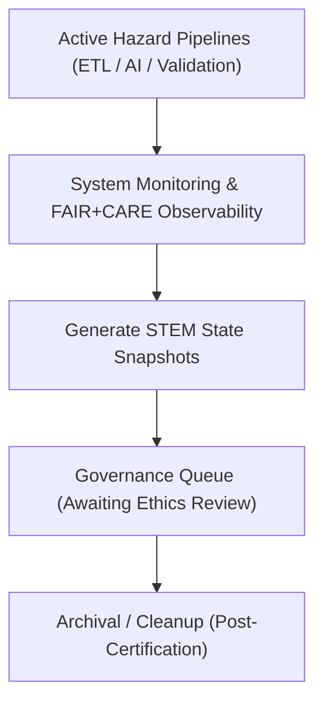

<div align="center">

# 🌐 Kansas Frontier Matrix — **Hazard STEM State Logs**
`data/work/tmp/hazards/logs/tmp/stem_state/README.md`

**Purpose:** Temporary workspace for recording the real-time *STEM State* of hazard pipelines—representing active computational, scientific, and governance status snapshots across ETL, AI, and FAIR+CARE processes in the Kansas Frontier Matrix (KFM).  
This directory maintains transient monitoring files that reflect the dynamic operational condition of hazard data and model systems.

[](../../../../../../../docs/standards/faircare-validation.md)
[](../../../../../../../LICENSE)
[](../../../../../../../docs/architecture/repo-focus.md)

</div>

---

## 📚 Overview

The `data/work/tmp/hazards/logs/tmp/stem_state/` directory captures **transient STEM state logs** that monitor the live computational, ethical, and environmental status of ongoing hazard data operations.  
It functions as a real-time observability and reproducibility checkpoint for FAIR+CARE-aligned data workflows, including ETL, AI inference, validation, and governance synchronization.

### Core Functions:
- Monitor the operational state of active ETL and AI workflows.  
- Record system resource utilization and model computation diagnostics.  
- Capture FAIR+CARE live compliance metrics for audit visibility.  
- Facilitate reproducibility through temporal state preservation snapshots.  

All STEM State logs are temporary and automatically cleared or archived post-processing once governance synchronization is complete.

---

## 🗂️ Directory Layout

```plaintext
data/work/tmp/hazards/logs/tmp/stem_state/
├── README.md                                 # This file — overview of hazard STEM state logs
│
├── pipeline_state_snapshot.json              # Snapshot of real-time ETL/AI operational context
├── ai_model_runtime_state.json               # Current model run diagnostics and explainability state
├── system_resource_monitor.log               # CPU/GPU/Memory utilization during hazard workflow execution
├── faircare_state_report.json                # FAIR+CARE live compliance monitor during processing
└── metadata.json                             # Provenance, checksum, and governance linkage record
```

---

## ⚙️ STEM State Workflow



### Workflow Description:
1. **Real-Time Capture:** Logs the operational status of ETL, validation, and AI systems.  
2. **Resource Metrics:** Monitors CPU, GPU, and memory consumption for reproducibility audits.  
3. **Ethical Tracking:** Captures FAIR+CARE compliance conditions in real time.  
4. **Governance Review:** Exports results to `data/work/tmp/hazards/logs/tmp/governance_queue/` for ethics certification.  
5. **Cleanup:** Purged after workflow completion and governance ledger update.

---

## 🧩 Example Metadata Record

```json
{
  "id": "stem_state_hazards_v9.3.2_2024Q4",
  "etl_cycle": "Q4 2024",
  "active_processes": ["etl_transform", "ai_inference_monitoring"],
  "cpu_utilization": "62.3%",
  "gpu_utilization": "74.5%",
  "memory_usage_gb": 18.2,
  "fairstatus": "compliant",
  "validator": "@kfm-system-monitor",
  "captured_at": "2025-10-28T17:50:00Z",
  "checksum": "sha256:b0d84f7ac9b83791cc6170831d2f22d3f589b7f5...",
  "governance_ref": "data/reports/audit/system_runtime_ledger.json"
}
```

---

## 🧠 FAIR+CARE Governance Alignment

| Principle | Implementation |
|------------|----------------|
| **Findable** | STEM state logs indexed by timestamp and pipeline stage. |
| **Accessible** | Stored in open JSON and text formats for reproducibility analysis. |
| **Interoperable** | Schema aligned with KFM’s FAIR+CARE telemetry schema. |
| **Reusable** | Records operational context and ethics compliance data. |
| **Collective Benefit** | Ensures open observability for computational integrity. |
| **Authority to Control** | FAIR+CARE Council oversees ethics compliance for live data operations. |
| **Responsibility** | Engineers and AI teams maintain performance transparency. |
| **Ethics** | Guarantees ethical computing resource use and data processing accountability. |

Governance linkage maintained in:  
`data/reports/audit/system_runtime_ledger.json`  
and `data/reports/fair/data_care_assessment.json`.

---

## ⚙️ STEM State Artifacts

| File | Description | Format |
|------|--------------|--------|
| `pipeline_state_snapshot.json` | Real-time snapshot of active data and ETL pipelines. | JSON |
| `ai_model_runtime_state.json` | Logs model inference context and explainability data. | JSON |
| `system_resource_monitor.log` | CPU, memory, and GPU utilization statistics. | Text |
| `faircare_state_report.json` | Tracks FAIR+CARE compliance metrics during runtime. | JSON |
| `metadata.json` | Tracks lineage, checksum, and governance linkage. | JSON |

All monitoring and validation handled by `stem_state_sync.yml`.

---

## ⚖️ Governance & Provenance Integration

| Record | Description |
|---------|-------------|
| `metadata.json` | Captures live provenance linkage and compliance metrics. |
| `data/reports/audit/system_runtime_ledger.json` | Logs runtime governance metrics and ethics records. |
| `data/reports/fair/data_care_assessment.json` | FAIR+CARE compliance data for system runtime monitoring. |
| `releases/v9.3.2/manifest.zip` | Contains runtime checksum registry for audit reproduction. |

Governance synchronization managed by FAIR+CARE-compliant CI/CD pipelines.

---

## 🧾 Retention & Cleanup Policy

| Log Type | Retention Duration | Policy |
|-----------|--------------------|--------|
| Runtime Snapshots | 24 hours | Purged automatically after workflow closure. |
| Resource Monitors | 48 hours | Archived if anomalies detected. |
| FAIR+CARE State Reports | 14 days | Retained for ethics review and audit logging. |
| Metadata | Permanent | Preserved for provenance and governance continuity. |

Automation managed by `stem_state_cleanup.yml`.

---

## 🧾 Internal Use Citation

```text
Kansas Frontier Matrix (2025). Hazard STEM State Logs (v9.3.2).
Real-time computational and ethical observability snapshots for hazard data pipelines under FAIR+CARE governance.
Maintained under MCP-DL v6.3 for transparency, performance accountability, and reproducibility.
```

---

## 🧾 Version Notes

| Version | Date | Notes |
|----------|------|--------|
| v9.3.2 | 2025-10-28 | Added FAIR+CARE live compliance tracking and resource observability. |
| v9.2.0 | 2024-07-15 | Enhanced runtime metadata logging and checksum integration. |
| v9.0.0 | 2023-01-10 | Established STEM State log workspace for live hazard monitoring. |

---

<div align="center">

**Kansas Frontier Matrix** · *Scientific Observability × FAIR+CARE Ethics × Provenance Transparency*  
[🔗 Repository](https://github.com/bartytime4life/Kansas-Frontier-Matrix) • [🧭 Docs Portal](../../../../../../../docs/) • [⚖️ Governance Ledger](../../../../../../../docs/standards/governance/)

</div>