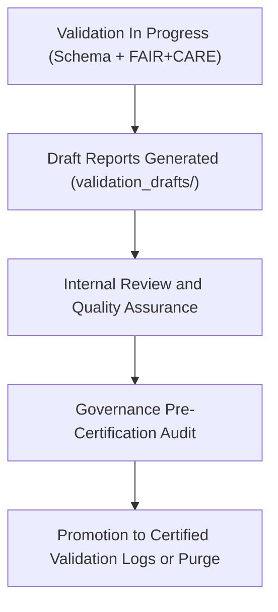

<div align="center">

# 🧾 Kansas Frontier Matrix — **Hazard Validation Draft Logs**
`data/work/tmp/hazards/logs/tmp/validation_drafts/README.md`

**Purpose:** Temporary workspace for draft validation results, QA summaries, and FAIR+CARE audit pre-reviews generated during hazard dataset testing in the Kansas Frontier Matrix (KFM).  
This directory functions as a holding zone for incomplete or in-review validation documents before their promotion to certified governance records.

[](../../../../../../../docs/standards/faircare-validation.md)
[](../../../../../../../LICENSE)
[](../../../../../../../docs/architecture/repo-focus.md)

</div>

---

## 📚 Overview

The `data/work/tmp/hazards/logs/tmp/validation_drafts/` directory stores **in-progress validation reports and pre-audit documentation** produced during the hazard data pipeline testing phase.  
These drafts are used for internal review, iterative schema corrections, and ethics evaluation before FAIR+CARE Council approval.

### Core Functions:
- Hold validation drafts for schema, ethics, and QA audits under review.  
- Support collaborative FAIR+CARE Council and engineering review cycles.  
- Serve as staging for internal testing and error correction before certification.  
- Maintain reproducibility and transparency through early metadata registration.  

All draft reports are automatically versioned and purged or promoted upon governance approval.

---

## 🗂️ Directory Layout

```plaintext
data/work/tmp/hazards/logs/tmp/validation_drafts/
├── README.md                                 # This file — documentation for hazard validation draft logs
│
├── validation_draft_report_2024Q4.json        # Draft schema and validation output under internal review
├── faircare_pre_audit_draft_2024Q4.json       # Early FAIR+CARE ethics evaluation summary
├── qa_review_notes_2024Q4.md                  # Human-readable review feedback from validation board
├── validation_errors_summary_2024Q4.csv       # Error matrix and unresolved validation issues
└── metadata.json                              # Draft provenance, governance linkage, and checksum record
```

---

## ⚙️ Validation Draft Workflow



### Workflow Description:
1. **Initial Validation:** ETL and AI pipelines produce draft reports during data testing.  
2. **Internal QA Review:** Drafts undergo technical and ethical checks by maintainers.  
3. **Pre-Audit Governance:** FAIR+CARE Council reviews draft compliance for accuracy.  
4. **Approval or Revision:** Drafts either approved for certification or flagged for rework.  
5. **Archival / Cleanup:** Non-compliant drafts removed after 30 days.

---

## 🧩 Example Metadata Record

```json
{
  "id": "validation_draft_hazards_v9.3.2_2024Q4",
  "etl_cycle": "Q4 2024",
  "reports_in_review": 3,
  "draft_status": "under_review",
  "reviewers": ["@kfm-validation-lab", "@kfm-ethics-team"],
  "issues_open": 2,
  "fairstatus": "in_review",
  "created": "2025-10-28T17:55:00Z",
  "checksum": "sha256:cb3b91c99e21b64a931d2f2a12cc773cf3de15a1...",
  "governance_ref": "data/reports/audit/data_provenance_ledger.json"
}
```

---

## 🧠 FAIR+CARE Governance Alignment

| Principle | Implementation |
|------------|----------------|
| **Findable** | Draft reports indexed by ETL cycle and dataset ID for traceability. |
| **Accessible** | Stored in open formats (JSON, CSV, Markdown) for Council review. |
| **Interoperable** | Structured according to FAIR+CARE validation schema. |
| **Reusable** | Maintains metadata and lineage records for reproducibility. |
| **Collective Benefit** | Enables collaborative audit and continuous improvement cycles. |
| **Authority to Control** | FAIR+CARE Council provides oversight on validation approvals. |
| **Responsibility** | Validators document corrections and ethical considerations. |
| **Ethics** | Ensures no uncertified data proceeds without transparent review. |

Governance linkage maintained in:  
`data/reports/audit/data_provenance_ledger.json`  
and `data/reports/fair/data_care_assessment.json`.

---

## ⚙️ Validation Draft Artifacts

| File | Description | Format |
|------|--------------|--------|
| `validation_draft_report_*.json` | Preliminary schema and QA validation outputs. | JSON |
| `faircare_pre_audit_draft_*.json` | Early-stage FAIR+CARE audit findings for review. | JSON |
| `qa_review_notes_*.md` | Internal governance and validation review notes. | Markdown |
| `validation_errors_summary_*.csv` | Summary of outstanding issues detected during validation. | CSV |
| `metadata.json` | Tracks lineage, review status, and governance linkage. | JSON |

Draft validation management automated by `validation_draft_sync.yml`.

---

## ⚖️ Governance & Provenance Integration

| Record | Description |
|---------|-------------|
| `metadata.json` | Tracks draft lineage, checksum, and validation reviewers. |
| `data/reports/audit/data_provenance_ledger.json` | Logs pre-certification governance actions. |
| `data/reports/fair/data_care_assessment.json` | Tracks FAIR+CARE draft review cycles. |
| `releases/v9.3.2/manifest.zip` | Stores checksum references for validated drafts. |

Governance synchronization automated by FAIR+CARE CI/CD pipelines.

---

## 🧾 Retention & Cleanup Policy

| File Type | Retention Duration | Policy |
|------------|--------------------|--------|
| Draft Validation Reports | 30 days | Promoted or deleted after certification review. |
| FAIR+CARE Draft Audits | 45 days | Archived upon Council approval or expiration. |
| QA Review Notes | 90 days | Retained for process improvement cycles. |
| Metadata | Permanent | Maintained for provenance tracking and governance traceability. |

Retention handled through `validation_draft_cleanup.yml`.

---

## 🧾 Internal Use Citation

```text
Kansas Frontier Matrix (2025). Hazard Validation Draft Logs (v9.3.2).
Temporary pre-certification workspace for FAIR+CARE validation drafts and schema QA reports in hazard data pipelines.
Maintained under MCP-DL v6.3 and FAIR+CARE governance for transparency and continuous validation improvement.
```

---

## 🧾 Version Notes

| Version | Date | Notes |
|----------|------|--------|
| v9.3.2 | 2025-10-28 | Added FAIR+CARE pre-certification tracking and governance integration. |
| v9.2.0 | 2024-07-15 | Expanded draft validation structure and audit review workflow. |
| v9.0.0 | 2023-01-10 | Established validation draft workspace for internal hazard QA reviews. |

---

<div align="center">

**Kansas Frontier Matrix** · *Validation Stewardship × FAIR+CARE Governance × Continuous Improvement*  
[🔗 Repository](https://github.com/bartytime4life/Kansas-Frontier-Matrix) • [🧭 Docs Portal](../../../../../../../docs/) • [⚖️ Governance Ledger](../../../../../../../docs/standards/governance/)

</div>