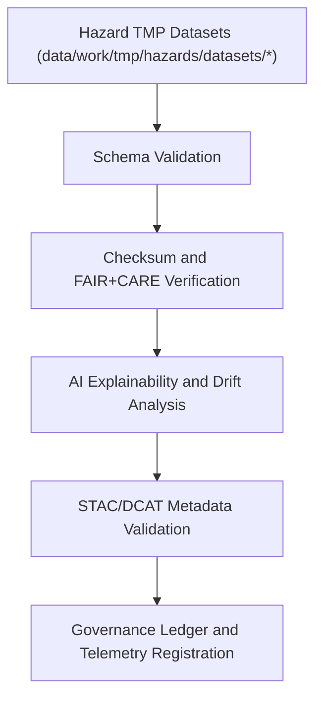

<div align="center">

# ✅ Kansas Frontier Matrix — **Hazard TMP Validation Logs**
`data/work/tmp/hazards/logs/validation/README.md`

**Purpose:**  
Central FAIR+CARE-certified repository for all **validation, audit, and ethics logs** produced during temporary hazard data processing within the Kansas Frontier Matrix (KFM).  
These logs ensure full transparency, reproducibility, and compliance across every hazard TMP pipeline under MCP-DL v6.3 governance.

[](../../../../../../docs/standards/faircare-validation.md)
[](../../../../../../LICENSE)
[](../../../../../../docs/architecture/repo-focus.md)

</div>

---

## 📚 Overview

The `data/work/tmp/hazards/logs/validation/` directory captures all **validation and QA reports** for hazard TMP operations, documenting schema compliance, FAIR+CARE scoring, checksum integrity, and governance synchronization events.  
It also includes AI explainability and model drift detection reports tied to the Focus Mode reasoning framework.

### Core Functions
- Validate hazard datasets against data contract and schema definitions.  
- Record checksum and provenance verification events.  
- Perform FAIR+CARE and AI explainability audits.  
- Log validation results and governance registration confirmations.  

---

## 🗂️ Directory Layout

```plaintext
data/work/tmp/hazards/logs/validation/
├── README.md                               # This file — documentation of hazard TMP validation logs
│
├── faircare_audit_report_2025Q4.json       # FAIR+CARE ethics validation and governance audit results
├── schema_validation_summary_2025Q4.json   # Schema compliance validation output
├── checksum_verification_2025Q4.json       # File integrity and hash registry logs
├── ai_explainability_audit_2025Q4.json     # Focus Mode AI interpretability and bias audit
├── stac_dcat_compliance_2025Q4.json        # Validation of metadata against STAC/DCAT standards
└── metadata.json                           # Provenance and governance linkage record
```

---

## ⚙️ Validation Workflow



### Workflow Description
1. **Schema Validation:** Confirms dataset adherence to FAIR+CARE-aligned data contracts.  
2. **Checksum Audit:** Validates SHA-256 hashes and digital signatures for integrity.  
3. **AI Explainability:** Assesses Focus Mode model reasoning, drift, and interpretability.  
4. **FAIR+CARE Governance:** Ethics compliance validated before promotion to staging.  
5. **Ledger Sync:** Results recorded in the AI Hazards Governance Ledger and telemetry.

---

## 🧩 Example Validation Log Record

```json
{
  "id": "hazards_validation_logs_v9.5.0_2025Q4",
  "datasets_validated": [
    "tornado_tracks_cf.geojson",
    "flood_extents_cf.geojson",
    "wildfire_perimeters_2025.geojson"
  ],
  "records_checked": 276543,
  "schema_issues_found": 0,
  "checksum_verified": true,
  "fair_care_compliance": 99.8,
  "ai_explainability_verified": true,
  "metadata_compliance": "passed",
  "fairstatus": "certified",
  "governance_synced": true,
  "telemetry_ref": "releases/v9.5.0/focus-telemetry.json",
  "governance_ref": "reports/audit/ai_hazards_ledger.json",
  "created": "2025-11-02T19:50:00Z",
  "validator": "@kfm-validation"
}
```

---

## 🧠 FAIR+CARE Governance Matrix

| Principle | Implementation |
|------------|----------------|
| **Findable** | Validation logs indexed by dataset and checksum in governance ledger. |
| **Accessible** | All reports stored in open JSON formats for internal FAIR+CARE review. |
| **Interoperable** | STAC 1.0, DCAT 3.0, and ISO 19115 compliance enforced. |
| **Reusable** | Logs maintain provenance, versioning, and ethics traceability. |
| **Collective Benefit** | Promotes transparency across all hazard QA activities. |
| **Authority to Control** | FAIR+CARE Council certifies validation logs post-review. |
| **Responsibility** | Validators document schema compliance and audit lineage. |
| **Ethics** | Ensures unbiased validation, transparency, and open reproducibility. |

Audit and lineage references stored in:  
`reports/audit/ai_hazards_ledger.json` • `reports/fair/hazards_validation_logs_summary.json`

---

## ⚙️ Validation Artifacts & QA Outputs

| File | Description | Format |
|------|--------------|--------|
| `faircare_audit_report_*.json` | FAIR+CARE governance ethics validation report. | JSON |
| `schema_validation_summary_*.json` | Schema compliance audit results. | JSON |
| `checksum_verification_*.json` | File integrity and hash registry report. | JSON |
| `ai_explainability_audit_*.json` | AI model interpretability and drift check results. | JSON |
| `stac_dcat_compliance_*.json` | Metadata validation output. | JSON |
| `metadata.json` | Provenance linkage and FAIR+CARE certification record. | JSON |

Automation managed by `hazards_validation_logs_sync.yml`.

---

## 🧾 Retention Policy

| Log Type | Retention Duration | Policy |
|-----------|--------------------|--------|
| FAIR+CARE Validation Logs | 365 days | Archived for governance and audit traceability. |
| AI Explainability Logs | 180 days | Retained for ethics re-certification review. |
| Checksum Logs | 365 days | Maintained for reproducibility validation. |
| Metadata | Permanent | Stored indefinitely under provenance ledger. |

Retention governed by `hazards_validation_logs_cleanup.yml`.

---

## 🧾 Internal Use Citation

```text
Kansas Frontier Matrix (2025). Hazard TMP Validation Logs (v9.5.0).
Comprehensive validation and audit log environment supporting FAIR+CARE ethics, AI explainability, and schema compliance.
Ensures hazard dataset integrity, provenance, and reproducibility across all TMP workflows.
```

---

## 🧾 Version Notes

| Version | Date | Notes |
|----------|------|--------|
| v9.5.0 | 2025-11-02 | Added telemetry schema v2, expanded FAIR+CARE validation, and Focus Mode explainability integration. |
| v9.3.2 | 2025-10-28 | Introduced automated STAC/DCAT metadata validation workflow. |
| v9.3.0 | 2025-10-26 | Established TMP validation logs workspace for hazard datasets. |

---

<div align="center">

**Kansas Frontier Matrix** · *Validation Accuracy × FAIR+CARE Ethics × Provenance Accountability*  
[🔗 Repository](https://github.com/bartytime4life/Kansas-Frontier-Matrix) • [🧭 Docs Portal](../../../../../../docs/) • [⚖️ Governance Ledger](../../../../../../docs/standards/governance/)

</div>