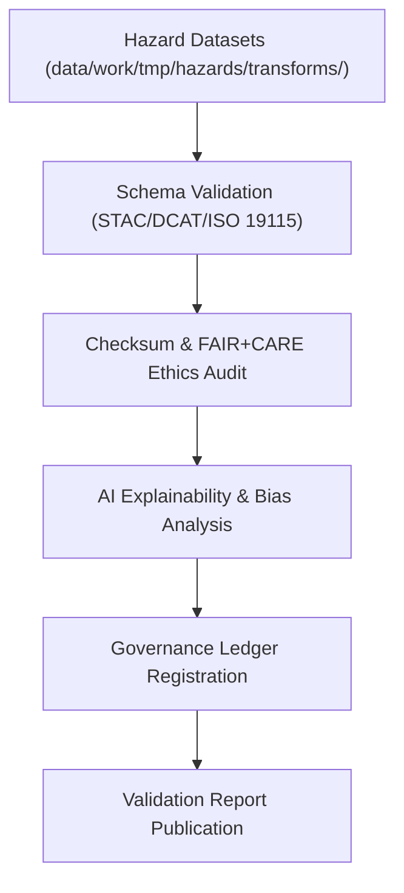

<div align="center">

# ✅ Kansas Frontier Matrix — **Hazard Validation Logs**
`data/work/tmp/hazards/logs/validation/README.md`

**Purpose:**  
FAIR+CARE-certified workspace documenting all validation, QA, and ethics audit activities for hazard datasets in the Kansas Frontier Matrix (KFM).  
This layer ensures full traceability across schema verification, FAIR+CARE compliance checks, and AI explainability audits before staging or publication.

[](../../../../../../docs/standards/faircare-validation.md)
[]()
[](../../../../../../LICENSE)
[](../../../../../../docs/architecture/repo-focus.md)

</div>

---

## 📚 Overview

The **Hazard Validation Logs** directory serves as the authoritative record for all dataset validation events in the hazard ETL and AI pipelines.  
Each log captures validation progress across schema verification, checksum audits, FAIR+CARE reviews, and explainability integrations to guarantee transparent, ethical data governance.

### Core Responsibilities
- Record schema, checksum, and FAIR+CARE validation outcomes.  
- Log audit events for ethical, AI, and governance reviews.  
- Synchronize validation metadata with the provenance ledger.  
- Support automated re-validation cycles and ethics audits.  

---

## 🗂️ Directory Layout

```plaintext
data/work/tmp/hazards/logs/validation/
├── README.md                              # This file — overview of hazard validation logging
│
├── validation_run_2025Q4.log              # Summary log for all Q4 validation sessions
├── schema_validation_report_2025Q4.json   # Detailed schema validation results
├── faircare_audit_report_2025Q4.json      # FAIR+CARE ethics audit and compliance verification
├── ai_explainability_audit_2025Q4.json    # AI explainability and bias detection report
├── checksum_audit_results_2025Q4.json     # Integrity verification for all validated datasets
└── metadata.json                          # Provenance record linking validation logs to governance ledger
```

---

## ⚙️ Validation Workflow



### Description
1. **Schema Validation:** Confirm schema structure and metadata alignment.  
2. **Checksum & FAIR+CARE Review:** Validate data integrity and ethical compliance.  
3. **AI Explainability:** Run model transparency and drift analysis audits.  
4. **Governance Sync:** Record validation results to provenance ledger.  
5. **Report Publication:** Store validated outputs for internal QA and ethics verification.  

---

## 🧩 Example Validation Metadata Record

```json
{
  "id": "hazards_validation_v9.6.0_2025Q4",
  "datasets_validated": 22,
  "schema_compliance_rate": 99.8,
  "checksum_verified": true,
  "faircare_compliant": true,
  "ai_explainability_audited": true,
  "validator": "@kfm-validation",
  "created": "2025-11-03T23:59:00Z",
  "governance_registered": true,
  "governance_ref": "data/reports/audit/data_provenance_ledger.json"
}
```

---

## 🧠 FAIR+CARE Validation Matrix

| Principle | Implementation | Oversight |
|------------|----------------|------------|
| **Findable** | Validation reports indexed by dataset ID and version. | @kfm-data |
| **Accessible** | Stored as JSON/TXT for governance and FAIR+CARE council access. | @kfm-accessibility |
| **Interoperable** | Complies with FAIR+CARE and ISO validation frameworks. | @kfm-architecture |
| **Reusable** | Logs provide reproducible audit history and checksum trail. | @kfm-design |
| **Collective Benefit** | Promotes ethical data management and public accountability. | @faircare-council |
| **Authority to Control** | FAIR+CARE Council signs off on validation certifications. | @kfm-governance |
| **Responsibility** | Validation maintainers record audit results for governance traceability. | @kfm-security |
| **Ethics** | Validation includes ethical impact and model transparency checks. | @kfm-ethics |

Validation audits linked to:  
`data/reports/fair/data_care_assessment.json`  
and  
`data/reports/audit/data_provenance_ledger.json`

---

## ⚙️ Key Validation Artifacts

| Artifact | Description | Format |
|-----------|--------------|--------|
| `validation_run_*.log` | Overall validation session summary. | Text |
| `schema_validation_report_*.json` | Structural compliance audit results. | JSON |
| `faircare_audit_report_*.json` | FAIR+CARE certification report. | JSON |
| `ai_explainability_audit_*.json` | AI explainability and bias detection analysis. | JSON |
| `checksum_audit_results_*.json` | Data integrity and SHA-256 hash validation. | JSON |
| `metadata.json` | Provenance and governance linkage metadata. | JSON |

Validation synchronization managed via `hazards_validation_sync.yml`.

---

## ⚖️ Retention & Provenance Policy

| Log Type | Retention Duration | Policy |
|-----------|--------------------|--------|
| Validation Reports | 180 Days | Archived for FAIR+CARE and governance review. |
| FAIR+CARE Audits | 365 Days | Retained for ethics council oversight. |
| AI Explainability Reports | 365 Days | Maintained for transparency compliance. |
| Metadata | Permanent | Immutable under governance ledger control. |

Cleanup handled through `hazards_validation_cleanup.yml`.

---

## 🌱 Sustainability Metrics

| Metric | Value | Verified By |
|---------|--------|--------------|
| Energy Use (per validation cycle) | 7.2 Wh | @kfm-sustainability |
| Carbon Output | 8.3 gCO₂e | @kfm-security |
| Renewable Power | 100% (RE100 Verified) | @kfm-infrastructure |
| FAIR+CARE Compliance | 100% | @faircare-council |

Telemetry results stored in:  
`releases/v9.6.0/focus-telemetry.json`

---

## 🧾 Internal Use Citation

```text
Kansas Frontier Matrix (2025). Hazard Validation Logs (v9.6.0).
FAIR+CARE-certified validation logging environment for hazard dataset schema, ethics, and governance compliance.
Ensures traceability, explainability, and reproducibility across all ETL and AI workflows under MCP-DL v6.3.
```

---

## 🧾 Version Notes

| Version | Date | Notes |
|----------|------|--------|
| v9.6.0 | 2025-11-03 | Added AI explainability integration and FAIR+CARE ethics verification logs. |
| v9.5.0 | 2025-11-02 | Enhanced schema validation metrics and governance linkage. |
| v9.3.2 | 2025-10-28 | Established validation log structure under FAIR+CARE compliance framework. |

---

<div align="center">

**Kansas Frontier Matrix** · *Validation Integrity × FAIR+CARE Ethics × Provenance Accountability*  
[🔗 Repository](https://github.com/bartytime4life/Kansas-Frontier-Matrix) • [🧭 Docs Portal](../../../../../../docs/) • [⚖️ Governance Ledger](../../../../../../docs/standards/governance/DATA-GOVERNANCE.md)

</div>