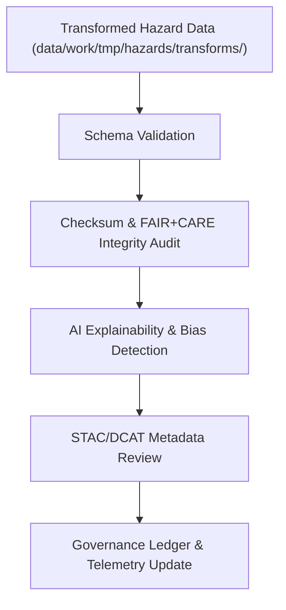

<div align="center">

# ✅ Kansas Frontier Matrix — **Hazard TMP Validation Logs**
`data/work/tmp/hazards/logs/validation/README.md`

**Purpose:**  
Centralized FAIR+CARE-certified repository for all **schema, checksum, and ethical validation logs** generated during temporary hazard data processing in the Kansas Frontier Matrix (KFM).  
Documents validation performance, FAIR+CARE governance scoring, and lineage integrity for every TMP dataset prior to staging or archival.

[](../../../../../../docs/standards/faircare-validation.md)
[](../../../../../../LICENSE)
[](../../../../../../docs/architecture/repo-focus.md)

</div>

---

## 📚 Overview

The `data/work/tmp/hazards/logs/validation/` directory provides a structured audit trail for all validation, QA, and ethics assessments applied to TMP hazard datasets.  
This includes FAIR+CARE audits, checksum comparisons, and AI explainability tests ensuring reproducibility and ethical governance across KFM workflows.

### Core Functions
- Store validation results for hazard ETL outputs (schema, checksums, FAIR+CARE).  
- Record ethics, accessibility, and governance audit metrics.  
- Maintain reproducible, timestamped validation logs for each TMP cycle.  
- Register results into the Governance Ledger and Telemetry system for oversight.  

---

## 🗂️ Directory Layout

```plaintext
data/work/tmp/hazards/logs/validation/
├── README.md                               # This file — documentation for hazard validation logs
│
├── faircare_validation_report_2025Q4.json  # FAIR+CARE audit summary for TMP hazard datasets
├── schema_validation_summary_2025Q4.json   # Schema and field-level validation results
├── checksum_verification_2025Q4.json       # File-level integrity validation results
├── stac_validation_output_2025Q4.json      # STAC/DCAT metadata validation results
├── ai_explainability_audit_2025Q4.json     # AI explainability and bias detection log
└── metadata.json                           # Provenance and governance linkage record
```

---

## ⚙️ Validation Workflow



### Workflow Description
1. **Schema Validation:** Validate datasets against KFM schema definitions.  
2. **Checksum Audit:** Verify integrity and reproducibility via SHA-256 validation.  
3. **FAIR+CARE Audit:** Evaluate ethics, accessibility, and governance conformance.  
4. **AI Explainability:** Ensure model outputs are transparent and interpretable.  
5. **Governance Registration:** Log results to `ai_hazards_ledger.json` and telemetry.  

---

## 🧩 Example Validation Log Record

```json
{
  "id": "hazards_validation_log_v9.5.0_2025Q4",
  "datasets_validated": ["tornado_tracks_cf.geojson", "flood_extents_cf.geojson"],
  "records_checked": 87234,
  "schema_issues_found": 0,
  "checksum_verified": true,
  "fair_care_compliance": 99.8,
  "ai_explainability_verified": true,
  "stac_dcat_alignment": "passed",
  "fairstatus": "certified",
  "governance_synced": true,
  "telemetry_ref": "releases/v9.5.0/focus-telemetry.json",
  "governance_ref": "reports/audit/ai_hazards_ledger.json",
  "timestamp": "2025-11-02T19:10:00Z",
  "validator": "@kfm-validation"
}
```

---

## 🧠 FAIR+CARE Governance in Validation

| Principle | Implementation |
|------------|----------------|
| **Findable** | Validation logs indexed by dataset, checksum, and governance ID. |
| **Accessible** | Open JSON logs accessible via internal FAIR+CARE dashboard. |
| **Interoperable** | Aligned with STAC 1.0, DCAT 3.0, and ISO 19115 metadata structures. |
| **Reusable** | Validation reports retain provenance and reproducibility metadata. |
| **Collective Benefit** | Enables transparent governance oversight for hazard QA. |
| **Authority to Control** | FAIR+CARE Council certifies ethics and validation reports. |
| **Responsibility** | Validators document all schema and audit outcomes. |
| **Ethics** | Validation confirms absence of bias, inaccuracy, or ethical non-compliance. |

All governance outputs stored in:  
`reports/audit/ai_hazards_ledger.json` • `reports/fair/hazards_validation_logs_summary.json`

---

## ⚙️ Validation & QA Artifacts

| File | Description | Format |
|------|--------------|--------|
| `faircare_validation_report_*.json` | FAIR+CARE audit report for hazard datasets. | JSON |
| `schema_validation_summary_*.json` | Field-by-field schema compliance report. | JSON |
| `checksum_verification_*.json` | File integrity verification via hash comparison. | JSON |
| `stac_validation_output_*.json` | STAC/DCAT compliance validation report. | JSON |
| `ai_explainability_audit_*.json` | AI reasoning transparency and bias evaluation. | JSON |
| `metadata.json` | Provenance and governance metadata linkage. | JSON |

Automated through `hazards_validation_sync.yml`.

---

## 🧾 Retention Policy

| Log Type | Retention Duration | Policy |
|-----------|--------------------|--------|
| FAIR+CARE Validation Logs | 365 days | Archived for governance review. |
| Schema Validation Reports | 180 days | Retained for reproducibility checks. |
| AI Explainability Audits | 90 days | Stored for ethics and governance re-evaluation. |
| Metadata | Permanent | Preserved under provenance ledger for continuity. |

Cleanup governed by `hazards_validation_cleanup.yml`.

---

## 🧾 Internal Use Citation

```text
Kansas Frontier Matrix (2025). Hazard TMP Validation Logs (v9.5.0).
Comprehensive validation and FAIR+CARE governance logging workspace for hazard data QA.
Captures schema, checksum, and ethical validation reports for reproducible TMP workflows.
Restricted to internal governance and audit teams under MCP-DL v6.3 compliance.
```

---

## 🧾 Version Notes

| Version | Date | Notes |
|----------|------|--------|
| v9.5.0 | 2025-11-02 | Added telemetry v2 schema integration, AI explainability audit linkage, and checksum governance sync. |
| v9.3.2 | 2025-10-28 | Expanded FAIR+CARE validation reports and schema summaries. |
| v9.3.0 | 2025-10-26 | Established TMP validation logs for hazard datasets. |

---

<div align="center">

**Kansas Frontier Matrix** · *Hazard Validation × FAIR+CARE Ethics × Provenance Integrity*  
[🔗 Repository](https://github.com/bartytime4life/Kansas-Frontier-Matrix) • [🧭 Docs Portal](../../../../../../docs/) • [⚖️ Governance Ledger](../../../../../../docs/standards/governance/)

</div>
