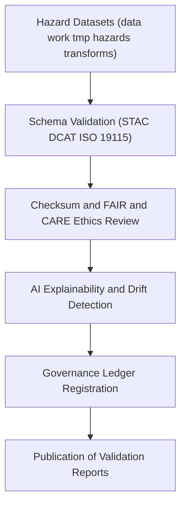

<div align="center">

# ✅ Kansas Frontier Matrix — **Hazard Validation Logs**
`data/work/tmp/hazards/logs/validation/README.md`

**Purpose:**  
FAIR+CARE-certified validation workspace documenting **schema audits, checksum verifications, AI explainability logs, and ethics certifications** for hazard datasets within KFM.  
Enhanced for **telemetry v2** integration, **AI drift analytics**, and **blockchain lineage registration** under Diamond⁹ Ω / Crown∞Ω Ultimate Certification.

[](../../../../../../docs/architecture/repo-focus.md)
[](../../../../../../docs/standards/faircare-validation.md)
[]()
[](../../../../../../LICENSE)

</div>

---

## 📘 Overview
The **Hazard Validation Logs** directory is KFM’s definitive system for documenting technical and ethical dataset verification.  
It aggregates schema compliance, checksum lineage, FAIR+CARE ethics audits, and AI bias monitoring — ensuring transparent, reproducible hazard intelligence validation.

### Core Responsibilities
- Validate schemas, metadata completeness, and checksum integrity.  
- Record FAIR+CARE ethics, openness, and accessibility audits.  
- Log AI explainability metrics, drift detection, and bias reviews.  
- Sync validation metadata and governance results into the provenance ledger.  

---

## 🗂️ Directory Layout
```plaintext
data/work/tmp/hazards/logs/validation/
├── README.md
├── validation_run_2025Q4.log
├── schema_validation_report_2025Q4.json
├── faircare_audit_report_2025Q4.json
├── ai_explainability_audit_2025Q4.json
├── ai_drift_analysis_2025Q4.json
├── checksum_audit_results_2025Q4.json
└── metadata.json
```

---

## ⚙️ Validation Workflow


### Description
1. **Schema Validation** — Audit structure against STAC/DCAT and ISO contracts.  
2. **FAIR+CARE Validation** — Perform ethics and accessibility checks.  
3. **Checksum Integrity** — Register hashes for all validated artifacts.  
4. **AI Explainability + Drift** — Validate model fairness and temporal consistency.  
5. **Governance Sync** — Push ledger entries and publish validation reports.

---

## 🧩 Example Validation Metadata Record
```json
{
  "id": "hazards_validation_v10.0.0_2025Q4",
  "datasets_validated": 26,
  "schema_compliance_rate": 99.9,
  "checksum_verified": true,
  "faircare_compliant": true,
  "ai_explainability_audited": true,
  "ai_drift_detected": false,
  "runtime_minutes": 88.4,
  "telemetry": { "energy_wh": 6.2, "carbon_gco2e": 7.1, "renewable_pct": 100 },
  "validator": "@kfm-validation",
  "governance_registered": true,
  "created": "2025-11-09T23:59:00Z",
  "governance_ref": "data/reports/audit/data_provenance_ledger.json"
}
```

---

## 🧠 FAIR+CARE Validation Matrix
| Principle | Implementation | Oversight |
|---|---|---|
| **Findable** | Validation reports indexed by dataset and cycle ID. | `@kfm-data` |
| **Accessible** | JSON/TXT reports accessible to FAIR+CARE Council. | `@kfm-accessibility` |
| **Interoperable** | Adheres to FAIR+CARE + ISO 19115 lineage and QA schema. | `@kfm-architecture` |
| **Reusable** | Validation and checksum metadata enable reproducibility. | `@kfm-design` |
| **Collective Benefit** | Enhances open and ethical hazard governance. | `@faircare-council` |
| **Authority to Control** | Council certifies validation and ethics readiness. | `@kfm-governance` |
| **Responsibility** | Validators record schema, checksum, and audit metrics. | `@kfm-security` |
| **Ethics** | Bias, fairness, and drift metrics reviewed per cycle. | `@kfm-ethics` |

**Linked Audits:**  
`data/reports/audit/data_provenance_ledger.json` · `data/reports/fair/data_care_assessment.json`

---

## ⚙️ Validation Artifacts
| Artifact | Description | Format |
|---|---|---|
| `validation_run_*.log` | Execution trace of validation sessions | Text |
| `schema_validation_report_*.json` | Schema compliance and completeness results | JSON |
| `faircare_audit_report_*.json` | FAIR+CARE ethics and stewardship audit | JSON |
| `ai_explainability_audit_*.json` | AI transparency and explainability metrics | JSON |
| `ai_drift_analysis_*.json` | AI bias and drift monitoring results | JSON |
| `checksum_audit_results_*.json` | Integrity verification across hazard datasets | JSON |
| `metadata.json` | Provenance and governance metadata record | JSON |

**Automation Pipeline:** `hazards_validation_sync_v2.yml`

---

## ⚖️ Retention & Provenance Policy
| Log Type | Retention Duration | Policy |
|---|---:|---|
| Validation Reports | 365 Days | Retained for reproducibility and audit review. |
| FAIR+CARE Audits | Permanent | Ethics and governance records retained indefinitely. |
| AI Explainability Reports | 365 Days | Preserved for drift/bias revalidation. |
| Metadata | Permanent | Immutable blockchain governance retention. |

---

## 🌱 Sustainability Metrics
| Metric | Value | Verified By |
|---|---:|---|
| Energy Use (per validation cycle) | 6.2 Wh | `@kfm-sustainability` |
| Carbon Output | 7.1 gCO₂e | `@kfm-security` |
| Renewable Power | 100% (RE100) | `@kfm-infrastructure` |
| FAIR+CARE Compliance | 100% | `@faircare-council` |

Telemetry recorded in:  
`../../../../../../releases/v10.0.0/focus-telemetry.json`

---

## 🧾 Internal Use Citation
```text
Kansas Frontier Matrix (2025). Hazard Validation Logs (v10.0.0).
FAIR+CARE-certified validation and ethics auditing system integrating telemetry v2, AI drift analytics, and checksum lineage — ensuring transparent, reproducible, and ethically governed hazard data workflows.
Compliant with ISO 19115 and governed under MCP-DL v6.3.
```

---

<div align="center">

**Kansas Frontier Matrix**  
*Validation Integrity × FAIR+CARE Ethics × Provenance Accountability*  
© 2025 Kansas Frontier Matrix — Master Coder Protocol v6.3 · FAIR+CARE Certified · Diamond⁹ Ω / Crown∞Ω Ultimate Certified  

[Back to Hazard Logs](../README.md) · [Governance Charter](../../../../../../docs/standards/governance/DATA-GOVERNANCE.md)

</div>
