<div align="center">

# ✅ Kansas Frontier Matrix — **Hazard Validation Logs**
`data/work/tmp/hazards/logs/validation/README.md`

**Purpose:**  
FAIR+CARE-certified validation workspace documenting all **schema checks, checksum audits, AI explainability reports, and ethics certifications** for hazard datasets in the Kansas Frontier Matrix (KFM).  
Guarantees traceability, reproducibility, and ethical governance across the hazard ETL and AI pipelines.

[](../../../../../../docs/architecture/repo-focus.md)
[](../../../../../../docs/standards/faircare-validation.md)
[]()
[](../../../../../../LICENSE)

</div>

---

## 📘 Overview

The **Hazard Validation Logs** directory serves as the central documentation hub for dataset validation and QA activities.  
It integrates schema verification, checksum tracking, FAIR+CARE ethics auditing, and AI bias monitoring to certify all hazard-related outputs for governance publication.

### Core Responsibilities
- Validate schema and checksum integrity across datasets.  
- Record FAIR+CARE ethics and transparency audits.  
- Log AI explainability, bias, and drift analyses.  
- Synchronize validation metadata with governance ledgers.  

---

## 🗂️ Directory Layout

```plaintext
data/work/tmp/hazards/logs/validation/
├── README.md
├── validation_run_2025Q4.log
├── schema_validation_report_2025Q4.json
├── faircare_audit_report_2025Q4.json
├── ai_explainability_audit_2025Q4.json
├── checksum_audit_results_2025Q4.json
└── metadata.json
```

---

## ⚙️ Validation Workflow

```mermaid
flowchart TD
    A["Hazard Datasets (data/work/tmp/hazards/transforms/)"] --> B["Schema Validation (STAC · DCAT · ISO 19115)"]
    B --> C["Checksum + FAIR+CARE Ethics Review"]
    C --> D["AI Explainability + Bias Audit"]
    D --> E["Governance Ledger Registration"]
    E --> F["Validation Report Publication"]
```



### Workflow Description
1. **Schema Validation:** Confirm structure alignment with data contract standards.  
2. **Checksum & FAIR+CARE Review:** Verify data integrity and ethics compliance.  
3. **AI Explainability:** Audit transparency and detect bias or drift.  
4. **Governance Sync:** Register validation results to the provenance ledger.  
5. **Publication:** Export reports for ethics review and audit traceability.  

---

## 🧩 Example Validation Metadata Record

```json
{
  "id": "hazards_validation_v9.7.0_2025Q4",
  "datasets_validated": 22,
  "schema_compliance_rate": 99.8,
  "checksum_verified": true,
  "faircare_compliant": true,
  "ai_explainability_audited": true,
  "validator": "@kfm-validation",
  "created": "2025-11-06T23:59:00Z",
  "governance_registered": true,
  "governance_ref": "data/reports/audit/data_provenance_ledger.json"
}
```

---

## 🧠 FAIR+CARE Validation Matrix

| Principle | Implementation | Oversight |
|------------|----------------|------------|
| **Findable** | Validation reports indexed by dataset and cycle ID. | @kfm-data |
| **Accessible** | JSON/TXT formats open for audit and FAIR+CARE council review. | @kfm-accessibility |
| **Interoperable** | Conforms to FAIR+CARE and ISO QA frameworks. | @kfm-architecture |
| **Reusable** | Logs maintain checksum and ethics trace for reproducibility. | @kfm-design |
| **Collective Benefit** | Strengthens transparency in environmental hazard governance. | @faircare-council |
| **Authority to Control** | FAIR+CARE Council validates audit readiness. | @kfm-governance |
| **Responsibility** | Validators record all audits and schema QA events. | @kfm-security |
| **Ethics** | AI explainability and ethical impact checks enforced. | @kfm-ethics |

**Linked Audits:**  
`data/reports/audit/data_provenance_ledger.json`  
`data/reports/fair/data_care_assessment.json`

---

## ⚙️ Validation Artifacts

| Artifact | Description | Format |
|-----------|--------------|--------|
| `validation_run_*.log` | Session summary of all validation activities. | Text |
| `schema_validation_report_*.json` | Schema audit and compliance verification report. | JSON |
| `faircare_audit_report_*.json` | FAIR+CARE ethics and validation audit results. | JSON |
| `ai_explainability_audit_*.json` | Bias, drift, and explainability metrics for AI models. | JSON |
| `checksum_audit_results_*.json` | SHA-256 checksum and integrity record. | JSON |
| `metadata.json` | Provenance and governance linkage reference. | JSON |

**Automation Pipeline:** `hazards_validation_sync.yml`

---

## ⚖️ Retention & Provenance Policy

| Log Type | Retention Duration | Policy |
|-----------|--------------------|--------|
| Validation Reports | 180 Days | Archived for governance and re-audit review. |
| FAIR+CARE Audits | 365 Days | Retained for ethics and certification review. |
| AI Explainability Reports | 365 Days | Preserved for bias and transparency compliance. |
| Metadata | Permanent | Immutable under blockchain governance. |

Cleanup automation handled by `hazards_validation_cleanup.yml`.

---

## 🌱 Sustainability Metrics

| Metric | Value | Verified By |
|---------|--------|--------------|
| Energy Use (per validation cycle) | 7.1 Wh | @kfm-sustainability |
| Carbon Output | 8.1 gCO₂e | @kfm-security |
| Renewable Power | 100% (RE100) | @kfm-infrastructure |
| FAIR+CARE Compliance | 100% | @faircare-council |

Telemetry data recorded in:  
`releases/v9.7.0/focus-telemetry.json`

---

## 🧾 Internal Use Citation

```text
Kansas Frontier Matrix (2025). Hazard Validation Logs (v9.7.0).
FAIR+CARE-certified validation logging and ethics auditing system ensuring traceability, transparency, and reproducibility across hazard ETL and AI workflows.
Compliant with ISO 19115 and governed under MCP-DL v6.3 standards.
```

---

## 🕰️ Version History

| Version | Date | Author | Summary |
|----------|------|--------|----------|
| v9.7.0 | 2025-11-06 | `@kfm-validation` | Upgraded for v9.7.0; telemetry schema added, FAIR+CARE revalidation automated. |
| v9.6.0 | 2025-11-03 | `@kfm-validation` | Added AI explainability integration and checksum audit expansion. |

---

<div align="center">

**Kansas Frontier Matrix**  
*Validation Integrity × FAIR+CARE Ethics × Provenance Accountability*  
© 2025 Kansas Frontier Matrix — Master Coder Protocol v6.3 · FAIR+CARE Certified · Diamond⁹ Ω / Crown∞Ω Ultimate Certified  

[Back to Hazard Logs](../README.md) · [Governance Charter](../../../../../../docs/standards/governance/DATA-GOVERNANCE.md)

</div>