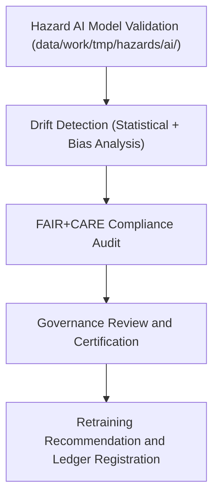

<div align="center">

# 🤖 Kansas Frontier Matrix — **AI Drift Reports for Hazard Validation**
`data/work/tmp/hazards/logs/validation/ai_drift_reports/README.md`

**Purpose:** Repository for AI drift detection, monitoring, and ethics compliance reports generated during hazard validation workflows within the Kansas Frontier Matrix (KFM).  
This workspace captures data and concept drift analyses across hazard AI models, ensuring continuous FAIR+CARE alignment, transparency, and reproducibility in model validation processes.

[](../../../../../../docs/standards/faircare-validation.md)
[](../../../../../../LICENSE)
[](../../../../../../docs/architecture/repo-focus.md)

</div>

---

## 📚 Overview

The `data/work/tmp/hazards/logs/validation/ai_drift_reports/` directory holds **AI drift monitoring reports** created during model validation for hazard risk forecasting, energy resilience, and environmental prediction systems in KFM.  
These reports record model performance shifts, bias variations, and FAIR+CARE compliance metrics between validation cycles.

### Core Functions:
- Detect and record feature or concept drift in hazard prediction AI models.  
- Evaluate ethical model performance consistency using FAIR+CARE principles.  
- Support governance-led retraining and validation transparency.  
- Provide reproducible lineage linking validation cycles and model versions.  

All drift reports are checksum-verified, ethically reviewed, and registered in the **AI Governance Ledger** for provenance tracking and FAIR+CARE certification.

---

## 🗂️ Directory Layout

```plaintext
data/work/tmp/hazards/logs/validation/ai_drift_reports/
├── README.md                               # This file — overview of AI drift reports
│
├── drift_detection_report_2024Q4.json      # Model drift detection summary for Q4 2024 validation cycle
├── bias_drift_analysis_2024Q4.json         # FAIR+CARE bias audit across AI model inference layers
├── feature_distribution_drift_2024Q4.csv   # Statistical drift measures (PSI, KS test, KL divergence)
├── retraining_recommendation_2024Q4.md     # Governance summary with retraining and ethics recommendations
└── metadata.json                           # Provenance, checksum, and governance linkage
```

---

## ⚙️ AI Drift Validation Workflow



### Workflow Description:
1. **Drift Detection:** Evaluate shifts in model features or outputs using statistical tests.  
2. **Bias Audit:** Assess ethical bias drift using demographic and spatial analysis.  
3. **Governance Review:** FAIR+CARE Council reviews drift metrics and performance logs.  
4. **Certification:** Validation logs approved or flagged for retraining under FAIR+CARE.  
5. **Retention:** Results archived and registered within the KFM Provenance Ledger.

---

## 🧩 Example Metadata Record

```json
{
  "id": "ai_drift_report_hazards_v9.3.2_2024Q4",
  "model_name": "hazards_risk_forecaster_v3",
  "validation_cycle": "Q4 2024",
  "drift_detected": true,
  "max_psi": 0.27,
  "bias_shift_score": 0.08,
  "retraining_recommended": true,
  "fairstatus": "certified",
  "audited_by": "@kfm-ai-gov",
  "created": "2025-10-28T18:00:00Z",
  "checksum": "sha256:1a5b74f01af07e32a0e187cfcbfbcd28cb55bfe4...",
  "governance_ref": "data/reports/audit/ai_hazards_ledger.json"
}
```

---

## 🧠 FAIR+CARE Governance Alignment

| Principle | Implementation |
|------------|----------------|
| **Findable** | Drift reports indexed by model name, version, and validation cycle. |
| **Accessible** | Stored in open JSON, CSV, and Markdown formats for audit review. |
| **Interoperable** | Structured according to FAIR+CARE and DCAT AI validation schema. |
| **Reusable** | Captures lineage between AI versions and validation metrics. |
| **Collective Benefit** | Ensures ethically consistent AI performance for hazard resilience. |
| **Authority to Control** | FAIR+CARE Council authorizes retraining or model retirement decisions. |
| **Responsibility** | Model validators document drift monitoring outcomes transparently. |
| **Ethics** | Upholds transparency, fairness, and ethical reproducibility standards. |

Governance and audit linkages stored in:  
`data/reports/audit/ai_hazards_ledger.json`  
and `data/reports/fair/data_care_assessment.json`.

---

## ⚙️ Validation & QA Artifacts

| File | Description | Format |
|------|--------------|--------|
| `drift_detection_report_*.json` | Core drift detection and performance summary. | JSON |
| `bias_drift_analysis_*.json` | Bias and ethical fairness drift audit. | JSON |
| `feature_distribution_drift_*.csv` | PSI, KS, and KL divergence feature-level statistics. | CSV |
| `retraining_recommendation_*.md` | Human-readable summary of retraining and governance outcomes. | Markdown |
| `metadata.json` | Captures lineage, checksum, and governance metadata. | JSON |

Automated governance validation handled by `ai_drift_monitor_sync.yml`.

---

## ⚖️ Governance & Provenance Integration

| Record | Description |
|---------|-------------|
| `metadata.json` | Tracks AI validation lineage and FAIR+CARE audit linkage. |
| `data/reports/audit/ai_hazards_ledger.json` | Logs drift analysis, retraining triggers, and ethics certifications. |
| `data/reports/fair/data_care_assessment.json` | FAIR+CARE ethics audit and compliance documentation. |
| `releases/v9.3.2/manifest.zip` | Registry of all AI validation artifacts and checksum records. |

Governance synchronization automated via AI compliance pipelines.

---

## 🧾 Retention & Certification Policy

| Report Type | Retention Duration | Policy |
|--------------|--------------------|--------|
| Drift Reports | 365 days | Archived post-validation for retraining analysis. |
| Bias Audits | 365 days | Retained for longitudinal FAIR+CARE ethics tracking. |
| Retraining Notes | Permanent | Stored in AI governance ledger for transparency. |
| Metadata | Permanent | Preserved for lineage verification and compliance review. |

Retention managed by `ai_drift_validation_cleanup.yml`.

---

## 🧾 Internal Use Citation

```text
Kansas Frontier Matrix (2025). AI Drift Reports for Hazard Validation (v9.3.2).
FAIR+CARE-certified drift monitoring and bias validation reports for hazard AI models, supporting ethical reproducibility and model transparency under MCP-DL v6.3.
```

---

## 🧾 Version Notes

| Version | Date | Notes |
|----------|------|--------|
| v9.3.2 | 2025-10-28 | Added FAIR+CARE drift monitoring and retraining governance linkage. |
| v9.2.0 | 2024-07-15 | Introduced bias drift detection and PSI statistical reporting. |
| v9.0.0 | 2023-01-10 | Established AI drift reporting directory for hazard model validation. |

---

<div align="center">

**Kansas Frontier Matrix** · *AI Reliability × FAIR+CARE Governance × Ethical Transparency*  
[🔗 Repository](https://github.com/bartytime4life/Kansas-Frontier-Matrix) • [🧭 Docs Portal](../../../../../../docs/) • [⚖️ AI Governance Ledger](../../../../../../docs/standards/governance/AI-GOVERNANCE.md)

</div>