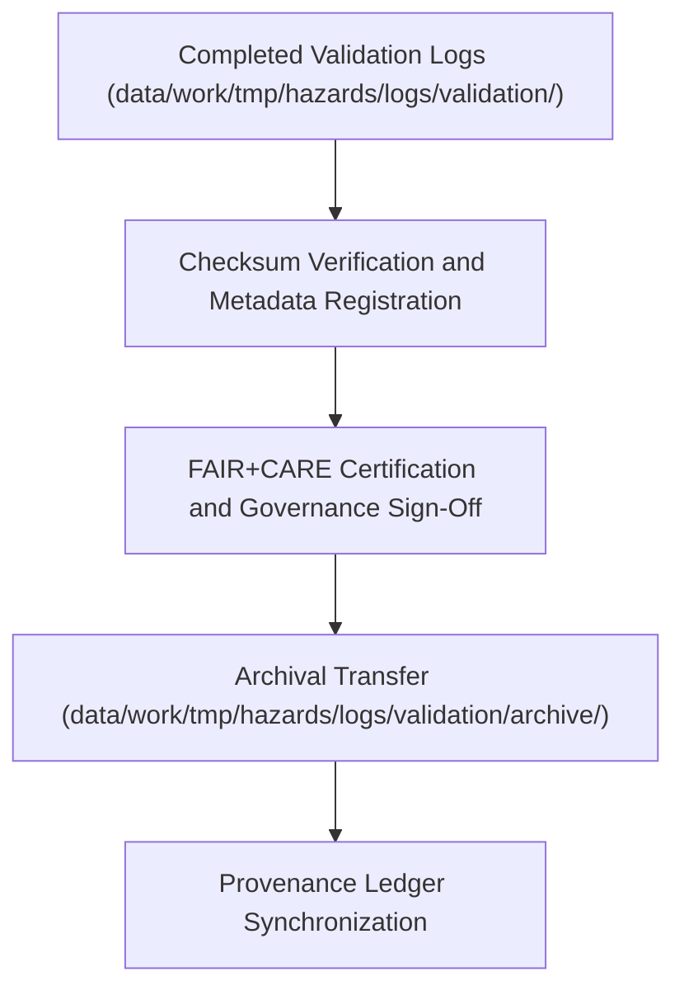

<div align="center">

# 🗂️ Kansas Frontier Matrix — **Hazard Validation Archive**
`data/work/tmp/hazards/logs/validation/archive/README.md`

**Purpose:** Long-term archival workspace for completed hazard validation reports, FAIR+CARE ethics certifications, and governance logs within the Kansas Frontier Matrix (KFM).  
This directory preserves historical validation data and provenance metadata to ensure reproducibility, transparency, and ethical accountability under FAIR+CARE governance.

[](../../../../../../docs/standards/faircare-validation.md)
[](../../../../../../LICENSE)
[](../../../../../../docs/architecture/repo-focus.md)

</div>

---

## 📚 Overview

The `data/work/tmp/hazards/logs/validation/archive/` directory contains **archived validation logs and FAIR+CARE certifications** for all hazard datasets that have passed final governance review.  
These records serve as immutable validation artifacts ensuring data quality, compliance, and ethical certification continuity across project releases.

### Core Functions:
- Preserve validation results and FAIR+CARE certifications from completed data cycles.  
- Maintain historical governance audit and ethics compliance records.  
- Provide lineage linkage for long-term reproducibility and FAIR+CARE traceability.  
- Support retrospective validation reviews and re-certification audits.  

All archived validation files are checksum-verified, digitally signed, and linked to the **KFM Provenance Ledger**.

---

## 🗂️ Directory Layout

```plaintext
data/work/tmp/hazards/logs/validation/archive/
├── README.md                                    # This file — documentation for hazard validation archive
│
├── validation_archive_report_2024Q4.json        # Archived validation report for Q4 2024
├── faircare_certification_record_2024Q4.json    # FAIR+CARE ethics certification log for archived validations
├── validation_audit_log_2024Q4.log              # Governance trace and validation lineage record
├── schema_validation_archive_2024Q4.csv         # Archived schema compliance results for all validated datasets
└── metadata.json                                # Provenance, checksum, and governance linkage metadata
```

---

## ⚙️ Validation Archival Workflow



### Workflow Description:
1. **Validation Completion:** Datasets pass schema and ethics verification in the active validation directory.  
2. **Checksum Registration:** File integrity verified and checksums stored in manifest registry.  
3. **Governance Certification:** FAIR+CARE Council approves ethics and compliance reports.  
4. **Archival Transfer:** Certified files moved to `archive/` for permanent storage.  
5. **Ledger Update:** Provenance ledger updated to link validation event lineage.

---

## 🧩 Example Metadata Record

```json
{
  "id": "validation_archive_hazards_v9.3.2_2024Q4",
  "etl_cycle": "Q4 2024",
  "files_archived": 12,
  "certifications_included": [
    "FAIR+CARE Ethics",
    "Schema Compliance",
    "Checksum Verification"
  ],
  "archived_by": "@kfm-validation-lab",
  "archival_date": "2025-10-28T18:10:00Z",
  "fairstatus": "certified",
  "checksum": "sha256:57e2aa41bb6d0cd833f902742e48cc793c2e24d7...",
  "governance_ref": "data/reports/audit/data_provenance_ledger.json"
}
```

---

## 🧠 FAIR+CARE Governance Alignment

| Principle | Implementation |
|------------|----------------|
| **Findable** | Archived validation logs indexed by ETL cycle, dataset, and certification type. |
| **Accessible** | Stored in open formats (JSON, CSV, text) under controlled internal access. |
| **Interoperable** | Aligned with FAIR+CARE metadata and governance schemas. |
| **Reusable** | Contains lineage, schema references, and checksum validation. |
| **Collective Benefit** | Promotes transparency, reproducibility, and ethical stewardship. |
| **Authority to Control** | FAIR+CARE Council maintains archival certification oversight. |
| **Responsibility** | Validation and governance teams ensure accurate certification logging. |
| **Ethics** | Retains verified FAIR+CARE compliance metadata to ensure accountability. |

All audit results referenced in:  
`data/reports/audit/data_provenance_ledger.json`  
and `data/reports/fair/data_care_assessment.json`.

---

## ⚙️ Validation Archive Artifacts

| File | Description | Format |
|------|--------------|--------|
| `validation_archive_report_*.json` | Full validation result summaries for archived datasets. | JSON |
| `faircare_certification_record_*.json` | Ethics and FAIR+CARE compliance record for archived validations. | JSON |
| `validation_audit_log_*.log` | Log of archival lineage and certification sync. | Text |
| `schema_validation_archive_*.csv` | Field-by-field schema compliance results. | CSV |
| `metadata.json` | Captures checksum registry and governance linkage. | JSON |

Archival automation managed by `validation_archive_sync.yml`.

---

## ⚖️ Governance & Provenance Integration

| Record | Description |
|---------|-------------|
| `metadata.json` | Records archival lineage, certification linkages, and checksum details. |
| `data/reports/audit/data_provenance_ledger.json` | Logs archival activity and FAIR+CARE certification. |
| `data/reports/fair/data_care_assessment.json` | Contains annual FAIR+CARE ethics assessments. |
| `releases/v9.3.2/manifest.zip` | Includes checksum manifest for all archived validations. |

Governance synchronization handled automatically via CI/CD FAIR+CARE workflows.

---

## 🧾 Retention & Certification Policy

| Record Type | Retention Duration | Policy |
|--------------|--------------------|--------|
| Validation Reports | Permanent | Archived indefinitely for governance and audit reference. |
| FAIR+CARE Certifications | Permanent | Maintained for ethics and provenance verification. |
| Governance Logs | 365 days | Archived for retrievable traceability. |
| Metadata | Permanent | Preserved as part of certification lineage chain. |

Retention managed through `validation_archive_cleanup.yml`.

---

## 🧾 Internal Use Citation

```text
Kansas Frontier Matrix (2025). Hazard Validation Archive (v9.3.2).
Governance-certified archival repository preserving hazard validation reports, FAIR+CARE ethics audits, and provenance metadata for reproducible scientific stewardship.
Maintained under MCP-DL v6.3 and FAIR+CARE ethics frameworks for transparency and traceability.
```

---

## 🧾 Version Notes

| Version | Date | Notes |
|----------|------|--------|
| v9.3.2 | 2025-10-28 | Added FAIR+CARE ethics validation registry and checksum manifest integration. |
| v9.2.0 | 2024-07-15 | Introduced schema validation archival with automated provenance registration. |
| v9.0.0 | 2023-01-10 | Established validation archive directory for hazard governance continuity. |

---

<div align="center">

**Kansas Frontier Matrix** · *Validation Provenance × FAIR+CARE Governance × Data Ethics Stewardship*  
[🔗 Repository](https://github.com/bartytime4life/Kansas-Frontier-Matrix) • [🧭 Docs Portal](../../../../../../docs/) • [⚖️ Governance Ledger](../../../../../../docs/standards/governance/)

</div>