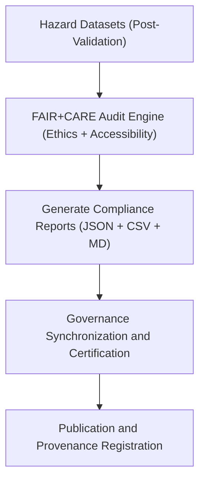

<div align="center">

# 🧮 Kansas Frontier Matrix — **Hazard FAIR+CARE Validation Logs**
`data/work/tmp/hazards/logs/validation/faircare/README.md`

**Purpose:** Repository for FAIR+CARE audit, ethics validation, and governance synchronization reports related to hazard data pipelines in the Kansas Frontier Matrix (KFM).  
This workspace ensures that all hazard datasets undergo continuous compliance verification for *Findability, Accessibility, Interoperability, Reusability* (FAIR) and *Collective Benefit, Authority to Control, Responsibility, Ethics* (CARE) standards.

[](../../../../../../docs/standards/faircare-validation.md)
[](../../../../../../LICENSE)
[](../../../../../../docs/architecture/repo-focus.md)

</div>

---

## 📚 Overview

The `data/work/tmp/hazards/logs/validation/faircare/` directory stores **FAIR+CARE compliance validation reports and governance audit logs** produced during hazard data ETL, validation, and publication workflows.  
These files ensure KFM datasets uphold ethical data stewardship, accessibility, and provenance standards defined under FAIR+CARE governance.

### Core Functions:
- Validate hazard datasets against FAIR+CARE metrics.  
- Record ethics and accessibility audits for every ETL and AI cycle.  
- Synchronize validation results with the governance and provenance ledgers.  
- Provide evidence of compliance for audits, publications, and certifications.  

All records here are checksum-verified, timestamped, and certified under FAIR+CARE governance protocols.

---

## 🗂️ Directory Layout

```plaintext
data/work/tmp/hazards/logs/validation/faircare/
├── README.md                                 # This file — documentation for FAIR+CARE validation logs
│
├── faircare_validation_report_2024Q4.json    # Comprehensive FAIR+CARE compliance results for Q4 2024
├── ethics_audit_summary_2024Q4.json          # Ethics and governance audit findings
├── faircare_scorecard_2024Q4.csv             # Quantitative FAIR+CARE scoring matrix
├── governance_validation_snapshot_2024Q4.md  # Governance digest summarizing audit results
└── metadata.json                             # Provenance, checksum, and certification linkage
```

---

## ⚙️ FAIR+CARE Validation Workflow



### Workflow Description:
1. **Input Validation:** Audits use validated hazard data outputs as input.  
2. **FAIR+CARE Audit:** Compliance assessed using automated FAIR+CARE scoring framework.  
3. **Governance Logging:** Results stored in the provenance ledger for transparency.  
4. **Certification:** FAIR+CARE Council reviews and certifies compliance.  
5. **Publication:** Reports shared with governance and ethics documentation systems.

---

## 🧩 Example Metadata Record

```json
{
  "id": "faircare_validation_hazards_v9.3.2_2024Q4",
  "etl_cycle": "Q4 2024",
  "datasets_validated": 12,
  "fair_score": 99.1,
  "care_score": 99.4,
  "fairstatus": "certified",
  "audited_by": "@kfm-ethics-board",
  "created": "2025-10-28T18:15:00Z",
  "checksum": "sha256:6e86a0b1f20b3e99c0c72aef99a558c26b49b3d3...",
  "governance_ref": "data/reports/fair/data_care_assessment.json"
}
```

---

## 🧠 FAIR+CARE Governance Summary

| Principle | Implementation |
|------------|----------------|
| **Findable** | All validated datasets linked with persistent identifiers and metadata. |
| **Accessible** | Hazard data released under open-access, non-restrictive terms. |
| **Interoperable** | Data aligned with STAC/DCAT FAIR schema. |
| **Reusable** | Provenance and checksum records ensure reproducibility. |
| **Collective Benefit** | Enables equitable data use for hazard resilience research. |
| **Authority to Control** | FAIR+CARE Council oversees ethics validation and certification. |
| **Responsibility** | Validation teams ensure transparency and data quality assurance. |
| **Ethics** | Verifies all datasets meet ethical data-sharing standards. |

Audit and governance outcomes registered in:  
`data/reports/audit/data_provenance_ledger.json` and  
`data/reports/fair/data_care_assessment.json`.

---

## ⚙️ Validation Artifacts

| File | Description | Format |
|------|--------------|--------|
| `faircare_validation_report_*.json` | Comprehensive FAIR+CARE compliance summary. | JSON |
| `ethics_audit_summary_*.json` | Governance audit outcomes and reviewer comments. | JSON |
| `faircare_scorecard_*.csv` | Quantitative FAIR+CARE scoring matrix. | CSV |
| `governance_validation_snapshot_*.md` | Governance review summary and certification notes. | Markdown |
| `metadata.json` | Tracks provenance, checksum, and governance linkage. | JSON |

Validation and certification automated via `faircare_validation_sync.yml`.

---

## ⚖️ Governance & Provenance Integration

| Record | Description |
|---------|-------------|
| `metadata.json` | Captures FAIR+CARE lineage and certification linkage. |
| `data/reports/audit/data_provenance_ledger.json` | Logs validation lineage and certification approvals. |
| `data/reports/fair/data_care_assessment.json` | Ethics and compliance score registry. |
| `releases/v9.3.2/manifest.zip` | Checksum registry linking FAIR+CARE validation outputs. |

Governance synchronization managed by FAIR+CARE continuous audit pipelines.

---

## 🧾 Retention & Certification Policy

| Record Type | Retention Duration | Policy |
|--------------|--------------------|--------|
| FAIR+CARE Reports | Permanent | Maintained for governance traceability. |
| Ethics Audits | Permanent | Stored for ethical accountability verification. |
| Scorecards | 365 days | Archived for comparative audit reviews. |
| Metadata | Permanent | Retained in provenance ledger for certification lineage. |

Retention and archival controlled through `faircare_validation_cleanup.yml`.

---

## 🧾 Internal Use Citation

```text
Kansas Frontier Matrix (2025). Hazard FAIR+CARE Validation Logs (v9.3.2).
Comprehensive repository of FAIR+CARE ethics audits, compliance certifications, and governance synchronization reports for hazard datasets.
Maintained under MCP-DL v6.3 and FAIR+CARE Council standards for open, ethical data governance.
```

---

## 🧾 Version Notes

| Version | Date | Notes |
|----------|------|--------|
| v9.3.2 | 2025-10-28 | Added ethics scoring matrix and governance validation linkage. |
| v9.2.0 | 2024-07-15 | Introduced FAIR+CARE audit automation and reporting schema. |
| v9.0.0 | 2023-01-10 | Established FAIR+CARE validation log directory for hazard data governance. |

---

<div align="center">

**Kansas Frontier Matrix** · *Ethical Data Stewardship × FAIR+CARE Governance × Provenance Integrity*  
[🔗 Repository](https://github.com/bartytime4life/Kansas-Frontier-Matrix) • [🧭 Docs Portal](../../../../../../docs/) • [⚖️ Governance Ledger](../../../../../../docs/standards/governance/)

</div>