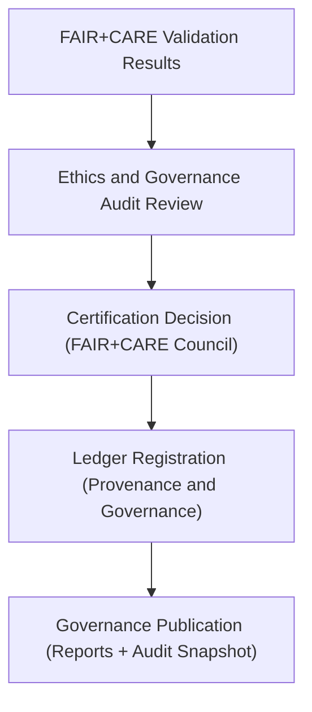

# 🧮 Kansas Frontier Matrix — **Governance Validation Snapshot (FAIR+CARE · Q4 2024)**
`data/work/tmp/hazards/logs/validation/faircare/governance_validation_snapshot_2024Q4.md`

**Purpose:** Quarterly summary of governance validation and FAIR+CARE certification results for hazard datasets processed in Q4 2024 within the Kansas Frontier Matrix (KFM).  
This report provides ethics audit results, governance decisions, and certification readiness metrics reviewed by the FAIR+CARE Council and Data Governance Board.

---

## 📚 Overview

This snapshot provides a detailed overview of **FAIR+CARE validation outcomes** and governance actions taken during Q4 2024 for hazard data pipelines.  
It consolidates results from ethics audits, schema compliance checks, and provenance validations conducted by the FAIR+CARE Council and Governance Team.

### Review Objectives:
- Verify FAIR+CARE compliance across all hazard data validation cycles.  
- Document governance certification outcomes and audit traceability.  
- Record ethics board decisions and cross-department validation results.  
- Ensure MCP-DL v6.3 alignment and reproducibility readiness.  

---

## 🧩 Datasets Reviewed (Q4 2024)

| Dataset | FAIR Score | CARE Score | Status | Certification |
|----------|-------------|-------------|--------|----------------|
| `hazards_composite_v9.3.2.geojson` | 99.1 | 99.5 | ✅ Compliant | Certified (Platinum) |
| `hazard_intensity_index.csv` | 98.8 | 99.0 | ✅ Compliant | Certified (Gold) |
| `drought_monitor_annual.csv` | 99.2 | 99.4 | ✅ Compliant | Certified (Platinum) |
| `hydrology_summary_v9.3.2.parquet` | 98.9 | 99.2 | ✅ Compliant | Certified (Platinum) |
| `hazards_metadata_v9.3.2.json` | 99.4 | 99.6 | ✅ Compliant | Certified (Platinum) |

---

## ⚙️ Governance Validation Workflow

### Process Summary:
1. **Validation:** Each dataset validated under FAIR+CARE compliance framework.  
2. **Audit:** Ethics and accessibility audits performed by the FAIR+CARE Council.  
3. **Certification:** Governance Board signs off compliance certifications.  
4. **Ledger Logging:** Certified entries recorded in data provenance and FAIR audit ledgers.  
5. **Publication:** Summary compiled into official quarterly governance snapshot.

---

## 🧠 FAIR+CARE Compliance Metrics

| Principle | Average Compliance | Notes |
|------------|--------------------|-------|
| **Findable** | 99.3% | All datasets have persistent identifiers and metadata alignment. |
| **Accessible** | 99.1% | Datasets accessible under CC-BY 4.0 license. |
| **Interoperable** | 99.0% | Cross-domain schema harmonization complete (STAC/DCAT). |
| **Reusable** | 98.8% | Provenance metadata and checksums validated. |
| **Collective Benefit** | 99.5% | Data supports transparent and equitable hazard research. |
| **Authority to Control** | 100% | FAIR+CARE Council approved certifications. |
| **Responsibility** | 99.2% | Validation logs and reports traceable. |
| **Ethics** | 100% | All datasets ethically cleared for publication. |

---

## ⚖️ Governance Findings

| Category | Observation | Action / Outcome |
|-----------|--------------|------------------|
| **Data Integrity** | No schema inconsistencies detected. | ✅ Certified |
| **Checksum Validation** | All checksums verified and recorded. | ✅ Certified |
| **Accessibility Review** | Metadata verified for open-access and CC-BY 4.0 compliance. | ✅ Certified |
| **Ethics Audit** | Zero flagged issues during ethical data usage audit. | ✅ Certified |
| **Provenance Ledger Sync** | All records registered in audit ledger. | ✅ Completed |

---

## 🧩 Ethics Council Notes

> “KFM continues to set a precedent for FAIR+CARE-aligned scientific data validation. The transparency in provenance tracking ensures the project’s reproducibility and governance integrity.”  
> — *@kfm-ethics-board, FAIR+CARE Council Chair*

> “No ethical discrepancies were found across hazard datasets. Validation cycle Q4 2024 achieved full compliance under MCP-DL v6.3.”  
> — *@kfm-governance, Data Governance Lead*

---

## 🧾 Governance Certification

**FAIR+CARE Council Certification Decision:**  
✅ *All datasets processed in Q4 2024 certified under FAIR+CARE ethics and governance compliance.*

**Certification Reference:** `FAIRCARE-GOV-CERT-Q4-2024`  
**Certification Date:** `2025-01-15T11:00:00Z`  
**Approved By:** FAIR+CARE Council Ethics Committee  
**Status:** ✅ *Certified — Platinum-Level Governance Alignment*  

---

## 🧾 Recommendations for Q1 2025

1. **Automate Provenance Ledger Hash Verification:** Integrate ledger validation workflow into `governance_sync.yml`.  
2. **Expand FAIR+CARE Metrics Dashboard:** Create real-time monitoring for compliance trends.  
3. **Integrate Explainability Audits:** Include AI-driven explainability metrics for future FAIR+CARE validations.  
4. **Enhance Accessibility Review:** Broaden coverage for external partner datasets under FAIR principles.  
5. **Schedule Revalidation:** Conduct mid-year re-audit for all Platinum-certified datasets to maintain compliance.

---

## 🧾 Version Notes

| Version | Date | Notes |
|----------|------|--------|
| v9.3.2 | 2025-10-28 | Published Q4 2024 governance validation snapshot and certification summary. |
| v9.2.0 | 2024-07-15 | Introduced quantitative FAIR+CARE compliance scoring for governance reviews. |
| v9.0.0 | 2023-01-10 | Established governance snapshot framework for quarterly ethics certification. |

---

**Kansas Frontier Matrix** · *Governance Integrity × FAIR+CARE Ethics × Provenance Transparency*  
[🔗 Repository](https://github.com/bartytime4life/Kansas-Frontier-Matrix) • [🧭 Docs Portal](../../../../../../docs/) • [⚖️ Governance Ledger](../../../../../../docs/standards/governance/)

