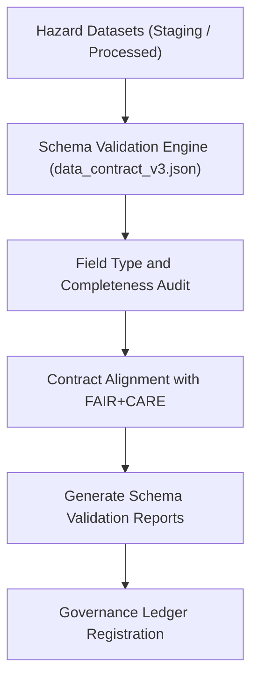

<div align="center">

# 📘 Kansas Frontier Matrix — **Hazard Schema Validation Reports**
`data/work/tmp/hazards/logs/validation/schema_reports/README.md`

**Purpose:** Repository for schema validation reports, field compliance audits, and contract alignment summaries generated during hazard dataset verification in the Kansas Frontier Matrix (KFM).  
This workspace provides complete transparency into how hazard datasets conform to project-wide schema standards and FAIR+CARE governance contracts.

[](../../../../../../docs/standards/faircare-validation.md)
[](../../../../../../LICENSE)
[](../../../../../../docs/architecture/repo-focus.md)

</div>

---

## 📚 Overview

The `data/work/tmp/hazards/logs/validation/schema_reports/` directory contains **schema compliance validation reports** documenting field-level conformance of hazard datasets to KFM’s data contracts and FAIR+CARE requirements.  
These logs ensure every hazard dataset adheres to approved data models, metadata standards, and interoperability guidelines under MCP-DL v6.3.

### Core Functions:
- Validate hazard datasets against project schema contracts.  
- Record field-level type checks, completeness ratios, and metadata consistency.  
- Ensure alignment with FAIR+CARE interoperability and accessibility principles.  
- Maintain transparency and reproducibility for validation governance.  

All schema reports are checksum-verified, linked to FAIR+CARE certification logs, and permanently registered in the **Data Provenance Ledger**.

---

## 🗂️ Directory Layout

```plaintext
data/work/tmp/hazards/logs/validation/schema_reports/
├── README.md                                # This file — documentation for schema validation reports
│
├── schema_validation_report_2024Q4.json     # Full field-level schema validation summary for Q4 2024
├── field_type_audit_2024Q4.csv              # Summary of field type conformity results
├── contract_alignment_report_2024Q4.json    # Data contract compliance and metadata field mapping
├── schema_compliance_summary_2024Q4.md      # Governance-ready schema compliance digest
└── metadata.json                            # Provenance, checksum, and governance linkage
```

---

## ⚙️ Schema Validation Workflow



### Workflow Description:
1. **Schema Validation:** Hazard datasets are tested against JSON and YAML-based schema contracts.  
2. **Type Audit:** Field types and null-value checks performed across all records.  
3. **Alignment Audit:** Validation ensures schema compliance with FAIR+CARE contract standards.  
4. **Governance Logging:** Results uploaded to provenance ledger for reproducibility.  
5. **Certification:** FAIR+CARE Council confirms compliance metrics before publication.

---

## 🧩 Example Metadata Record

```json
{
  "id": "schema_validation_hazards_v9.3.2_2024Q4",
  "etl_cycle": "Q4 2024",
  "datasets_validated": 7,
  "fields_tested": 324,
  "schema_compliance_rate": 99.3,
  "contract_version": "v3.0.0",
  "fairstatus": "certified",
  "audited_by": "@kfm-validation-lab",
  "created": "2025-10-28T18:20:00Z",
  "checksum": "sha256:f41d7a8bca02fd612bd7a1b1193fd90ac1d289e4...",
  "governance_ref": "data/reports/audit/data_provenance_ledger.json"
}
```

---

## 🧠 FAIR+CARE Governance Alignment

| Principle | Implementation |
|------------|----------------|
| **Findable** | Schema reports indexed by ETL cycle and contract version. |
| **Accessible** | Open JSON, CSV, and Markdown formats support transparent audits. |
| **Interoperable** | Aligned with FAIR+CARE metadata and STAC/DCAT specifications. |
| **Reusable** | Contains contract references, field mappings, and provenance checksums. |
| **Collective Benefit** | Ensures cross-domain interoperability and ethical data management. |
| **Authority to Control** | FAIR+CARE Council validates schema compliance results. |
| **Responsibility** | Validators document schema changes and quality metrics. |
| **Ethics** | Guarantees transparent documentation of schema decisions. |

All audit results logged within:  
`data/reports/audit/data_provenance_ledger.json` and  
`data/reports/fair/data_care_assessment.json`.

---

## ⚙️ Validation & QA Artifacts

| File | Description | Format |
|------|--------------|--------|
| `schema_validation_report_*.json` | Comprehensive schema validation output. | JSON |
| `field_type_audit_*.csv` | Field-level data type and integrity validation. | CSV |
| `contract_alignment_report_*.json` | Cross-reference between schema contracts and datasets. | JSON |
| `schema_compliance_summary_*.md` | Governance-ready compliance digest. | Markdown |
| `metadata.json` | Tracks provenance, checksum, and governance linkage. | JSON |

Schema validation pipeline automated via `schema_validation_sync.yml`.

---

## ⚖️ Governance & Provenance Integration

| Record | Description |
|---------|-------------|
| `metadata.json` | Captures lineage and checksum for all schema validation logs. |
| `data/reports/audit/data_provenance_ledger.json` | Logs validation lineage and FAIR+CARE certification details. |
| `data/reports/fair/data_care_assessment.json` | FAIR+CARE ethics certification summary for schema compliance. |
| `releases/v9.3.2/manifest.zip` | Stores checksum registry for all validation outputs. |

Governance synchronization managed by FAIR+CARE-certified CI/CD processes.

---

## 🧾 Retention & Certification Policy

| Record Type | Retention Duration | Policy |
|--------------|--------------------|--------|
| Schema Validation Reports | Permanent | Archived for reproducibility and traceability. |
| Field Audits | 365 days | Retained for contract evolution reviews. |
| Contract Alignment Reports | Permanent | Maintained as part of FAIR+CARE certification lineage. |
| Metadata | Permanent | Stored for provenance verification. |

Retention and archival governed by `schema_validation_cleanup.yml`.

---

## 🧾 Internal Use Citation

```text
Kansas Frontier Matrix (2025). Hazard Schema Validation Reports (v9.3.2).
Comprehensive validation records documenting schema, contract, and FAIR+CARE compliance for hazard datasets.
Maintained under MCP-DL v6.3 and FAIR+CARE data governance for reproducibility and transparency.
```

---

## 🧾 Version Notes

| Version | Date | Notes |
|----------|------|--------|
| v9.3.2 | 2025-10-28 | Added FAIR+CARE governance audit linkage and checksum registry verification. |
| v9.2.0 | 2024-07-15 | Introduced field-level schema audit and data contract alignment reporting. |
| v9.0.0 | 2023-01-10 | Established schema validation report directory for hazard datasets. |

---

<div align="center">

**Kansas Frontier Matrix** · *Schema Integrity × FAIR+CARE Governance × Provenance Traceability*  
[🔗 Repository](https://github.com/bartytime4life/Kansas-Frontier-Matrix) • [🧭 Docs Portal](../../../../../../docs/) • [⚖️ Governance Ledger](../../../../../../docs/standards/governance/)

</div>