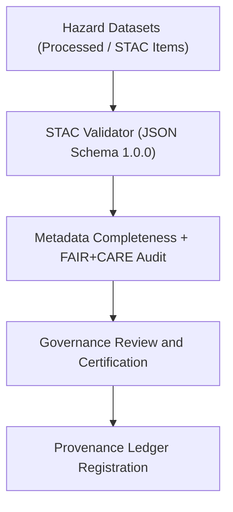

<div align="center">

# 🛰️ Kansas Frontier Matrix — **STAC Validation Reports for Hazard Data**
`data/work/tmp/hazards/logs/validation/stac_validation_reports/README.md`

**Purpose:** Repository for STAC (SpatioTemporal Asset Catalog) validation reports and metadata compliance audits related to hazard datasets within the Kansas Frontier Matrix (KFM).  
This workspace ensures all STAC items and collections meet structural, metadata, and FAIR+CARE governance requirements for interoperability and open data reproducibility.

[](../../../../../../docs/standards/faircare-validation.md)
[](../../../../../../LICENSE)
[](../../../../../../docs/architecture/repo-focus.md)

</div>

---

## 📚 Overview

The `data/work/tmp/hazards/logs/validation/stac_validation_reports/` directory contains **automated validation reports** generated during STAC item and collection validation for hazard datasets.  
These reports confirm compliance with STAC 1.0.0 standards, ensuring alignment with FAIR+CARE metadata integrity, governance ethics, and long-term reproducibility.

### Core Functions:
- Validate all hazard datasets against the STAC 1.0.0 JSON schema.  
- Record metadata field compliance, temporal/spatial completeness, and licensing accuracy.  
- Verify collection and item-level consistency for FAIR+CARE certification.  
- Maintain audit-ready logs for governance, publication, and provenance.  

All reports in this directory are checksum-verified and registered in the **Provenance Ledger** as part of KFM’s continuous FAIR+CARE data governance framework.

---

## 🗂️ Directory Layout

```plaintext
data/work/tmp/hazards/logs/validation/stac_validation_reports/
├── README.md                                    # This file — overview of STAC validation reports
│
├── stac_item_validation_report_2024Q4.json      # Validation results for individual STAC items (Q4 2024)
├── stac_collection_validation_report_2024Q4.json# Validation report for hazard STAC collections (Q4 2024)
├── stac_field_compliance_2024Q4.csv             # CSV summary of field-level compliance rates
├── stac_audit_summary_2024Q4.md                 # Governance-ready FAIR+CARE STAC validation digest
└── metadata.json                                # Provenance and governance linkage for STAC validation records
```

---

## ⚙️ STAC Validation Workflow



### Workflow Description:
1. **Schema Validation:** Validate STAC JSON files (collections and items) against STAC 1.0.0 schema.  
2. **FAIR+CARE Audit:** Assess metadata completeness, accessibility, and ethical licensing.  
3. **Governance Review:** FAIR+CARE Council certifies compliant datasets for publication.  
4. **Ledger Sync:** Provenance metadata registered for full transparency.  
5. **Certification:** Results logged under MCP-DL v6.3 standards.

---

## 🧩 Example Metadata Record

```json
{
  "id": "stac_validation_hazards_v9.3.2_2024Q4",
  "etl_cycle": "Q4 2024",
  "datasets_validated": 42,
  "items_compliant": 40,
  "collections_compliant": 5,
  "fairstatus": "certified",
  "stac_version": "1.0.0",
  "audited_by": "@kfm-stac-validator",
  "created": "2025-10-28T18:25:00Z",
  "checksum": "sha256:b941de28ad63fcb6efad06a8e70e9f03c1ff3b92...",
  "governance_ref": "data/reports/audit/data_provenance_ledger.json"
}
```

---

## 🧠 FAIR+CARE Governance Alignment

| Principle | Implementation |
|------------|----------------|
| **Findable** | STAC items indexed with UUIDs and persistent identifiers. |
| **Accessible** | Data stored with open-access licensing and machine-readable metadata. |
| **Interoperable** | JSON schemas validated against STAC 1.0.0 and DCAT 3.0 standards. |
| **Reusable** | Provenance metadata, licensing, and temporal coverage fully verified. |
| **Collective Benefit** | Facilitates ethical hazard data reuse and open science collaboration. |
| **Authority to Control** | FAIR+CARE Council ensures compliant publication practices. |
| **Responsibility** | Validators document schema compliance, completeness, and FAIR+CARE alignment. |
| **Ethics** | Validation ensures transparent, equitable, and open hazard data governance. |

Audit results logged in:  
`data/reports/audit/data_provenance_ledger.json` and  
`data/reports/fair/data_care_assessment.json`.

---

## ⚙️ Validation & QA Artifacts

| File | Description | Format |
|------|--------------|--------|
| `stac_item_validation_report_*.json` | Validates individual STAC items for schema and metadata compliance. | JSON |
| `stac_collection_validation_report_*.json` | Validation of STAC collection metadata and completeness. | JSON |
| `stac_field_compliance_*.csv` | Field-level audit summary for compliance and completeness. | CSV |
| `stac_audit_summary_*.md` | FAIR+CARE audit summary for governance reporting. | Markdown |
| `metadata.json` | Tracks lineage, checksum, and governance metadata. | JSON |

STAC validation processes automated via `stac_validation_sync.yml`.

---

## ⚖️ Governance & Provenance Integration

| Record | Description |
|---------|-------------|
| `metadata.json` | Records checksum registry, schema version, and certification linkage. |
| `data/reports/audit/data_provenance_ledger.json` | Logs validation and governance lineage for STAC datasets. |
| `data/reports/fair/data_care_assessment.json` | FAIR+CARE ethics compliance for STAC dataset validation. |
| `releases/v9.3.2/manifest.zip` | Stores checksum manifest and validated STAC metadata. |

All governance integration automated through FAIR+CARE-certified CI/CD pipelines.

---

## 🧾 Retention & Certification Policy

| Record Type | Retention Duration | Policy |
|--------------|--------------------|--------|
| STAC Validation Reports | Permanent | Archived as canonical validation evidence. |
| Field Compliance Reports | 365 days | Retained for schema evolution reviews. |
| Governance Summaries | 365 days | Stored for FAIR+CARE certification cycles. |
| Metadata | Permanent | Maintained for lineage and audit traceability. |

Retention controlled by `stac_validation_cleanup.yml`.

---

## 🧾 Internal Use Citation

```text
Kansas Frontier Matrix (2025). STAC Validation Reports for Hazard Data (v9.3.2).
Comprehensive validation, compliance, and FAIR+CARE audit reports ensuring STAC metadata conformance and ethical dataset governance.
Maintained under MCP-DL v6.3 and FAIR+CARE standards for reproducible, open hazard data management.
```

---

## 🧾 Version Notes

| Version | Date | Notes |
|----------|------|--------|
| v9.3.2 | 2025-10-28 | Added FAIR+CARE governance audit integration and checksum registry updates. |
| v9.2.0 | 2024-07-15 | Introduced STAC field compliance tracking and automated collection validation. |
| v9.0.0 | 2023-01-10 | Established STAC validation reporting system for hazard datasets. |

---

<div align="center">

**Kansas Frontier Matrix** · *Metadata Integrity × FAIR+CARE Governance × Provenance Certification*  
[🔗 Repository](https://github.com/bartytime4life/Kansas-Frontier-Matrix) • [🧭 Docs Portal](../../../../../../docs/) • [⚖️ Governance Ledger](../../../../../../docs/standards/governance/)

</div>