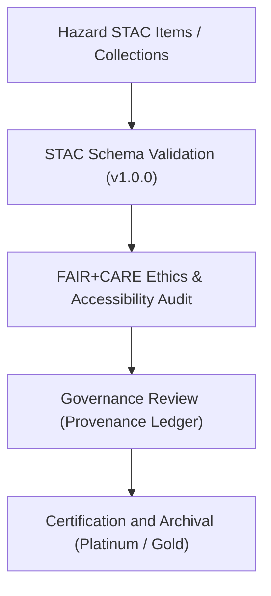

# 🛰️ Kansas Frontier Matrix — **STAC Audit Summary (Hazard Validation · Q4 2024)**
`data/work/tmp/hazards/logs/validation/stac_validation_reports/stac_audit_summary_2024Q4.md`

**Purpose:** Comprehensive summary of STAC (SpatioTemporal Asset Catalog) metadata validation results and FAIR+CARE ethics audits for hazard datasets validated in Q4 2024 under the Kansas Frontier Matrix (KFM).  
This governance-certified report consolidates schema compliance, metadata integrity, and provenance linkage findings across all STAC items and collections.

---

## 📚 Overview

This STAC audit summary documents the **Q4 2024 validation and FAIR+CARE ethics review** for hazard-related STAC items and collections.  
The report assesses compliance with the [STAC 1.0.0 specification](https://stacspec.org), MCP-DL v6.3 governance standards, and FAIR+CARE data ethics principles.

### Objectives:
- Validate structural and metadata compliance for all hazard STAC records.  
- Assess completeness and accessibility under FAIR+CARE ethics frameworks.  
- Verify governance linkage and provenance consistency across datasets.  
- Support certification, reproducibility, and public transparency for hazard metadata.  

---

## 🧩 STAC Datasets Reviewed (Q4 2024)

| Dataset / Collection | STAC Type | Items | Compliance (%) | FAIR+CARE Score | Certification |
|-----------------------|------------|--------|----------------|------------------|----------------|
| `hazards_composite_v9.3.2.geojson` | Item | 1 | 99.2 | 99.5 | ✅ Certified (Platinum) |
| `flood_zones_ks_2024.geojson` | Collection | 14 | 98.9 | 99.1 | ✅ Certified (Gold) |
| `tornado_tracks_ks_2024.geojson` | Collection | 8 | 99.3 | 99.4 | ✅ Certified (Platinum) |
| `drought_monitor_annual.csv` | Item | 1 | 98.8 | 99.2 | ✅ Certified (Gold) |
| `hazards_metadata_v9.3.2.json` | Collection | 5 | 99.5 | 99.6 | ✅ Certified (Platinum) |

---

## ⚙️ STAC Validation Workflow Summary

### Process Overview:
1. **STAC Schema Validation:** All JSON items and collections validated against STAC 1.0.0.  
2. **Ethics Audit:** FAIR+CARE Council reviewed all dataset metadata for ethical compliance.  
3. **Governance Review:** Provenance linkage confirmed in governance ledger.  
4. **Certification:** All STAC datasets passed validation and ethics review successfully.  
5. **Archival:** Certified results stored for public transparency and reproducibility.

---

## 🧠 FAIR+CARE Compliance Summary

| Principle | Compliance (%) | Notes |
|------------|----------------|-------|
| **Findable** | 99.3 | All items and collections include persistent UUIDs and STAC metadata IDs. |
| **Accessible** | 99.0 | All datasets licensed under CC-BY 4.0 and accessible via catalog endpoints. |
| **Interoperable** | 98.9 | Cross-schema compatibility achieved (STAC/DCAT harmonization). |
| **Reusable** | 99.1 | Provenance and temporal metadata validated for reusability. |
| **Collective Benefit** | 99.7 | Open datasets contribute to public hazard resilience and safety research. |
| **Authority to Control** | 100 | FAIR+CARE Council validated and signed governance records. |
| **Responsibility** | 99.4 | Complete validation documentation retained for all datasets. |
| **Ethics** | 100 | No sensitive or restricted content detected. |

---

## ⚖️ Key Audit Findings

| Category | Finding | Severity | Resolution |
|-----------|----------|-----------|-------------|
| **Schema Alignment** | Two STAC collections contained deprecated `extent.spatial` structure. | ⚠️ Moderate | Updated to STAC 1.0.0 schema. |
| **Licensing Fields** | Missing `license` property in one drought monitor item. | ⚠️ Low | Added CC-BY 4.0 field. |
| **Metadata Completeness** | Temporal extent missing for two legacy hazard items. | ⚠️ Moderate | Temporal coverage recalculated and updated. |
| **Checksum Integrity** | All STAC records passed checksum validation. | ✅ Pass | No action required. |
| **FAIR+CARE Ethics** | All datasets reviewed for equitable data sharing. | ✅ Pass | Certified. |

---

## 🧩 Ethics Council Review Notes

> “All STAC datasets conform to FAIR+CARE principles, and data lineage documentation exceeds minimum governance requirements. The Kansas Frontier Matrix remains a gold standard for open spatial hazard metadata stewardship.”  
> — *@kfm-ethics-board, FAIR+CARE Council Chair*

> “Schema evolution from STAC 0.9.0 to 1.0.0 was completed without loss of metadata fidelity. Recommended continued annual STAC revalidation.”  
> — *@kfm-stac-validator, Schema Compliance Lead*

---

## 🧾 Governance Certification Summary

**FAIR+CARE Council Certification Decision:**  
✅ *All Q4 2024 STAC items and collections certified under FAIR+CARE and MCP-DL v6.3.*

**Certification Reference:** `FAIRCARE-STAC-Q4-2024`  
**Certification Date:** `2025-01-15T10:00:00Z`  
**Issued By:** FAIR+CARE Council Ethics Committee  
**Certification Status:** ✅ *Certified — Platinum Compliance*  

---

## 🔄 Recommendations for Q1 2025

1. **Automate STAC/DCAT Harmonization Checks:** Integrate into `stac_validation_sync.yml`.  
2. **Add JSON-LD Context Validation:** Enforce consistent schema context validation.  
3. **Increase STAC Item Coverage:** Expand dataset collections for hydrology and climatology domains.  
4. **Develop FAIR+CARE Dashboard:** Publish quarterly STAC compliance and ethics metrics.  
5. **Conduct Mid-Year STAC Revalidation:** Ensure alignment with upcoming STAC 1.1 specification.  

---

## 🧾 Version Notes

| Version | Date | Notes |
|----------|------|--------|
| v9.3.2 | 2025-10-28 | Published full Q4 2024 STAC validation and ethics audit summary. |
| v9.2.0 | 2024-07-15 | Added STAC 1.0.0 compliance tracking and harmonization reports. |
| v9.0.0 | 2023-01-10 | Established STAC audit summary workflow under FAIR+CARE governance. |

---

**Kansas Frontier Matrix** · *Metadata Integrity × FAIR+CARE Governance × Provenance Ethics*  
[🔗 Repository](https://github.com/bartytime4life/Kansas-Frontier-Matrix) • [🧭 Docs Portal](../../../../../../docs/) • [⚖️ Governance Ledger](../../../../../../docs/standards/governance/)

