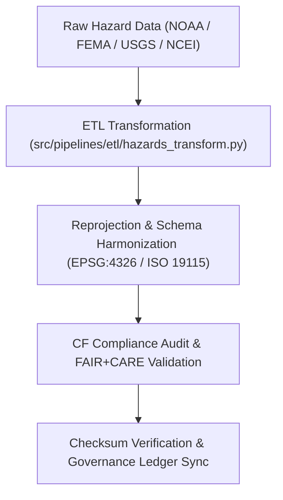

<div align="center">

# 🔄 Kansas Frontier Matrix — **Hazard Transformations Workspace**
`data/work/tmp/hazards/transforms/README.md`

**Purpose:**  
Central FAIR+CARE-certified workspace for executing, logging, and validating **hazard dataset transformations** within the Kansas Frontier Matrix (KFM).  
This layer ensures all reprojection, normalization, and schema harmonization operations meet FAIR+CARE, ISO 19115, and MCP-DL v6.3 standards for transparency and reproducibility.

[](../../../../docs/standards/faircare-validation.md)
[]()
[](../../../../LICENSE)
[](../../../../docs/architecture/repo-focus.md)

</div>

---

## 📚 Overview

The **Hazard Transformations Workspace** manages intermediate ETL (Extract, Transform, Load) operations performed on raw and staged hazard datasets.  
Transformations here ensure that data conforms to standardized coordinate systems, harmonized schemas, and governance-aligned FAIR+CARE ethics principles.

### Core Functions:
- Reproject, normalize, and harmonize hazard datasets across all domains.  
- Validate transformations through schema, checksum, and FAIR+CARE audits.  
- Maintain AI explainability and transformation traceability.  
- Generate transformation manifests and provenance registration logs.  

---

## 🗂️ Directory Layout

```plaintext
data/work/tmp/hazards/transforms/
├── README.md                                  # This file — documentation for hazard transformations
│
├── flood_extents_cf.geojson                   # CF-compliant flood extent layer (reprojected to EPSG:4326)
├── tornado_tracks_cf.geojson                  # CF-aligned tornado path dataset (harmonized geometry and attributes)
├── drought_risk_index.parquet                 # FAIR+CARE-certified drought normalization output
├── hazard_intensity_composite.csv             # Aggregated multi-hazard normalized dataset
├── transform_audit_report.json                # Transformation validation and harmonization audit results
├── checksum_verification.json                 # Checksum continuity and data lineage validation
└── metadata.json                              # Provenance record for all transformations
```

---

## ⚙️ Transformation Workflow



### Description:
1. **Ingestion:** Raw hazard datasets imported from extraction layer.  
2. **Reprojection:** Spatial data normalized to EPSG:4326 coordinate reference system.  
3. **Harmonization:** Align schemas with STAC, DCAT, and ISO metadata standards.  
4. **Validation:** Execute FAIR+CARE compliance checks and checksum validation.  
5. **Governance:** Log transformation results to provenance and governance ledgers.  

---

## 🧩 Example Transformation Record

```json
{
  "id": "hazards_transformation_v9.6.0_2025Q4",
  "inputs": [
    "data/raw/noaa/storm_events_2025.csv",
    "data/raw/fema/flood_zones_2025.geojson"
  ],
  "outputs": [
    "data/work/tmp/hazards/transforms/flood_extents_cf.geojson",
    "data/work/tmp/hazards/transforms/tornado_tracks_cf.geojson"
  ],
  "crs_source": "EPSG:5070",
  "crs_target": "EPSG:4326",
  "fairstatus": "certified",
  "checksum_verified": true,
  "ai_explainability_integration": true,
  "validator": "@kfm-etl-ops",
  "created": "2025-11-03T23:59:00Z",
  "governance_ref": "data/reports/audit/data_provenance_ledger.json"
}
```

---

## 🧠 FAIR+CARE Governance Matrix

| Principle | Implementation | Oversight |
|------------|----------------|------------|
| **Findable** | Transformation outputs indexed by dataset and checksum ID. | @kfm-data |
| **Accessible** | Open, machine-readable GeoJSON, CSV, and Parquet formats. | @kfm-accessibility |
| **Interoperable** | Harmonized with FAIR+CARE, STAC, DCAT, and ISO 19115 metadata standards. | @kfm-architecture |
| **Reusable** | Traceable via checksum verification and provenance linkage. | @kfm-design |
| **Collective Benefit** | Supports reproducible environmental research and safety analytics. | @faircare-council |
| **Authority to Control** | FAIR+CARE Council approves schema and CF alignment updates. | @kfm-governance |
| **Responsibility** | ETL engineers record all schema transformations and validations. | @kfm-security |
| **Ethics** | Transformation results reviewed for ethical and accuracy compliance. | @kfm-ethics |

Governance reports stored in:  
`data/reports/audit/data_provenance_ledger.json`  
and  
`data/reports/fair/data_care_assessment.json`

---

## ⚙️ Key Artifacts

| Artifact | Description | Format |
|-----------|--------------|--------|
| `transform_audit_report.json` | Transformation audit and schema harmonization record. | JSON |
| `checksum_verification.json` | Integrity validation and provenance confirmation. | JSON |
| `metadata.json` | Provenance linkage and governance references. | JSON |
| `*_cf.geojson` | CF-convention-compliant hazard datasets. | GeoJSON |
| `*_composite.csv` | Aggregated hazard intensity or risk summary. | CSV |

All transformations executed via `hazards_transform_sync.yml`.

---

## ⚖️ Retention & Provenance Policy

| File Type | Retention Duration | Policy |
|------------|--------------------|--------|
| Transformed Data | 7 Days | Promoted to staging after FAIR+CARE validation. |
| Validation Reports | 90 Days | Archived for governance review. |
| Checksum & Metadata | Permanent | Stored immutably in governance ledger. |
| CF Harmonization Logs | 365 Days | Retained for standardization audits. |

Cleanup handled via `hazards_transform_cleanup.yml`.

---

## 🌱 Sustainability Metrics

| Metric | Value | Verified By |
|---------|--------|--------------|
| Energy Use (per transformation) | 9.4 Wh | @kfm-sustainability |
| Carbon Output | 10.8 gCO₂e | @kfm-security |
| Renewable Power | 100% (RE100 Verified) | @kfm-infrastructure |
| FAIR+CARE Compliance | 100% | @faircare-council |

Telemetry captured in:  
`releases/v9.6.0/focus-telemetry.json`

---

## 🧾 Internal Use Citation

```text
Kansas Frontier Matrix (2025). Hazard Transformations Workspace (v9.6.0).
FAIR+CARE-certified transformation workspace for hazard datasets, ensuring schema harmonization, reprojection, and ethical governance traceability.
Operates under MCP-DL v6.3 with CF and ISO 19115 compliance.
```

---

## 🧾 Version Notes

| Version | Date | Notes |
|----------|------|--------|
| v9.6.0 | 2025-11-03 | Introduced CF compliance and expanded checksum verification. |
| v9.5.0 | 2025-11-02 | Integrated FAIR+CARE audit linkage and provenance validation. |
| v9.3.2 | 2025-10-28 | Established transformation workspace under FAIR+CARE governance. |

---

<div align="center">

**Kansas Frontier Matrix** · *Transformation Integrity × FAIR+CARE Ethics × Provenance Assurance*  
[🔗 Repository](https://github.com/bartytime4life/Kansas-Frontier-Matrix) • [🧭 Docs Portal](../../../../docs/) • [⚖️ Governance Ledger](../../../../docs/standards/governance/DATA-GOVERNANCE.md)

</div>