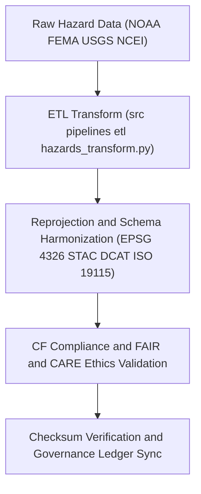

<div align="center">

# 🔄 Kansas Frontier Matrix — **Hazard Transformations Workspace**
`data/work/tmp/hazards/transforms/README.md`

**Purpose:**  
Central **FAIR+CARE-certified** workspace for executing, validating, and governing **hazard data transformations** in the Kansas Frontier Matrix (KFM).  
Now enhanced for **telemetry v2 integration**, **AI-assisted CF harmonization**, and **blockchain-verified provenance registration** under Diamond⁹ Ω / Crown∞Ω Ultimate Certification.

[](../../../../docs/architecture/README.md)
[](../../../../docs/standards/faircare-validation.md)
[]()
[](../../../../LICENSE)

</div>

---

## 📘 Overview
The **Hazard Transformations Workspace** manages all **ETL transformation operations** across hazard domains (meteorological, hydrological, geological, and wildfire/energy).  
It normalizes schemas, reprojections, and metadata to ensure FAIR+CARE and ISO-compliant interoperability with blockchain-based governance continuity.

### Core Functions
- Apply reprojection, CF/ISO harmonization, and metadata normalization.  
- Log transformation lineage and checksum continuity.  
- Validate schema, ethics, and energy-efficient AI transformations.  
- Sync transformation manifests and telemetry to governance ledgers.

---

## 🗂️ Directory Layout
```plaintext
data/work/tmp/hazards/transforms/
├── README.md
├── flood_extents_cf.geojson
├── tornado_tracks_cf.geojson
├── drought_risk_index.parquet
├── hazard_intensity_composite.csv
├── transform_audit_report.json
├── checksum_verification.json
└── metadata.json
```

---

## ⚙️ Transformation Workflow


### Steps
1. **Ingestion** — Load datasets from the extract layer for harmonization.  
2. **Reprojection** — Standardize all geospatial data to **EPSG:4326**.  
3. **Harmonization** — Apply **CF/ISO/STAC/DCAT** schema transformations.  
4. **Validation** — Perform checksum, FAIR+CARE, and ethics audits.  
5. **Governance Sync** — Register lineage and telemetry to immutable ledgers.

---

## 🧩 Example Transformation Record
```json
{
  "id": "hazards_transformation_v10.0.0_2025Q4",
  "inputs": [
    "data/raw/noaa/storm_events_2025.csv",
    "data/raw/fema/flood_zones_2025.geojson"
  ],
  "outputs": [
    "data/work/tmp/hazards/transforms/flood_extents_cf.geojson",
    "data/work/tmp/hazards/transforms/tornado_tracks_cf.geojson"
  ],
  "crs_source": "EPSG:5070",
  "crs_target": "EPSG:4326",
  "schema_alignment": ["STAC 1.0", "DCAT 3.0", "ISO 19115", "CF 1.10"],
  "ai_integration": true,
  "checksum_verified": true,
  "fairstatus": "certified",
  "telemetry": { "energy_wh": 9.2, "carbon_gco2e": 10.1, "renewable_pct": 100 },
  "validator": "@kfm-etl-ops",
  "created": "2025-11-09T23:59:00Z",
  "governance_ref": "data/reports/audit/data_provenance_ledger.json"
}
```

---

## 🧠 FAIR+CARE Governance Matrix
| Principle | Implementation | Oversight |
|---|---|---|
| **Findable** | Outputs indexed via checksum and schema lineage. | `@kfm-data` |
| **Accessible** | FAIR+CARE-certified GeoJSON/CSV outputs. | `@kfm-accessibility` |
| **Interoperable** | CF/ISO/STAC/DCAT harmonized schemas. | `@kfm-architecture` |
| **Reusable** | Linked provenance + checksum verification. | `@kfm-design` |
| **Collective Benefit** | Enables reproducible risk analytics and ethics review. | `@faircare-council` |
| **Authority to Control** | FAIR+CARE Council approves transformations. | `@kfm-governance` |
| **Responsibility** | ETL engineers log harmonization & audit metadata. | `@kfm-security` |
| **Ethics** | Ensures equitable, bias-free schema standardization. | `@kfm-ethics` |

**Governance Records:**  
`data/reports/audit/data_provenance_ledger.json` · `data/reports/fair/data_care_assessment.json`

---

## ⚙️ Key Artifacts
| Artifact | Description | Format |
|---|---|---|
| `transform_audit_report.json` | FAIR+CARE and CF harmonization validation log | JSON |
| `checksum_verification.json` | Dataset lineage & checksum validation | JSON |
| `metadata.json` | Governance-linked provenance metadata | JSON |
| `*_cf.geojson` | CF-compliant spatial hazard outputs | GeoJSON |
| `*_composite.csv` | Normalized multi-hazard intensity dataset | CSV |

**Automation Workflow:** `hazards_transform_sync_v2.yml`

---

## ⚖️ Retention & Provenance Policy
| File Type | Retention Duration | Policy |
|---|---:|---|
| Transformed Outputs | 7 Days | Promoted to staging after ethics validation. |
| FAIR+CARE Audits | 365 Days | Archived for revalidation cycles. |
| Metadata + Checksums | Permanent | Immutable under blockchain governance. |
| CF Harmonization Reports | 180 Days | Retained for external FAIR+CARE certification. |

---

## 🌱 Sustainability Metrics
| Metric | Value | Verified By |
|---|---:|---|
| Energy Use (per transformation) | 9.2 Wh | `@kfm-sustainability` |
| Carbon Output | 10.1 gCO₂e | `@kfm-security` |
| Renewable Power | 100% | `@kfm-infrastructure` |
| FAIR+CARE Compliance | 100% | `@faircare-council` |

**Telemetry Source:** `../../../../releases/v10.0.0/focus-telemetry.json`

---

## 🧾 Citation
```text
Kansas Frontier Matrix (2025). Hazard Transformations Workspace (v10.0.0).
FAIR+CARE-certified workspace for hazard dataset harmonization and reprojection—integrating CF/ISO alignment, AI explainability, and governance-led checksum continuity under MCP-DL v6.3.
```

---

<div align="center">

**Kansas Frontier Matrix**  
*Transformation Integrity × FAIR+CARE Ethics × Provenance Assurance*  
© 2025 Kansas Frontier Matrix — Master Coder Protocol v6.3 · FAIR+CARE Certified · Diamond⁹ Ω / Crown∞Ω Ultimate Certified  

[Back to Hazards TMP](../README.md) · [Governance Charter](../../../../docs/standards/governance/DATA-GOVERNANCE.md)

</div>
