<div align="center">

# 🔄 Kansas Frontier Matrix — **Hazard Transformations Workspace**
`data/work/tmp/hazards/transforms/README.md`

**Purpose:**  
Central **FAIR+CARE-certified** workspace for executing, logging, and validating **hazard dataset transformations** in the Kansas Frontier Matrix (KFM).  
Ensures all reprojection, normalization, and schema harmonization meet **FAIR+CARE**, **ISO 19115**, and **MCP-DL v6.3** for transparency and reproducibility.

[](../../../../docs/architecture/README.md)
[](../../../../docs/standards/faircare-validation.md)
[]()
[](../../../../LICENSE)

</div>

---

## 📘 Overview

The **Hazard Transformations Workspace** manages intermediate **ETL** operations over raw and staged hazard datasets (meteorological, hydrological, geological, wildfire/energy).  
Transformations performed here normalize coordinate reference systems, align schemas, enrich metadata, and register governance-linked provenance and checksums.

### Core Functions
- Reproject, normalize, and harmonize hazard datasets across domains.  
- Validate transformations via schema, checksum, and **FAIR+CARE** audits.  
- Capture **AI explainability** artifacts tied to transformation steps.  
- Generate transformation manifests and **provenance/ledger** registrations.  

---

## 🗂️ Directory Layout

```plaintext
data/work/tmp/hazards/transforms/
├── README.md                          # This file — documentation for hazard transformations
│
├── flood_extents_cf.geojson           # CF-compliant flood extent layer (EPSG:4326)
├── tornado_tracks_cf.geojson          # CF-aligned tornado paths (harmonized geometry/attributes)
├── drought_risk_index.parquet         # FAIR+CARE-certified drought normalization output
├── hazard_intensity_composite.csv     # Aggregated multi-hazard normalized dataset
├── transform_audit_report.json        # Transformation validation & harmonization audit results
├── checksum_verification.json         # Checksum continuity & data lineage validation
└── metadata.json                      # Transformation provenance & governance references
```

---

## ⚙️ Transformation Workflow

```mermaid
flowchart TD
    A["Raw Hazard Data (NOAA · FEMA · USGS · NCEI)"] --> B["ETL Transform (src/pipelines/etl/hazards_transform.py)"]
    B --> C["Reprojection & Schema Harmonization (EPSG:4326 · STAC/DCAT · ISO 19115)"]
    C --> D["CF Compliance Audit & FAIR+CARE Validation"]
    D --> E["Checksum Verification & Governance Ledger Sync"]
```



### Description
1. **Ingestion** — Import from extract layer.  
2. **Reprojection** — Normalize spatial data to **EPSG:4326**.  
3. **Harmonization** — Align with **STAC/DCAT** and ISO 19115 metadata.  
4. **Validation** — Run **FAIR+CARE** checks, CF compliance, and checksum audits.  
5. **Governance** — Register results and manifests to provenance/ledger.

---

## 🧩 Example Transformation Record

```json
{
  "id": "hazards_transformation_v9.7.0_2025Q4",
  "inputs": [
    "data/raw/noaa/storm_events_2025.csv",
    "data/raw/fema/flood_zones_2025.geojson"
  ],
  "outputs": [
    "data/work/tmp/hazards/transforms/flood_extents_cf.geojson",
    "data/work/tmp/hazards/transforms/tornado_tracks_cf.geojson"
  ],
  "crs_source": "EPSG:5070",
  "crs_target": "EPSG:4326",
  "schema_alignment": ["STAC 1.0", "DCAT 3.0", "ISO 19115", "CF 1.10"],
  "fairstatus": "certified",
  "checksum_verified": true,
  "ai_explainability_integration": true,
  "validator": "@kfm-etl-ops",
  "created": "2025-11-06T23:59:00Z",
  "governance_ref": "data/reports/audit/data_provenance_ledger.json"
}
```

---

## 🧠 FAIR+CARE Governance Matrix

| Principle | Implementation | Oversight |
|-----------|----------------|-----------|
| **Findable** | Outputs indexed by dataset & checksum ID. | @kfm-data |
| **Accessible** | GeoJSON/CSV/Parquet with open licenses. | @kfm-accessibility |
| **Interoperable** | Harmonized to STAC/DCAT + ISO 19115 + CF. | @kfm-architecture |
| **Reusable** | Checksum continuity & provenance links. | @kfm-design |
| **Collective Benefit** | Enables reproducible risk & resilience analytics. | @faircare-council |
| **Authority to Control** | Council approves schema/CF alignment updates. | @kfm-governance |
| **Responsibility** | ETL engineers log all transforms & audits. | @kfm-security |
| **Ethics** | Results reviewed for accuracy & equity. | @kfm-ethics |

**Governance Records:**  
`data/reports/audit/data_provenance_ledger.json` · `data/reports/fair/data_care_assessment.json`

---

## ⚙️ Key Artifacts

| Artifact | Description | Format |
|---------|-------------|--------|
| `transform_audit_report.json` | Transformation & harmonization audit | JSON |
| `checksum_verification.json` | Integrity & lineage evidence | JSON |
| `metadata.json` | Provenance + ledger references | JSON |
| `*_cf.geojson` | CF-compliant hazard layers | GeoJSON |
| `*_composite.csv` | Aggregated hazard intensity/risk | CSV |

**Automation:** `hazards_transform_sync.yml`

---

## ⚖️ Retention & Provenance Policy

| File Type | Retention Duration | Policy |
|-----------|--------------------|--------|
| Transformed Data | 7 Days | Promoted to staging post-FAIR+CARE validation. |
| Validation Reports | 90 Days | Archived for governance review. |
| Checksums & Metadata | Permanent | Stored immutably in governance ledger. |
| CF Harmonization Logs | 365 Days | Retained for standards audits. |

---

## 🌱 Sustainability Metrics

| Metric | Value | Verified By |
|--------|------:|-------------|
| Energy Use (per transformation) | 9.3 Wh | @kfm-sustainability |
| Carbon Output | 10.7 gCO₂e | @kfm-security |
| Renewable Power | 100% (RE100) | @kfm-infrastructure |
| FAIR+CARE Compliance | 100% | @faircare-council |

**Telemetry:** `../../../../releases/v9.7.0/focus-telemetry.json`

---

## 🧾 Citation

```text
Kansas Frontier Matrix (2025). Hazard Transformations Workspace (v9.7.0).
FAIR+CARE-certified transformation hub for hazard datasets, delivering schema harmonization, reprojection, and governance-linked traceability under MCP-DL v6.3 with CF & ISO 19115 alignment.
```

---

## 🕰️ Version History

| Version | Date | Author | Summary |
|--------:|------|--------|---------|
| v9.7.0  | 2025-11-06 | `@kfm-etl-ops` | Upgraded to v9.7.0; telemetry schema added; governance alignment refined. |
| v9.6.0  | 2025-11-03 | `@kfm-etl-ops` | Introduced CF compliance; expanded checksum verification. |

---

<div align="center">

**Kansas Frontier Matrix**  
*Transformation Integrity × FAIR+CARE Ethics × Provenance Assurance*  
© 2025 Kansas Frontier Matrix — Master Coder Protocol v6.3 · FAIR+CARE Certified · Diamond⁹ Ω / Crown∞Ω Ultimate Certified  

[Back to Hazards TMP](../README.md) · [Governance Charter](../../../../docs/standards/governance/DATA-GOVERNANCE.md)

</div>