<div align="center">

# 🔄 Kansas Frontier Matrix — **Hazards Transforms Layer**
`data/work/tmp/hazards/transforms/`

**Purpose:**  
Intermediate processing and harmonization layer for **reprojecting, resampling, and unifying multi-domain hazard datasets** (meteorological, hydrological, geological, wildfire/energy).  
This stage ensures **checksum-verified, FAIR+CARE-aligned, and AI-audited** transformations ready for validation and governance certification.

[](../../../../docs/standards/faircare-validation.md)
[]()
[]()
[]()
[]()

</div>

---

## 📚 Overview

The **Hazards Transforms Layer** acts as the **core harmonization and reprojection environment** for KFM’s hazard datasets.  
All transformations performed here — from coordinate normalization to CF compliance — are traceable, explainable, and validated against FAIR+CARE and ISO standards.

### Core Responsibilities
- Reproject multi-domain hazard datasets to EPSG:4326 (WGS84).  
- Harmonize field naming and schema contracts across data domains.  
- Apply FAIR+CARE and AI explainability audits during transformation.  
- Produce **CF-compliant, checksum-verified** hazard layers for QA validation.  
- Register every operation in the **AI Hazards Transform Ledger**.

---

## 🗂️ Directory Layout

```plaintext
data/work/tmp/hazards/transforms/
├── README.md                              # This file — hazards transformation documentation
│
├── flood_extents_cf.geojson               # Hydrological reprojected flood polygons (EPSG:4326)
├── tornado_tracks_cf.geojson              # Tornado track harmonized dataset with CF fields
├── drought_indices_cf.parquet             # CF-aligned drought index timeseries
├── wildfire_perimeters_cf.geojson         # Normalized wildfire boundary and burn severity data
├── hazard_energy_corr_cf.parquet          # Energy hazard correlation matrix from AI inference
├── cf_fix_logs.json                       # CF compliance and attribute normalization report
├── reprojection_trace.log                 # CRS and reprojection transformation history
├── harmonization_summary.json             # Aggregated field mapping and schema audit summary
├── checksum_verification.json             # Integrity hashes for all transformed outputs
└── transform_manifest.json                # Transformation manifest and ledger references
```

---

## ⚙️ Transformation Workflow

```mermaid
flowchart TD
    A["Hazard TMP Datasets (meteorological / hydrological / geological / wildfire_energy)"] --> B["Reprojection (EPSG:4326 / CF Compliance)"]
    B --> C["Field Harmonization (Schema + FAIR Metadata)"]
    C --> D["AI Explainability & Bias Detection Audit"]
    D --> E["Checksum Verification + Ethics Validation"]
    E --> F["Provenance Registration → transform_manifest.json"]
    F --> G["Governance Ledger Sync + Telemetry Update"]
```



---

## 🧩 Transform Manifest Example

```json
{
  "transform_id": "hazards-transform-2025Q4",
  "datasets_processed": [
    "tornado_tracks_cf.geojson",
    "flood_extents_cf.geojson",
    "wildfire_perimeters_cf.geojson"
  ],
  "crs_source": "EPSG:3857",
  "crs_target": "EPSG:4326",
  "transformations_applied": ["Reprojection", "Field Harmonization", "CF Compliance", "FAIR+CARE Enrichment"],
  "ai_audit_score": 0.985,
  "checksum": "sha256:23e7acb23b8f1b437ebffb8eae9a82bc45e12a98...",
  "validator": "@kfm-hazards",
  "governance_ref": "reports/audit/ai_hazards_transform_ledger.json",
  "timestamp": "2025-11-02T17:55:00Z"
}
```

---

## ☀️ FAIR+CARE & CF Compliance Summary

| Standard | Description | Result | Validator |
|:--|:--|:--|:--|
| **FAIR+CARE** | FAIR and CARE audit for ethical metadata compliance | ✅ | @kfm-fair |
| **CF Conventions 1.10** | Climate and forecast metadata consistency | ✅ | @kfm-hazards |
| **ISO 19115** | Metadata lineage documentation and data dictionary | ✅ | @kfm-security |
| **Blockchain Provenance** | Immutable record registered in governance ledger | ✅ | @kfm-governance |

---

## 🧠 AI Explainability Snapshot

```json
{
  "model": "focus-hazards-transform-v6",
  "method": "SHAP",
  "variables_assessed": [
    {"variable": "projection_warp_error", "impact": 0.08},
    {"variable": "field_mapping_confidence", "impact": 0.12},
    {"variable": "crs_conversion_accuracy", "impact": 0.10}
  ],
  "drift_detected": false,
  "explanation_score": 0.985
}
```

---

## 🔐 Provenance Ledger Record

```json
{
  "ledger_id": "hazards-transform-ledger-2025-11-02",
  "datasets_processed": ["tornado_tracks_cf.geojson", "flood_extents_cf.geojson"],
  "checksum_sha256": "23e7acb23b8f1b437ebffb8eae9a82bc45e12a98...",
  "ai_model": "focus-hazards-transform-v6",
  "audit_score": 0.985,
  "verified_by": "@kfm-governance",
  "timestamp": "2025-11-02T17:55:00Z"
}
```

---

## 🌱 ISO & Sustainability Metrics

| Metric | Standard | Value | Verified By |
|:--|:--|:--|:--|
| **Energy Use (Wh/run)** | ISO 50001 | 19.4 | @kfm-security |
| **Carbon Output (gCO₂e/run)** | ISO 14064 | 21.7 | @kfm-ethics |
| **Renewable Power Offset** | RE100 | 100% | @kfm-governance |
| **Ethical Compliance** | FAIR+CARE Governance | 100% | @kfm-fair |

---

## 🧾 Retention Policy

| Artifact Type | Retention Duration | Policy |
|----------------|--------------------|--------|
| Transformed Geo/Tabular Data | 14 days | Promoted after validation. |
| Logs & Reports | 30 days | Archived under governance record. |
| Metadata | 365 days | Stored for provenance and reproducibility. |
| AI/ML Outputs | 7 days | Purged after drift verification. |

Automation handled by `hazards_transform_cleanup.yml`.

---

## 🧾 Internal Use Citation

```text
Kansas Frontier Matrix (2025). Hazards Transforms Layer (v9.5.0).
Intermediate harmonization workspace for reprojection, CF alignment, and FAIR+CARE validation of multi-domain hazard datasets.
FAIR+CARE-certified, ISO 19115 compliant, and blockchain-linked for governance transparency.
Restricted to internal ETL, AI QA, and provenance workflows.
```

---

## 🧾 Version History

| Version | Date | Notes |
|----------|------|--------|
| v9.5.0 | 2025-11-02 | Added multi-domain harmonization, telemetry v2, AI explainability integration. |
| v9.3.2 | 2025-10-28 | Added CF compliance reports and provenance ledger automation. |
| v9.3.0 | 2025-10-26 | Established hazard reprojection and field harmonization layer. |

---

<div align="center">

**Kansas Frontier Matrix** · *Multi-Hazard Intelligence × FAIR+CARE Governance × Provenance Assurance*  
[🔗 Repository](https://github.com/bartytime4life/Kansas-Frontier-Matrix) • [🧭 Docs Portal](../../../../docs/) • [⚖️ Governance Ledger](../../../../docs/standards/governance/)

</div>
