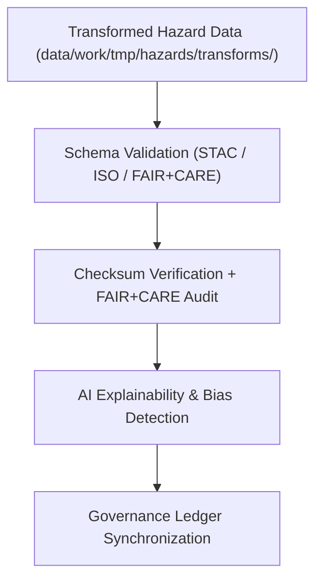

<div align="center">

# ✅ Kansas Frontier Matrix — **Hazard Validation Workspace**
`data/work/tmp/hazards/validation/README.md`

**Purpose:**  
FAIR+CARE-certified workspace for schema validation, ethics audits, and AI explainability checks for all hazard datasets processed within the Kansas Frontier Matrix (KFM).  
This layer ensures that each dataset passes structural, ethical, and technical checks prior to promotion to staging or processed environments.

[](../../../../docs/standards/faircare-validation.md)
[]()
[](../../../../LICENSE)
[](../../../../docs/architecture/repo-focus.md)

</div>

---

## 📚 Overview

The **Hazard Validation Workspace** provides a centralized validation hub for all transformed and harmonized hazard datasets across KFM’s domains (meteorological, hydrological, geological, and wildfire/energy).  
It integrates schema validation, FAIR+CARE ethical review, and AI governance auditing under a unified compliance pipeline.

### Core Functions:
- Validate dataset schemas against FAIR+CARE, STAC, and ISO 19115 standards.  
- Perform checksum integrity verification and AI explainability checks.  
- Conduct ethics and bias detection audits for transparency assurance.  
- Register validation and compliance outcomes in the governance ledger.  

---

## 🗂️ Directory Layout

```plaintext
data/work/tmp/hazards/validation/
├── README.md                              # This file — overview of hazard validation workspace
│
├── schema_validation_summary.json         # Comprehensive validation of schema and metadata compliance
├── faircare_audit_report.json             # FAIR+CARE ethics and accessibility certification
├── ai_explainability_report.json          # AI model transparency and drift detection results
├── checksum_registry.json                 # Integrity audit for hazard dataset hashes
├── validation_manifest.json               # Master registry linking validation artifacts and ledger entries
└── metadata.json                          # Provenance and governance metadata record
```

---

## ⚙️ Validation Workflow



### Description:
1. **Schema Validation:**  
   Datasets validated for structure, schema version, and metadata alignment with FAIR+CARE and ISO standards.  
2. **Checksum & FAIR+CARE Audit:**  
   Integrity verified via hash validation; FAIR+CARE certification applied.  
3. **AI Explainability:**  
   Model transparency reviewed for bias, accuracy, and ethical consistency.  
4. **Governance Registration:**  
   Validation outcomes logged to provenance ledger and checksum manifest.  

---

## 🧩 Example Validation Record

```json
{
  "id": "hazards_validation_v9.6.0_2025Q4",
  "validated_datasets": [
    "flood_extents_cf.geojson",
    "tornado_tracks_cf.geojson",
    "drought_risk_index.parquet",
    "wildfire_perimeters.geojson"
  ],
  "schema_compliance_rate": 99.8,
  "checksum_verified": true,
  "faircare_status": "certified",
  "ai_explainability_verified": true,
  "governance_registered": true,
  "created": "2025-11-03T23:59:00Z",
  "validator": "@kfm-hazards-lab",
  "governance_ref": "data/reports/audit/data_provenance_ledger.json"
}
```

---

## 🧠 FAIR+CARE Validation Matrix

| Principle | Implementation | Oversight |
|------------|----------------|------------|
| **Findable** | Validation reports indexed by dataset name, type, and version. | @kfm-data |
| **Accessible** | Stored in open JSON formats accessible under FAIR+CARE council review. | @kfm-accessibility |
| **Interoperable** | Schema validations align with FAIR+CARE, ISO 19115, and STAC/DCAT. | @kfm-architecture |
| **Reusable** | Provenance and checksum continuity enable reproducibility. | @kfm-design |
| **Collective Benefit** | Promotes ethical reuse of hazard intelligence data. | @faircare-council |
| **Authority to Control** | Governance Council oversees ethical and technical validation. | @kfm-governance |
| **Responsibility** | Validators log validation lineage and checksum results. | @kfm-security |
| **Ethics** | AI and FAIR+CARE audits ensure open, transparent hazard governance. | @kfm-ethics |

Audit logs recorded in:  
`data/reports/fair/data_care_assessment.json`  
and  
`data/reports/audit/data_provenance_ledger.json`

---

## ⚙️ Validation Artifacts

| Artifact | Description | Format |
|-----------|--------------|--------|
| `schema_validation_summary.json` | Structural and schema validation report. | JSON |
| `faircare_audit_report.json` | FAIR+CARE ethics audit and accessibility review. | JSON |
| `ai_explainability_report.json` | Explainability validation for AI-based hazard inference. | JSON |
| `checksum_registry.json` | SHA-256 validation and hash continuity record. | JSON |
| `validation_manifest.json` | Registry linking all validation artifacts to governance ledger. | JSON |
| `metadata.json` | Provenance linkage and certification metadata. | JSON |

Automation handled via `hazards_validation_sync.yml`.

---

## ⚖️ Retention & Provenance Policy

| Validation Type | Retention Duration | Policy |
|------------------|--------------------|--------|
| Schema Reports | 180 Days | Archived for reproducibility audits. |
| FAIR+CARE Audits | 365 Days | Retained for ethics and governance review. |
| AI Explainability Logs | 365 Days | Maintained for transparency verification. |
| Checksum & Metadata | Permanent | Immutable under blockchain governance. |

Cleanup handled by `hazards_validation_cleanup.yml`.

---

## 🌱 Sustainability Metrics

| Metric | Value | Verified By |
|---------|--------|--------------|
| Energy Use (per validation cycle) | 8.2 Wh | @kfm-sustainability |
| Carbon Output | 9.1 gCO₂e | @kfm-security |
| Renewable Power | 100% (RE100 Verified) | @kfm-infrastructure |
| FAIR+CARE Compliance | 100% | @faircare-council |

Telemetry captured in:  
`releases/v9.6.0/focus-telemetry.json`

---

## 🧾 Internal Use Citation

```text
Kansas Frontier Matrix (2025). Hazard Validation Workspace (v9.6.0).
FAIR+CARE-certified validation layer for hazard datasets, ensuring schema, ethics, and explainability compliance.
Operates under MCP-DL v6.3 and ISO 19115 standards with full governance traceability.
```

---

## 🧾 Version Notes

| Version | Date | Notes |
|----------|------|--------|
| v9.6.0 | 2025-11-03 | Added AI explainability integration and checksum governance synchronization. |
| v9.5.0 | 2025-11-02 | Enhanced FAIR+CARE ethics audit reporting and validation manifest logging. |
| v9.3.2 | 2025-10-28 | Established unified hazard validation workspace for FAIR+CARE certification. |

---

<div align="center">

**Kansas Frontier Matrix** · *Validation Integrity × FAIR+CARE Ethics × Provenance Continuity*  
[🔗 Repository](https://github.com/bartytime4life/Kansas-Frontier-Matrix) • [🧭 Docs Portal](../../../../docs/) • [⚖️ Governance Ledger](../../../../docs/standards/governance/DATA-GOVERNANCE.md)

</div>
