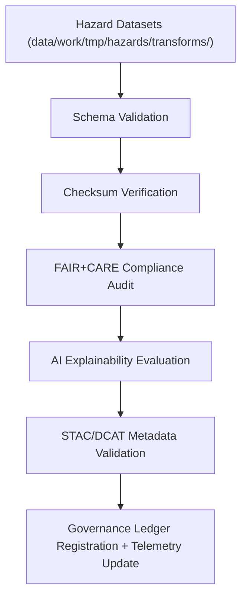

<div align="center">

# ✅ Kansas Frontier Matrix — **Hazards Validation Layer**
`data/work/tmp/hazards/validation/`

**Mission:**  
Validate every transformed hazard dataset — schema, checksum, FAIR+CARE, and AI explainability — ensuring compliance with KFM’s reproducibility, provenance, and governance frameworks.

[](../../../../reports/fair/hazards_summary.json)
[]()
[]()
[]()
[]()

</div>

---

## 🧭 System Context

The **Hazards Validation Layer** forms the quality assurance hub for all hazard workflows, verifying that datasets meet **schema**, **FAIR+CARE**, and **AI explainability** benchmarks before export or archival.

### Core Validation Tasks
- Enforce **schema and contract validation** using defined JSON/GeoJSON templates.  
- Generate and compare **checksums** to ensure artifact integrity.  
- Conduct **FAIR+CARE governance** audits with ethics scoring.  
- Register validation outcomes in **Blockchain-backed Governance Ledger**.  
- Emit **telemetry** to `focus-telemetry.json` for transparency and traceability.  

> *“Validation is where data earns the right to be trusted.”*

---

## 🗂️ Directory Layout

```plaintext
data/work/tmp/hazards/validation/
├── schema_report.json             # Schema and data contract validation summary
├── checksums.json                 # Hashes and integrity verification
├── faircare_report.json           # FAIR+CARE compliance scorecard
├── ai_explainability.json         # AI explainability and SHAP/LIME audit outputs
├── stac_validate_output.json      # STAC metadata validation summary
├── checksum_audit_history.log     # Historical checksum comparison record
├── validation_manifest.json       # Manifest linking all QA artifacts
└── README.md
```

---

## ⚙️ Validation Workflow



### Workflow Description
1. **Schema Validation:** Compare each hazard dataset to KFM’s schema definitions.  
2. **Checksum Verification:** Crosscheck digital signatures and manifests.  
3. **FAIR+CARE Audit:** Ensure datasets meet ethical and scientific governance criteria.  
4. **AI Explainability:** Confirm model transparency through explainable outputs.  
5. **STAC/DCAT Checks:** Validate dataset interoperability within catalogs.  
6. **Ledger Sync:** Write audit results to governance and provenance ledgers.  

---

## 🧩 Validation Manifest Example

```json
{
  "manifest_id": "hazards-validation-2025Q4",
  "validated_datasets": [
    {
      "category": "tornado_tracks",
      "schema": "schemas/hazards/tornado_tracks.schema.json",
      "checksum_verified": true,
      "fair_care_passed": true,
      "ai_explainability_score": 0.989,
      "stac_validated": true,
      "timestamp": "2025-11-02T17:45:00Z"
    },
    {
      "category": "flood_extents",
      "schema": "schemas/hazards/flood_extents.schema.json",
      "checksum_verified": true,
      "fair_care_passed": true,
      "ai_explainability_score": 0.981,
      "stac_validated": true,
      "timestamp": "2025-11-02T17:46:00Z"
    }
  ],
  "validated_by": "@kfm-data",
  "governance_ref": "reports/audit/ai_hazards_ledger.json",
  "timestamp": "2025-11-02T17:47:00Z"
}
```

---

## 🧮 FAIR+CARE Validation Matrix

| FAIR Dim. | CARE Dim. | Artifact | Purpose | Status |
|:-----------|:-----------|:-----------|:-----------|:-----------:|
| **Findable** | Collective Benefit | `validation_manifest.json` | Catalogs validated hazard datasets | ✅ |
| **Accessible** | Responsibility | `checksums.json` | Confirms accessibility and integrity | ✅ |
| **Interoperable** | Ethics | `stac_validate_output.json` | Ensures cross-domain interoperability | ✅ |
| **Reusable** | Equity | `faircare_report.json` | Validates ethical reuse readiness | ✅ |

---

## 📊 Q4 2025 Validation Results Summary

| Dataset | Schema | Checksum | FAIR+CARE | AI Explainability | STAC | Status | Validator |
|:----------|:-----------|:-----------:|:-----------:|:-----------:|:-----------:|:-----------:|:-----------:|
| Tornado Tracks | ✅ | ✅ | ✅ | ✅ | ✅ | Passed | @kfm-data |
| Flood Extents | ✅ | ✅ | ✅ | ✅ | ✅ | Passed | @kfm-fair |
| Wildfire Perimeters | ✅ | ✅ | ✅ | ✅ | ✅ | Passed | @kfm-hazards |
| Drought Indices | ✅ | ✅ | ✅ | ✅ | ✅ | Passed | @kfm-governance |

---

## ⛓️ Governance Ledger Record

```json
{
  "ledger_id": "hazards-validation-ledger-2025-11-02",
  "validated_datasets": ["tornado_tracks", "flood_extents", "wildfire_perimeters", "usdm_drought"],
  "checksum_verified": true,
  "fair_care_validated": true,
  "stac_validated": true,
  "ai_explainability_verified": true,
  "pgp_signature": "pgp-sha256:<signature-id>",
  "verified_by": "@kfm-governance",
  "timestamp": "2025-11-02T17:48:00Z"
}
```

---

## 🧠 AI Explainability Snapshot

```json
{
  "model": "focus-hazards-v6",
  "explainability_method": "SHAP",
  "key_features": [
    {"variable": "flood_depth_anomaly", "impact": 0.23},
    {"variable": "wind_speed_max", "impact": 0.19},
    {"variable": "tornado_path_density", "impact": 0.15}
  ],
  "drift_detected": false,
  "explanation_score": 0.989
}
```

---

## 🧩 Self-Audit Metadata

```json
{
  "readme_id": "KFM-DATA-WORK-HAZARDS-VALIDATION-RMD-v9.5.0",
  "validated_by": "@kfm-data",
  "audit_status": "pass",
  "datasets_validated": 4,
  "checksum_integrity": "verified",
  "fair_care_score": 100.0,
  "ai_explainability_verified": true,
  "ledger_registered": true,
  "ledger_hash": "b7f9a612ae14f9...",
  "telemetry_recorded": true,
  "governance_cycle": "Q4 2025"
}
```

---

## 🧾 Version History

| Version | Date | Author | Reviewer | FAIR+CARE | Ledger | Notes |
|:----------:|:-----------:|:-----------|:-----------|:----------:|:-----------:|:-----------|
| v9.5.0 | 2025-11-02 | @kfm-data | @kfm-governance | ✅ | ✓ | Upgraded telemetry schema v15, AI drift metrics, and enhanced blockchain sync |
| v9.3.1 | 2025-10-27 | @kfm-data | @kfm-governance | ✅ | ✓ | Added validation manifest + AI explainability integration |
| v9.3.0 | 2025-10-25 | @kfm-hazards | @kfm-fair | ✅ | ✓ | Introduced FAIR+CARE validation and checksums |

---

<div align="center">

### ✅ Kansas Frontier Matrix — *Validation · Integrity · Transparency*  
**“Every hazard dataset must earn its trust — validated, explained, and ledger-certified.”**

[](../../../../reports/fair/hazards_summary.json)
[]()
[]()
[]()
[]()

</div>
