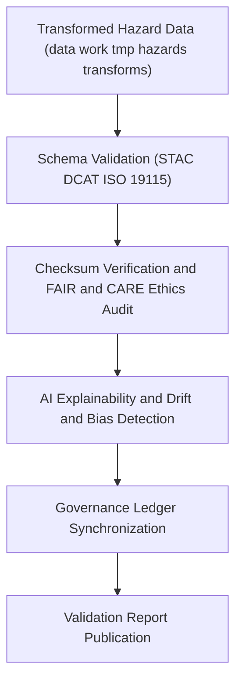

<div align="center">

# ✅ Kansas Frontier Matrix — **Hazard Validation Workspace**
`data/work/tmp/hazards/validation/README.md`

**Purpose:**  
FAIR+CARE-certified workspace for **schema validation, ethics audits, and AI explainability checks** for all hazard datasets processed within the Kansas Frontier Matrix (KFM).  
Now enhanced with **telemetry v2 (energy, carbon, coverage)** and stronger **blockchain-anchored provenance** to ensure every dataset passes structural, ethical, and technical checks before promotion to staging or processed environments.

[](../../../../docs/architecture/README.md)
[](../../../../LICENSE)
[](../../../../docs/standards/faircare.md)
[]()

</div>

---

## 📘 Overview
The **Hazard Validation Workspace** provides a centralized validation hub for all transformed and harmonized hazard datasets across KFM domains (**meteorological**, **hydrological**, **geological**, **wildfire and energy**).  
It integrates schema validation, FAIR+CARE ethical review, AI governance auditing, checksum lineage, and sustainability telemetry under a unified compliance pipeline.

### Core Functions
- Validate dataset schemas against **STAC 1.0**, **DCAT 3.0**, **ISO 19115**, and **FAIR+CARE**.  
- Verify checksum integrity and register results to the **manifest and governance ledger**.  
- Perform **AI explainability** (SHAP, LIME) and **drift and bias** audits.  
- Synchronize all validation outcomes with the **provenance and governance ledger** and **telemetry v2**.

---

## 🗂️ Directory Layout
```plaintext
data/work/tmp/hazards/validation/
├── README.md                          # This file — hazard validation workspace overview
│
├── schema_validation_summary.json     # Structural and metadata compliance (STAC/DCAT/ISO)
├── faircare_audit_report.json         # FAIR+CARE ethics and accessibility certification
├── ai_explainability_report.json      # AI transparency and feature importance (SHAP/LIME)
├── ai_drift_analysis.json             # Drift and bias monitoring results
├── checksum_registry.json             # SHA-256 integrity and continuity audit
├── validation_manifest.json           # Registry linking validation artifacts to ledger entries
└── metadata.json                      # Validation provenance, signatures, and telemetry v2
```

---

## ⚙️ Validation Workflow


### Description
1. **Schema Validation** — Confirm structure, codelists, and metadata alignment.  
2. **Checksum and FAIR and CARE** — Verify integrity and certify ethical compliance.  
3. **AI Explainability and Drift** — Assess model transparency and detect bias or drift.  
4. **Governance Sync** — Publish validation results and checksums to the ledger.  
5. **Publication** — Export reports for council review and audit traceability.

---

## 🧩 Example Validation Record
```json
{
  "id": "hazards_validation_v10.0.0_2025Q4",
  "validated_datasets": [
    "flood_extents_cf.geojson",
    "tornado_tracks_cf.geojson",
    "drought_risk_index.parquet",
    "wildfire_perimeters.geojson"
  ],
  "schema_compliance_rate": 99.9,
  "checksum_verified": true,
  "faircare_status": "certified",
  "ai_explainability_verified": true,
  "ai_drift_detected": false,
  "runtime_minutes": 86.7,
  "telemetry": { "energy_wh": 6.0, "carbon_gco2e": 6.9, "coverage_pct": 100 },
  "governance_registered": true,
  "created": "2025-11-09T23:59:00Z",
  "validator": "@kfm-hazards-lab",
  "governance_ref": "data/reports/audit/data_provenance_ledger.json"
}
```

---

## 🧠 FAIR+CARE Validation Matrix
| Principle | Implementation | Oversight |
|---|---|---|
| **Findable** | Validation reports indexed by dataset name, type, version, and ledger ID. | `@kfm-data` |
| **Accessible** | Open JSON artifacts for council review. | `@kfm-accessibility` |
| **Interoperable** | Conforms to FAIR+CARE, STAC, DCAT, ISO 19115. | `@kfm-architecture` |
| **Reusable** | Checksum continuity and provenance ensure reproducibility. | `@kfm-design` |
| **Collective Benefit** | Ethics and accessibility reinforced for public value. | `@faircare-council` |
| **Authority to Control** | Governance Council approves certification gates. | `@kfm-governance` |
| **Responsibility** | Validators log outcomes and link to ledger records. | `@kfm-security` |
| **Ethics** | AI and FAIR+CARE audits enforce transparency and fairness. | `@kfm-ethics` |

**Linked Audits:**  
`data/reports/fair/data_care_assessment.json` · `data/reports/audit/data_provenance_ledger.json`

---

## ⚙️ Validation Artifacts
| Artifact | Description | Format |
|---|---|---|
| `schema_validation_summary.json` | Structural and schema compliance results | JSON |
| `faircare_audit_report.json` | FAIR+CARE ethics and accessibility certification | JSON |
| `ai_explainability_report.json` | SHAP and LIME + qualitative reasoning notes | JSON |
| `ai_drift_analysis.json` | Distributional drift and bias metrics | JSON |
| `checksum_registry.json` | SHA-256 integrity and continuity record | JSON |
| `validation_manifest.json` | Cross-links artifacts to governance ledger | JSON |
| `metadata.json` | Provenance context, signatures, and telemetry v2 | JSON |

**Automation:** `hazards_validation_sync_v2.yml`

---

## ⚖️ Retention and Provenance Policy
| Validation Type | Retention Duration | Policy |
|---|---:|---|
| Schema Reports | 365 Days | Archived for reproducibility audits |
| FAIR+CARE Audits | Permanent | Retained for ethics and governance review |
| AI Explainability Logs | 365 Days | Preserved for transparency verification |
| Checksums and Metadata | Permanent | Immutable under blockchain governance |

---

## 🌱 Sustainability Metrics
| Metric | Value | Verified By |
|---|---:|---|
| Energy Use (per validation cycle) | 6.0 Wh | `@kfm-sustainability` |
| Carbon Output | 6.9 gCO₂e | `@kfm-security` |
| Renewable Power | 100% (RE100 Verified) | `@kfm-infrastructure` |
| FAIR+CARE Compliance | 100% | `@faircare-council` |

**Telemetry Source:** `../../../../releases/v10.0.0/focus-telemetry.json`

---

## 🧾 Citation
```text
Kansas Frontier Matrix (2025). Hazard Validation Workspace (v10.0.0).
FAIR+CARE-certified validation layer for hazard datasets, integrating schema, checksum, explainability, and drift audits with governance-ledger traceability and telemetry v2 under MCP-DL v6.3 and ISO 19115.
```

---

## 🕰️ Version History
| Version | Date | Author | Summary |
|---|---|---|---|
| v10.0.0 | 2025-11-09 | `@kfm-hazards-lab` | Upgraded to v10; added telemetry v2, drift analytics, and stronger ledger anchoring. |
| v9.7.0  | 2025-11-06 | `@kfm-hazards-lab` | Telemetry schema added; governance sync hardened. |
| v9.6.0  | 2025-11-03 | `@kfm-hazards-lab` | Introduced AI explainability integration and checksum governance sync. |

---

<div class="footnotes" align="center">

**Kansas Frontier Matrix**  
*Validation Integrity × FAIR+CARE Ethics × Provenance Continuity*  
© 2025 Kansas Frontier Matrix — CC-BY 4.0 · **Diamond⁹ Ω / Crown∞Ω** Ultimate Certified  

[Back to Hazards TMP](../README.md) · [Governance Charter](../../../../docs/standards/governance/DATA-GOVERNANCE.md)

</div>
