<div align="center">

# ✅ Kansas Frontier Matrix — **Hazard Validation Workspace**
`data/work/tmp/hazards/validation/README.md`

**Purpose:**  
FAIR+CARE-certified workspace for **schema validation, ethics audits, and AI explainability checks** for all hazard datasets processed within the Kansas Frontier Matrix (KFM).  
Ensures that each dataset passes structural, ethical, and technical checks prior to promotion to staging or processed environments.

[](../../../../docs/architecture/README.md)
[](../../../../LICENSE)
[](../../../../docs/standards/faircare-validation.md)
[]()

</div>

---

## 📘 Overview

The **Hazard Validation Workspace** provides a centralized validation hub for all transformed and harmonized hazard datasets across KFM domains (**meteorological**, **hydrological**, **geological**, **wildfire/energy**).  
It integrates schema validation, FAIR+CARE ethical review, and AI governance auditing under a unified compliance pipeline.

### Core Functions
- Validate dataset schemas against **STAC 1.0**, **DCAT 3.0**, **ISO 19115**, and **FAIR+CARE**.  
- Verify checksum integrity and register results to the manifest/ledger.  
- Perform **AI explainability** (SHAP/LIME) and drift/bias audits.  
- Synchronize all validation outcomes with the **provenance & governance ledger**.

---

## 🗂️ Directory Layout

```plaintext
data/work/tmp/hazards/validation/
├── README.md                         # This file — overview of hazard validation workspace
│
├── schema_validation_summary.json    # Structural & metadata compliance (STAC/DCAT/ISO)
├── faircare_audit_report.json        # FAIR+CARE ethics & accessibility certification
├── ai_explainability_report.json     # AI transparency & drift/bias evaluation
├── checksum_registry.json            # SHA-256 integrity & continuity audit
├── validation_manifest.json          # Registry linking validation artifacts to ledger entries
└── metadata.json                     # Validation provenance & governance metadata
```

---

## ⚙️ Validation Workflow

```mermaid
flowchart TD
    A["Transformed Hazard Data (data/work/tmp/hazards/transforms/)"] --> B["Schema Validation (STAC · ISO · FAIR+CARE)"]
    B --> C["Checksum Verification + FAIR + CARE Ethics Audit"]
    C --> D["AI Explainability & Bias/Drift Detection"]
    D --> E["Governance Ledger Synchronization"]
```



### Description
1. **Schema Validation** — Confirm structure, codelists, and metadata alignment.  
2. **Checksum & FAIR+CARE** — Verify integrity and certify ethical compliance.  
3. **AI Explainability** — Assess model transparency and bias/drift signals.  
4. **Governance Sync** — Publish validation results and checksums to the ledger.

---

## 🧩 Example Validation Record

```json
{
  "id": "hazards_validation_v9.7.0_2025Q4",
  "validated_datasets": [
    "flood_extents_cf.geojson",
    "tornado_tracks_cf.geojson",
    "drought_risk_index.parquet",
    "wildfire_perimeters.geojson"
  ],
  "schema_compliance_rate": 99.8,
  "checksum_verified": true,
  "faircare_status": "certified",
  "ai_explainability_verified": true,
  "governance_registered": true,
  "created": "2025-11-06T23:59:00Z",
  "validator": "@kfm-hazards-lab",
  "governance_ref": "data/reports/audit/data_provenance_ledger.json"
}
```

---

## 🧠 FAIR+CARE Validation Matrix

| Principle | Implementation | Oversight |
|---|---|---|
| **Findable** | Validation reports indexed by dataset name, type, version. | @kfm-data |
| **Accessible** | Open JSON artifacts for council review. | @kfm-accessibility |
| **Interoperable** | Conforms to FAIR+CARE, STAC, DCAT, ISO 19115. | @kfm-architecture |
| **Reusable** | Checksum continuity & provenance ensure reproducibility. | @kfm-design |
| **Collective Benefit** | Ethics and accessibility reinforced for public value. | @faircare-council |
| **Authority to Control** | Governance Council approves certification gates. | @kfm-governance |
| **Responsibility** | Validators log outcomes and link to ledger records. | @kfm-security |
| **Ethics** | AI and FAIR+CARE audits enforce transparency & fairness. | @kfm-ethics |

**Linked Audits:**  
`data/reports/fair/data_care_assessment.json` · `data/reports/audit/data_provenance_ledger.json`

---

## ⚙️ Validation Artifacts

| Artifact | Description | Format |
|---|---|---|
| `schema_validation_summary.json` | Structural & schema compliance results | JSON |
| `faircare_audit_report.json` | FAIR+CARE ethics & accessibility certification | JSON |
| `ai_explainability_report.json` | SHAP/LIME + drift/bias metrics | JSON |
| `checksum_registry.json` | SHA-256 integrity & continuity record | JSON |
| `validation_manifest.json` | Cross-links artifacts to governance ledger | JSON |
| `metadata.json` | Provenance context & signatures | JSON |

**Automation:** `hazards_validation_sync.yml`

---

## ⚖️ Retention & Provenance Policy

| Validation Type | Retention Duration | Policy |
|---|---:|---|
| Schema Reports | 180 Days | Archived for reproducibility audits |
| FAIR+CARE Audits | 365 Days | Retained for ethics/governance review |
| AI Explainability Logs | 365 Days | Maintained for transparency verification |
| Checksums & Metadata | Permanent | Immutable under blockchain governance |

---

## 🌱 Sustainability Metrics

| Metric | Value | Verified By |
|---|---:|---|
| Energy Use (per validation cycle) | 8.1 Wh | @kfm-sustainability |
| Carbon Output | 9.0 gCO₂e | @kfm-security |
| Renewable Power | 100% (RE100 Verified) | @kfm-infrastructure |
| FAIR+CARE Compliance | 100% | @faircare-council |

**Telemetry:** `../../../../releases/v9.7.0/focus-telemetry.json`

---

## 🧾 Citation

```text
Kansas Frontier Matrix (2025). Hazard Validation Workspace (v9.7.0).
FAIR+CARE-certified validation layer for hazard datasets, integrating schema, checksum, and explainability audits with governance-ledger traceability under MCP-DL v6.3 and ISO 19115.
```

---

## 🕰️ Version History

| Version | Date | Author | Summary |
|---|---|---|---|
| v9.7.0 | 2025-11-06 | `@kfm-hazards-lab` | Upgraded for v9.7.0; telemetry schema added; governance sync hardened. |
| v9.6.0 | 2025-11-03 | `@kfm-hazards-lab` | Added AI explainability integration and checksum governance synchronization. |

---

<div align="center">

**Kansas Frontier Matrix**  
*Validation Integrity × FAIR+CARE Ethics × Provenance Continuity*  
© 2025 Kansas Frontier Matrix — Master Coder Protocol v6.3 · FAIR+CARE Certified · **Diamond⁹ Ω / Crown∞Ω** Ultimate Certified  

[Back to Hazards TMP](../README.md) · [Governance Charter](../../../../docs/standards/governance/DATA-GOVERNANCE.md)

</div>