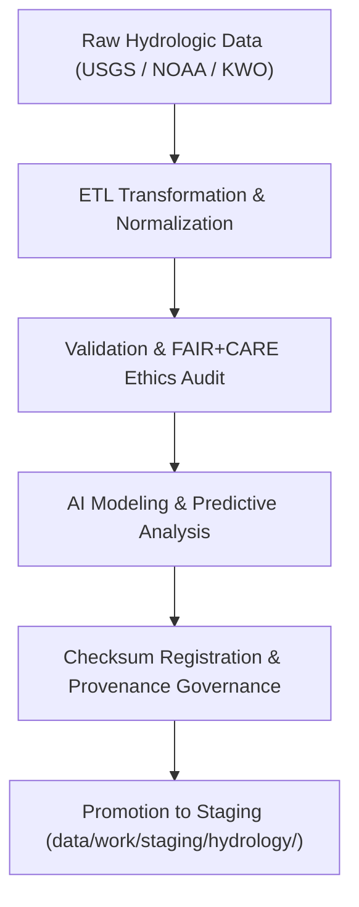

<div align="center">

# 💧 Kansas Frontier Matrix — **Hydrology TMP Workspace**
`data/work/tmp/hydrology/README.md`

**Purpose:**  
Temporary FAIR+CARE-certified workspace for hydrological data ingestion, transformation, validation, and AI analysis within the Kansas Frontier Matrix (KFM).  
This workspace manages transient datasets covering watersheds, streamflow, groundwater, soil moisture, and hydrologic modeling pipelines under strict governance alignment.

[](../../../../docs/standards/faircare-validation.md)
[](../../../../LICENSE)
[](../../../../docs/architecture/repo-focus.md)

</div>

---

## 📚 Overview

The `data/work/tmp/hydrology/` directory serves as the **temporary processing and validation hub** for all hydrologic datasets within the KFM data ecosystem.  
It supports data integration from USGS, NOAA, NIDIS, and the Kansas Water Office (KWO), ensuring every dataset is schema-compliant, FAIR+CARE-audited, and provenance-linked prior to promotion to staging or processed layers.

### Core Responsibilities
- Ingest and normalize hydrologic datasets for ETL and FAIR+CARE workflows.  
- Perform schema validation, checksum verification, and provenance registration.  
- Support AI-based streamflow modeling and water-balance analysis.  
- Maintain ethical data handling under open governance principles.  

---

## 🗂️ Directory Layout

```plaintext
data/work/tmp/hydrology/
├── README.md                              # This file — overview of the Hydrology TMP workspace
│
├── datasets/                              # Temporary raw and normalized hydrologic datasets
│   ├── streamflow_observations.csv
│   ├── groundwater_levels.parquet
│   ├── soil_moisture_anomalies.parquet
│   ├── watershed_boundaries.geojson
│   └── metadata.json
│
├── transforms/                            # ETL transformations and hydrologic model preprocessing
│   ├── hydrology_normalized.parquet
│   ├── flow_direction_grid.tif
│   ├── water_balance_summary.csv
│   └── metadata.json
│
├── validation/                            # FAIR+CARE schema validation and checksum audits
│   ├── schema_validation_summary.json
│   ├── faircare_audit_report.json
│   ├── checksum_registry.json
│   └── metadata.json
│
├── logs/                                  # ETL, validation, and AI processing logs
│   ├── etl_run.log
│   ├── ai_model_run.log
│   ├── governance_sync.log
│   └── metadata.json
│
└── exports/                               # Temporary export files for testing and governance review
    ├── hydrology_summary_2025.csv
    ├── hydrology_tileset_2025.tif
    └── metadata.json
```

---

## ⚙️ Hydrology TMP Workflow



### Workflow Description
1. **Extraction:** Retrieve hydrologic datasets from authoritative sources (USGS, NOAA, KWO).  
2. **Transformation:** Harmonize schema, reproject spatial layers, and compute derived metrics.  
3. **Validation:** Conduct FAIR+CARE audits, checksum verification, and schema compliance checks.  
4. **AI Modeling:** Perform water-balance and streamflow predictions with Focus Mode.  
5. **Governance:** Register lineage, metadata, and certification in governance ledgers.  

---

## 🧩 Example Metadata Record

```json
{
  "id": "hydrology_tmp_v9.5.0_2025Q4",
  "datasets": [
    "streamflow_observations.csv",
    "groundwater_levels.parquet",
    "soil_moisture_anomalies.parquet"
  ],
  "records_processed": 241836,
  "schema_version": "v3.0.1",
  "validation_status": "passed",
  "checksum_verified": true,
  "fairstatus": "certified",
  "ai_model_used": "focus-hydro-v3",
  "ai_explainability_score": 0.984,
  "governance_ref": "reports/audit/ai_hydrology_ledger.json",
  "telemetry_ref": "releases/v9.5.0/focus-telemetry.json",
  "created": "2025-11-02T20:45:00Z",
  "validator": "@kfm-hydrology"
}
```

---

## 🧠 FAIR+CARE Governance Integration

| Principle | Implementation |
|------------|----------------|
| **Findable** | Indexed under governance ledger with schema metadata and checksums. |
| **Accessible** | Stored in FAIR-compliant open formats (CSV, Parquet, GeoJSON). |
| **Interoperable** | Follows ISO 19115, STAC 1.0, and DCAT 3.0 metadata standards. |
| **Reusable** | Maintains provenance and checksum registries for reproducibility. |
| **Collective Benefit** | Supports sustainable water governance and open environmental data. |
| **Authority to Control** | FAIR+CARE Council oversees hydrologic data release and review. |
| **Responsibility** | Validators document schema and ethics reviews per dataset. |
| **Ethics** | Removes sensitive private well and property data during preprocessing. |

Governance and audit logs maintained in:  
`reports/audit/ai_hydrology_ledger.json` • `reports/fair/hydrology_summary.json`

---

## ⚙️ QA & Validation Artifacts

| File | Description | Format |
|------|--------------|--------|
| `schema_validation_summary.json` | Schema validation and completeness report. | JSON |
| `faircare_audit_report.json` | FAIR+CARE ethical compliance report. | JSON |
| `checksum_registry.json` | File integrity and governance tracking registry. | JSON |
| `etl_run.log` | ETL process execution log. | Text |
| `governance_sync.log` | Ledger synchronization record. | Text |

Validation automated by `hydrology_tmp_validation.yml`.

---

## 🧾 Retention Policy

| Data Type | Retention Duration | Policy |
|------------|--------------------|--------|
| TMP Datasets | 14 days | Purged after staging or governance certification. |
| Logs | 90 days | Archived for FAIR+CARE audit cycles. |
| Metadata | 365 days | Retained for provenance and reproducibility. |
| Governance Records | Permanent | Maintained indefinitely for lineage continuity. |

Retention and cleanup automated via `hydrology_tmp_cleanup.yml`.

---

## 🧾 Internal Use Citation

```text
Kansas Frontier Matrix (2025). Hydrology TMP Workspace (v9.5.0).
Temporary FAIR+CARE-certified workspace for hydrological data ETL, validation, and governance.
Supports water-balance modeling, AI explainability, and ethical open-science data stewardship.
```

---

## 🧾 Version Notes

| Version | Date | Notes |
|----------|------|--------|
| v9.5.0 | 2025-11-02 | Expanded hydrologic modeling integration and telemetry schema v14 support. |
| v9.3.2 | 2025-10-28 | Added checksum governance and FAIR+CARE pre-validation automation. |
| v9.3.0 | 2025-10-26 | Established hydrology TMP workspace under FAIR+CARE governance. |

---

<div align="center">

**Kansas Frontier Matrix** · *Water Intelligence × FAIR+CARE Ethics × Provenance Accountability*  
[🔗 Repository](https://github.com/bartytime4life/Kansas-Frontier-Matrix) • [🧭 Docs Portal](../../../../docs/) • [⚖️ Governance Ledger](../../../../docs/standards/governance/)

</div>