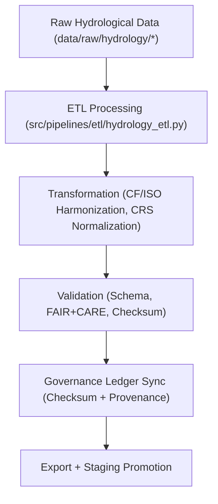

<div align="center">

# 💧 Kansas Frontier Matrix — **Hydrology TMP Workspace**
`data/work/tmp/hydrology/README.md`

**Purpose:**  
Temporary FAIR+CARE-certified workspace for managing hydrological data transformations, validation, and governance audits within the Kansas Frontier Matrix (KFM).  
This layer supports reproducible ETL operations for aquifers, watersheds, streamflow, and hydrological models, ensuring data integrity and ethical traceability.

[](../../../../docs/standards/faircare-validation.md)
[]()
[](../../../../LICENSE)
[](../../../../docs/architecture/repo-focus.md)

</div>

---

## 📚 Overview

The **Hydrology TMP Workspace** serves as the operational hub for hydrological data processing under FAIR+CARE, ISO 19115, and MCP-DL v6.3 frameworks.  
All data passing through this workspace undergo schema validation, checksum verification, and ethics auditing prior to staging or publication.

### Core Responsibilities:
- Manage ingestion, transformation, and validation of hydrological datasets.  
- Enforce FAIR+CARE and ISO-aligned schema conformance.  
- Generate reproducible outputs for staging or processed layers.  
- Synchronize governance metadata and checksum records across pipelines.  

---

## 🗂️ Directory Layout

```plaintext
data/work/tmp/hydrology/
├── README.md                              # This file — overview of hydrology TMP workspace
│
├── datasets/                              # Temporary hydrology datasets (aquifers, watersheds, streamflow)
│   ├── groundwater_levels_tmp.csv
│   ├── streamflow_measurements_tmp.parquet
│   └── metadata.json
│
├── transforms/                            # Schema harmonization and reprojection outputs
│   ├── hydrology_summary_v9.6.0.parquet
│   ├── aquifer_extent_reprojected.geojson
│   └── metadata.json
│
├── validation/                            # FAIR+CARE schema and checksum audit layer
│   ├── schema_validation_summary.json
│   ├── faircare_hydrology_audit.json
│   └── metadata.json
│
├── exports/                               # Temporary export-ready files prior to staging
│   ├── hydrology_summary_export.csv
│   ├── governance_registration_export.log
│   └── metadata.json
│
└── logs/                                  # ETL, validation, and governance audit logs
    ├── etl_run.log
    ├── ai_explainability_audit.log
    ├── governance_sync.log
    └── metadata.json
```

---

## ⚙️ Hydrology TMP Workflow



### Description:
1. **Ingestion:** Import raw data from USGS, EPA, and NIDIS sources.  
2. **Transformation:** Apply reprojection, schema normalization, and FAIR+CARE compliance.  
3. **Validation:** Verify schema, ethics, and checksum reproducibility.  
4. **Governance:** Register results into the KFM provenance ledger.  
5. **Export:** Prepare certified outputs for `data/work/staging/hydrology/`.  

---

## 🧩 Example TMP Metadata Record

```json
{
  "id": "hydrology_tmp_v9.6.0_2025Q4",
  "domain": "hydrology",
  "records_processed": 58720,
  "schema_compliance_rate": 99.8,
  "checksum_verified": true,
  "faircare_status": "certified",
  "ai_explainability_audited": true,
  "validator": "@kfm-hydro-lab",
  "created": "2025-11-03T23:59:00Z",
  "governance_registered": true,
  "governance_ref": "data/reports/audit/data_provenance_ledger.json"
}
```

---

## 🧠 FAIR+CARE Governance Matrix

| Principle | Implementation | Oversight |
|------------|----------------|------------|
| **Findable** | TMP hydrology files indexed by checksum and dataset name. | @kfm-data |
| **Accessible** | Stored in FAIR-compliant open formats (CSV, GeoJSON, Parquet). | @kfm-accessibility |
| **Interoperable** | Harmonized with FAIR+CARE, CF, and ISO metadata standards. | @kfm-architecture |
| **Reusable** | Checksum lineage and validation manifest enable reproducibility. | @kfm-design |
| **Collective Benefit** | Supports open hydrology data for sustainable water management. | @faircare-council |
| **Authority to Control** | FAIR+CARE Council approves schema transformations. | @kfm-governance |
| **Responsibility** | Validators record schema, ethics, and checksum validation logs. | @kfm-security |
| **Ethics** | All hydrology data reviewed under ethical use and sustainability guidelines. | @kfm-ethics |

Validation records stored in:  
`data/reports/fair/data_care_assessment.json`  
and  
`data/reports/audit/data_provenance_ledger.json`

---

## ⚙️ TMP Artifacts

| Artifact | Description | Format |
|-----------|--------------|--------|
| `*_tmp.*` | Temporary datasets during ETL and validation. | CSV / GeoJSON / Parquet |
| `*_reprojected.geojson` | CF-compliant, ISO-aligned spatial reprojected datasets. | GeoJSON |
| `hydrology_summary_v9.6.0.parquet` | Consolidated hydrological metrics and indicators. | Parquet |
| `faircare_hydrology_audit.json` | FAIR+CARE compliance report. | JSON |
| `checksum_registry.json` | Checksum validation and continuity tracking. | JSON |
| `metadata.json` | Provenance metadata linking TMP operations to governance ledger. | JSON |

Automation handled via `hydrology_tmp_sync.yml`.

---

## ⚖️ Retention & Provenance Policy

| File Type | Retention Duration | Policy |
|------------|--------------------|--------|
| TMP Data | 7 Days | Auto-purged after validation or staging promotion. |
| Validation Reports | 180 Days | Retained for governance and ethics review. |
| FAIR+CARE Audits | 365 Days | Maintained for certification reference. |
| Metadata | Permanent | Immutable under governance ledger control. |

Cleanup handled via `hydrology_tmp_cleanup.yml`.

---

## 🌱 Sustainability Metrics

| Metric | Value | Verified By |
|---------|--------|--------------|
| Energy Use (per TMP cycle) | 8.6 Wh | @kfm-sustainability |
| Carbon Output | 9.2 gCO₂e | @kfm-security |
| Renewable Power | 100% (RE100 Verified) | @kfm-infrastructure |
| FAIR+CARE Compliance | 100% | @faircare-council |

Telemetry recorded in:  
`releases/v9.6.0/focus-telemetry.json`

---

## 🧾 Internal Use Citation

```text
Kansas Frontier Matrix (2025). Hydrology TMP Workspace (v9.6.0).
FAIR+CARE-certified workspace for temporary hydrological ETL transformation, validation, and ethics governance.
Ensures reproducibility, transparency, and provenance under MCP-DL v6.3 and ISO 19115 compliance.
```

---

## 🧾 Version Notes

| Version | Date | Notes |
|----------|------|--------|
| v9.6.0 | 2025-11-03 | Added FAIR+CARE audit linkage and AI explainability integration. |
| v9.5.0 | 2025-11-02 | Improved checksum registry and governance synchronization automation. |
| v9.3.2 | 2025-10-28 | Established hydrology TMP structure for reproducible ETL and validation. |

---

<div align="center">

**Kansas Frontier Matrix** · *Hydrological Intelligence × FAIR+CARE Ethics × Provenance Transparency*  
[🔗 Repository](https://github.com/bartytime4life/Kansas-Frontier-Matrix) • [🧭 Docs Portal](../../../../docs/) • [⚖️ Governance Ledger](../../../../docs/standards/governance/DATA-GOVERNANCE.md)

</div>
