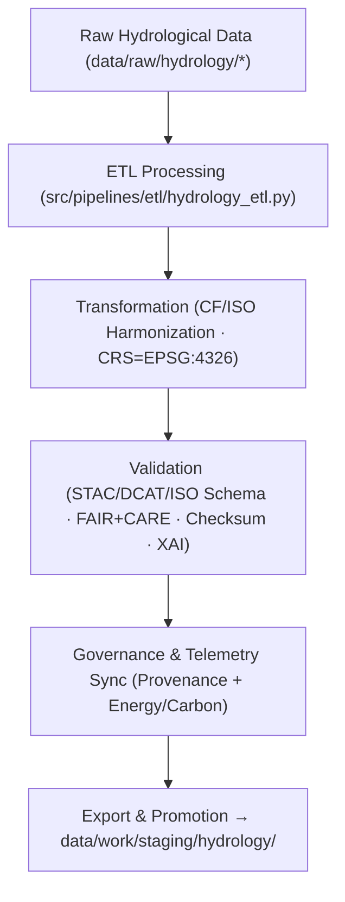

<div align="center">

# 💧 Kansas Frontier Matrix — **Hydrology TMP Workspace**
`data/work/tmp/hydrology/README.md`

**Purpose:**  
FAIR+CARE-certified temporary workspace for managing hydrological data **ingestion, transformation, validation, and governance audits** within the Kansas Frontier Matrix (KFM).  
Supports reproducible ETL for **aquifers, watersheds, streamflow, groundwater**, and model-ready hydrology products with full provenance and ethics traceability.

[](../../../../docs/architecture/README.md)
[](../../../../LICENSE)
[](../../../../docs/standards/faircare-validation.md)
[]()

</div>

---

## 📘 Overview

The **Hydrology TMP Workspace** is the operational hub for short-lived processing under **FAIR+CARE**, **ISO 19115**, and **MCP-DL v6.3**.  
All artifacts traversing this layer are subject to **schema validation, checksum verification, ethics auditing, AI explainability review**, and **governance ledger** registration prior to staging or release.

### Core Responsibilities
- Manage ingestion, transformation, and validation of hydrological datasets.  
- Enforce FAIR+CARE, CF conventions, and ISO 19115 metadata conformance.  
- Produce reproducible outputs for `data/work/staging/hydrology/` and `data/work/processed/hydrology/`.  
- Synchronize provenance, checksum, FAIR+CARE, and telemetry records across pipelines.

---

## 🗂️ Directory Layout

```plaintext
data/work/tmp/hydrology/
├── README.md                           # This file — Hydrology TMP documentation
│
├── datasets/                           # Temporary inputs & intermediate artifacts
│   ├── groundwater_levels_tmp.csv
│   ├── streamflow_measurements_tmp.parquet
│   └── metadata.json
│
├── transforms/                         # Schema/CRS/CF harmonized outputs
│   ├── hydrology_summary_v9.7.0.parquet
│   ├── aquifer_extent_reprojected.geojson
│   └── metadata.json
│
├── validation/                         # Schema, FAIR+CARE, checksum, XAI audits
│   ├── schema_validation_summary.json
│   ├── faircare_hydrology_audit.json
│   ├── ai_explainability_audit.json
│   └── metadata.json
│
├── exports/                            # Temp exports prior to staging
│   ├── hydrology_summary_export.csv
│   ├be── governance_registration_export.log
│   └── metadata.json
│
└── logs/                               # ETL, XAI, governance & telemetry logs
    ├── etl_run.log
    ├── ai_explainability_audit.log
    ├── governance_sync.log
    ├── checksum_audit.log
    └── metadata.json
```

---

## ⚙️ Hydrology TMP Workflow



### Description
1. **Ingestion** — Import data from **USGS, EPA, NIDIS** and partner sources.  
2. **Transformation** — Reproject to **EPSG:4326**, normalize attributes, apply CF/ISO harmonization.  
3. **Validation** — Run schema checks, **FAIR+CARE** ethics audit, checksum verification, and **explainability** review for model-ready outputs.  
4. **Governance** — Register validation, checksum, and audit artifacts to the **provenance ledger**; emit telemetry (energy/carbon) per **ISO 50001/14064**.  
5. **Export** — Generate certified deliverables and promote to staging.

---

## 🧩 Example TMP Metadata Record

```json
{
  "id": "hydrology_tmp_v9.7.0_2025Q4",
  "domain": "hydrology",
  "records_processed": 61240,
  "schema_compliance_rate": 99.8,
  "checksum_verified": true,
  "faircare_status": "certified",
  "ai_explainability_audited": true,
  "validator": "@kfm-hydro-lab",
  "created": "2025-11-06T23:59:00Z",
  "governance_registered": true,
  "governance_ref": "data/reports/audit/data_provenance_ledger.json"
}
```

---

## 🧠 FAIR+CARE Governance Matrix

| Principle | Implementation | Oversight |
|---|---|---|
| **Findable** | TMP artifacts indexed by checksum & dataset identifiers | @kfm-data |
| **Accessible** | Open formats (CSV/GeoJSON/Parquet) with licenses | @kfm-accessibility |
| **Interoperable** | STAC/DCAT + CF + ISO 19115 alignment | @kfm-architecture |
| **Reusable** | Checksum lineage & validation manifests | @kfm-design |
| **Collective Benefit** | Supports sustainable water planning & science | @faircare-council |
| **Authority to Control** | Council approves schema/CF updates | @kfm-governance |
| **Responsibility** | Validators log ethics, schema, checksum, XAI | @kfm-security |
| **Ethics** | Data reviewed for equity, sensitivity, and sustainability | @kfm-ethics |

**Validation Records:**  
`data/work/tmp/hydrology/validation/*` · `data/reports/fair/data_care_assessment.json` · `data/reports/audit/data_provenance_ledger.json`

---

## ⚙️ TMP Artifacts

| Artifact | Description | Format |
|---|---|---|
| `datasets/*` | Temporary inputs during ETL & validation | CSV/GeoJSON/Parquet |
| `*_reprojected.geojson` | ISO/CF-aligned spatial layers (EPSG:4326) | GeoJSON |
| `hydrology_summary_v9.7.0.parquet` | Consolidated hydrological indicators | Parquet |
| `faircare_hydrology_audit.json` | FAIR+CARE compliance report | JSON |
| `checksum_registry.json` | SHA-256 continuity tracking | JSON |
| `metadata.json` | Provenance & ledger linkage | JSON |

**Automation:** `hydrology_tmp_sync.yml`

---

## ⚖️ Retention & Provenance Policy

| File Type | Retention Duration | Policy |
|---|---:|---|
| TMP Data | 7 Days | Purged after validation or staging promotion |
| Validation Reports | 180 Days | Retained for governance & ethics review |
| FAIR+CARE Audits | 365 Days | Maintained for certification reference |
| Metadata & Checksums | Permanent | Immutable under governance ledger |

---

## 🌱 Sustainability Metrics

| Metric | Value | Verified By |
|---|---:|---|
| Energy Use (per TMP cycle) | 8.6 Wh | @kfm-sustainability |
| Carbon Output | 9.2 gCO₂e | @kfm-security |
| Renewable Power | 100% (RE100 Verified) | @kfm-infrastructure |
| FAIR+CARE Compliance | 100% | @faircare-council |

**Telemetry:** `../../../../releases/v9.7.0/focus-telemetry.json`

---

## 🧾 Citation

```text
Kansas Frontier Matrix (2025). Hydrology TMP Workspace (v9.7.0).
FAIR+CARE-certified hydrology TMP for reproducible ETL, CF/ISO harmonization, validation, and governance audits with full provenance under MCP-DL v6.3.
```

---

## 🕰️ Version History

| Version | Date | Author | Summary |
|---|---|---|---|
| v9.7.0 | 2025-11-06 | `@kfm-hydro-lab` | Upgraded to v9.7.0; telemetry schema added; governance & CF alignment refined. |
| v9.6.0 | 2025-11-03 | `@kfm-hydro-lab` | Added FAIR+CARE audit linkage and AI explainability integration. |

---

<div align="center">

**Kansas Frontier Matrix**  
*Hydrological Intelligence × FAIR+CARE Ethics × Provenance Transparency*  
© 2025 Kansas Frontier Matrix — Master Coder Protocol v6.3 · FAIR+CARE Certified · Diamond⁹ Ω / Crown∞Ω Ultimate Certified  

[Back to Hydrology Work Layer](../README.md) · [Governance Charter](../../../../docs/standards/governance/DATA-GOVERNANCE.md)

</div>