<div align="center">

# 💧 Kansas Frontier Matrix — **Hydrology TMP Workspace**
`data/work/tmp/hydrology/README.md`

**Purpose:**  
FAIR+CARE-certified temporary workspace for managing hydrological data **ingestion, transformation, validation, and governance audits** within the Kansas Frontier Matrix (KFM).  
Supports reproducible ETL for **aquifers, watersheds, streamflow, groundwater**, and model-ready hydrology products with full provenance, **telemetry v2** sustainability metrics, and ethics traceability.

[](../../../../docs/architecture/README.md)
[](../../../../LICENSE)
[](../../-ath/docs/standards/faircare.md)
[]()

</div>

---

## 📘 Overview

The **Hydrology TMP Workspace** is the operational hub for short-lived processing under **FAIR+CARE**, **ISO 19115**, and **MCP-DL v6.3**.  
All artifacts traversing this layer are subject to **schema validation, checksum verification, ethics auditing, AI explainability review**, and **governance ledger** registration prior to staging or release.

**v10 Enhancements**

- Adoption of **telemetry v2** (energy Wh, carbon gCO2e, coverage %) emitted per step.  
- JSON-LD lineage anchors in `metadata.json` linking datasets ↔ ETL stages ↔ ledger entries.  
- Strengthened CF and ISO crosswalk checks and continuous checksum reconciliation.

### Core Responsibilities

- Manage ingestion, transformation, and validation of hydrological datasets.  
- Enforce FAIR+CARE, CF conventions, and ISO 19115 metadata conformance.  
- Produce reproducible outputs for `data/work/staging/hydrology/` and `data/work/processed/hydrology/`.  
- Synchronize provenance, checksum, FAIR+CARE, and telemetry records across pipelines.

---

## 🗂️ Directory Layout

```plaintext
data/work/tmp/hydrology/
├── README.md                           # This file — Hydrology TMP documentation
│
├── datasets/                           # Temporary inputs and intermediate artifacts
│   ├── groundwater_levels_tmp.csv
│   ├── streamflow_measurements_tmp.parquet
│   └── metadata.json
│
├── transforms/                         # Schema / CRS / CF harmonized outputs
│   ├── hydrology_summary_v10.0.0.parquet
│   ├── aquifer_extent_reprojected.geojson
│   └── metadata.json
│
├── validation/                         # Schema, FAIR+CARE, checksum, XAI audits
│   ├── schema_validation_summary.json
│   ├── faircare_hydrology_audit.json
│   ├── ai_explainability_audit.json
│   └── metadata.json
│
├── exports/                            # Temp exports prior to staging
│   ├── hydrology_summary_export.csv
│   ├── governance_registration_export.log
│   └── metadata.json
│
└── logs/                               # ETL, XAI, governance and telemetry logs
    ├── etl_run.log
    ├── ai_explainability_audit.log
    ├── governance_sync.log
    ├── checksum_audit.log
    └── metadata.json
```

---

## ⚙️ Hydrology TMP Workflow

```mermaid
flowchart TD
    A["Raw Hydrological Data (data raw hydrology)"] --> B["ETL Processing (src pipelines etl hydrology_etl.py)"]
    B --> C["Transformation (CF and ISO Harmonization · CRS = EPSG 4326)"]
    C --> D["Validation (STAC DCAT ISO Schema · FAIR and CARE · Checksum · XAI)"]
    D --> E["Governance and Telemetry Sync (Provenance plus Energy and Carbon)"]
    E --> F["Export and Promotion to data work staging hydrology"]
```



### Description

1. **Ingestion** — Import data from **USGS, EPA, NIDIS** and partner sources.  
2. **Transformation** — Reproject to **EPSG 4326**, normalize attributes, apply CF and ISO harmonization.  
3. **Validation** — Run schema checks, **FAIR+CARE** audit, checksum verification, and **explainability** review.  
4. **Governance** — Register validation, checksum, and audit artifacts to the **provenance ledger**; emit telemetry (energy / carbon) per **ISO 50001 / 14064**.  
5. **Export** — Generate certified deliverables and promote to staging.

---

## 🧩 Example TMP Metadata Record

```json
{
  "id": "hydrology_tmp_v10.0.0_2025Q4",
  "domain": "hydrology",
  "records_processed": 63420,
  "schema_compliance_rate": 99.9,
  "checksum_verified": true,
  "faircare_status": "certified",
  "ai_explainability_audited": true,
  "telemetry": { "energy_wh": 8.0, "carbon_gco2e": 8.8, "coverage_pct": 100 },
  "validator": "@kfm-hydro-lab",
  "created": "2025-11-09T23:59:00Z",
  "governance_registered": true,
  "governance_ref": "data/reports/audit/data_provenance_ledger.json"
}
```

---

## 🧠 FAIR+CARE Governance Matrix

| Principle | Implementation | Oversight |
|---|---|---|
| **Findable** | TMP artifacts indexed by checksum and dataset identifiers | `@kfm-data` |
| **Accessible** | Open formats (CSV, GeoJSON, Parquet) with licenses | `@kfm-accessibility` |
| **Interoperable** | STAC / DCAT + CF + ISO 19115 alignment | `@kfm-architecture` |
| **Reusable** | Checksum lineage and validation manifests | `@kfm-design` |
| **Collective Benefit** | Supports sustainable water planning and science | `@faircare-council` |
| **Authority to Control** | Council approves schema and CF updates | `@kfm-governance` |
| **Responsibility** | Validators log ethics, schema, checksum, XAI | `@kfm-security` |
| **Ethics** | Data reviewed for equity, sensitivity, and sustainability | `@kfm-ethics` |

**Validation Records:**  
`data/work/tmp/hydrology/validation/*` · `data/reports/fair/data_care_assessment.json` · `data/reports/audit/data_provenance_ledger.json`

---

## ⚙️ TMP Artifacts

| Artifact | Description | Format |
|---|---|---|
| `datasets/*` | Temporary inputs during ETL and validation | CSV / GeoJSON / Parquet |
| `*_reprojected.geojson` | ISO and CF aligned spatial layers (EPSG 4326) | GeoJSON |
| `hydrology_summary_v10.0.0.parquet` | Consolidated hydrological indicators | Parquet |
| `faircare_hydrology_audit.json` | FAIR+CARE compliance report | JSON |
| `checksum_registry.json` | SHA-256 continuity tracking | JSON |
| `metadata.json` | Provenance, lineage, and telemetry v2 | JSON |

**Automation:** `hydrology_tmp_sync_v2.yml`

---

## ⚖️ Retention & Provenance Policy

| File Type | Retention Duration | Policy |
|---|---:|---|
| TMP Data | 7 Days | Purged after validation or staging promotion |
| Validation Reports | 180 Days | Retained for governance and ethics review |
| FAIR+CARE Audits | 365 Days | Maintained for certification reference |
| Metadata and Checksums | Permanent | Immutable under governance ledger |

---

## 🌱 Sustainability Metrics

| Metric | Value | Verified By |
|---|---:|---|
| Energy Use (per TMP cycle) | 8.0 Wh | `@kfm-sustainability` |
| Carbon Output | 8.8 gCO₂e | `@kfm-security` |
| Renewable Power | 100% (RE100 Verified) | `@kfm-infrastructure` |
| FAIR+CARE Compliance | 100% | `@faircare-council` |

**Telemetry:** `../../../../releases/v10.0.0/focus-telemetry.json`

---

## 🧾 Citation

```text
Kansas Frontier Matrix (2025). Hydrology TMP Workspace (v10.0.0).
FAIR+CARE-certified hydrology TMP for reproducible ETL, CF and ISO harmonization, validation, and governance audits with full provenance and telemetry v2 under MCP-DL v6.3.
```

---

## 🕰️ Version History

| Version | Date | Author | Summary |
|---|---|---|---|
| v10.0.0 | 2025-11-09 | `@kfm-hydro-lab` | Upgraded to v10: telemetry v2, JSON-LD lineage, enhanced CF and ISO crosswalks. |
| v9.7.0  | 2025-11-06 | `@kfm-hydro-lab` | Telemetry schema added; governance and CF alignment refined. |
| v9.6.0  | 2025-11-03 | `@kfm-hydro-lab` | Added FAIR+CARE audit linkage and AI explainability integration. |

---

<div align="center">

**Kansas Frontier Matrix**  
*Hydrological Intelligence × FAIR+CARE Ethics × Provenance Transparency*  
© 2025 Kansas Frontier Matrix — CC-BY 4.0 · Diamond⁹ Ω / Crown∞Ω Ultimate Certified  

[Back to Hydrology Work Layer](../README.md) · [Governance Charter](../../../../docs/standards/governance/DATA-GOVERNANCE.md)

</div>
