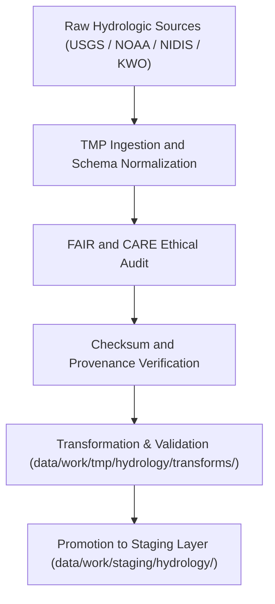

<div align="center">

# 💧 Kansas Frontier Matrix — **Hydrology TMP Datasets**
`data/work/tmp/hydrology/datasets/README.md`

**Purpose:**  
Temporary FAIR+CARE-certified workspace for **hydrologic datasets** used in ETL, validation, and AI modeling pipelines within the Kansas Frontier Matrix (KFM).  
This directory integrates streamflow, groundwater, soil moisture, and watershed datasets from authoritative hydrological data providers for ethical, reproducible processing.

[](../../../../../docs/standards/faircare-validation.md)
[](../../../../../LICENSE)
[](../../../../../docs/architecture/repo-focus.md)

</div>

---

## 📚 Overview

The `data/work/tmp/hydrology/datasets/` directory hosts **temporary hydrologic datasets** from trusted public sources (USGS, NOAA, NIDIS, EPA, and Kansas Water Office).  
It acts as a transient data layer used for ETL transformation, FAIR+CARE validation, and Focus Mode AI hydrological analysis.

### Core Responsibilities
- Aggregate hydrologic datasets for normalization and quality control.  
- Maintain ethical, traceable, and reproducible open hydrology data records.  
- Support FAIR+CARE governance and ISO lineage documentation.  
- Provide intermediate datasets for AI modeling and analytical simulations.  

---

## 🗂️ Directory Layout

```plaintext
data/work/tmp/hydrology/datasets/
├── README.md                              # This file — documentation of hydrology TMP datasets
│
├── streamflow_observations.csv            # Streamflow and discharge data (USGS / KWO)
├── groundwater_levels.parquet             # Groundwater level observations (KGS / USGS)
├── soil_moisture_anomalies.parquet        # Surface and root-zone soil moisture metrics (NOAA / NIDIS)
├── watershed_boundaries.geojson           # Kansas HUC12 watershed and sub-basin polygons
└── metadata.json                          # FAIR+CARE certification, provenance, and checksum record
```

---

## ⚙️ Hydrology Dataset Workflow



### Workflow Description
1. **Ingestion:** Collect hydrologic datasets from authoritative open-data APIs.  
2. **Normalization:** Standardize schema fields and harmonize measurement units.  
3. **FAIR+CARE Audit:** Evaluate accessibility, ethics, and provenance compliance.  
4. **Checksum Validation:** Compute SHA-256 file integrity hashes.  
5. **Promotion:** Forward validated datasets to the hydrology staging workspace.

---

## 🧩 Example Metadata Record

```json
{
  "id": "hydrology_datasets_v9.5.0_2025Q4",
  "datasets": [
    "streamflow_observations.csv",
    "groundwater_levels.parquet",
    "soil_moisture_anomalies.parquet",
    "watershed_boundaries.geojson"
  ],
  "records_processed": 184392,
  "checksum_verified": true,
  "fairstatus": "certified",
  "schema_version": "v3.0.1",
  "validator": "@kfm-hydrology",
  "checksum": "sha256:4b89e61a7c49a24fcd9e81733b1fa6c5b719b9a3...",
  "governance_ref": "reports/audit/ai_hydrology_ledger.json",
  "telemetry_ref": "releases/v9.5.0/focus-telemetry.json",
  "created": "2025-11-02T21:10:00Z"
}
```

---

## 🧠 FAIR+CARE Hydrology Governance Matrix

| Principle | Implementation |
|------------|----------------|
| **Findable** | Indexed with dataset IDs and checksum metadata in governance ledger. |
| **Accessible** | Stored as open-access CSV, Parquet, and GeoJSON formats. |
| **Interoperable** | Schema aligned with DCAT 3.0, STAC 1.0, and ISO 19115 lineage standards. |
| **Reusable** | Includes provenance metadata and ethical certification records. |
| **Collective Benefit** | Supports equitable access to Kansas hydrological data. |
| **Authority to Control** | FAIR+CARE Council validates ethical and scientific compliance. |
| **Responsibility** | Data maintainers document lineage and FAIR+CARE outcomes. |
| **Ethics** | Removes private or restricted well data and sensitive hydrologic info. |

Audit results stored in:  
`reports/audit/ai_hydrology_ledger.json` • `reports/fair/hydrology_datasets_summary.json`

---

## ⚙️ Dataset QA & Provenance Artifacts

| File | Description | Format |
|------|--------------|--------|
| `streamflow_observations.csv` | Streamflow and discharge data (USGS / KWO). | CSV |
| `groundwater_levels.parquet` | Groundwater and aquifer trends dataset. | Parquet |
| `soil_moisture_anomalies.parquet` | Soil moisture index and drought risk factors. | Parquet |
| `watershed_boundaries.geojson` | Hydrologic boundaries (HUC-level delineations). | GeoJSON |
| `metadata.json` | FAIR+CARE metadata and provenance checksums. | JSON |

QA automated through `hydrology_datasets_sync.yml`.

---

## 🧾 Retention Policy

| Data Type | Retention Duration | Policy |
|------------|--------------------|--------|
| TMP Hydrology Datasets | 14 days | Purged post-validation or staging. |
| FAIR+CARE Metadata | 365 days | Retained for audit and provenance review. |
| Checksum & Governance Logs | Permanent | Archived indefinitely for lineage continuity. |

Cleanup managed via `hydrology_datasets_cleanup.yml`.

---

## 🧾 Internal Use Citation

```text
Kansas Frontier Matrix (2025). Hydrology TMP Datasets (v9.5.0).
Temporary FAIR+CARE-compliant repository for hydrologic datasets including streamflow, groundwater, and watershed layers.
Maintains reproducibility, ethics, and governance traceability under MCP-DL v6.3 open-science standards.
```

---

## 🧾 Version Notes

| Version | Date | Notes |
|----------|------|--------|
| v9.5.0 | 2025-11-02 | Added soil moisture dataset integration and telemetry schema v2 linkage. |
| v9.3.2 | 2025-10-28 | Integrated FAIR+CARE compliance and checksum automation. |
| v9.3.0 | 2025-10-26 | Established hydrology TMP dataset directory under FAIR+CARE standards. |

---

<div align="center">

**Kansas Frontier Matrix** · *Hydrologic Data Quality × FAIR+CARE Ethics × Provenance Assurance*  
[🔗 Repository](https://github.com/bartytime4life/Kansas-Frontier-Matrix) • [🧭 Docs Portal](../../../../../docs/) • [⚖️ Governance Ledger](../../../../../docs/standards/governance/)

</div>