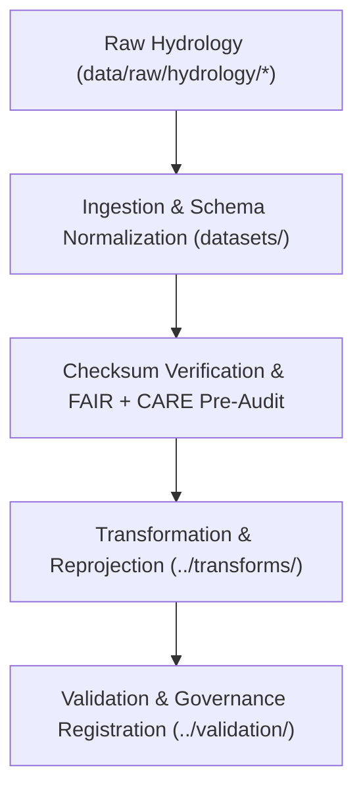

<div align="center">

# 💧 Kansas Frontier Matrix — **Hydrology TMP Datasets**
`data/work/tmp/hydrology/datasets/README.md`

**Purpose:**  
Temporary **FAIR+CARE**-compliant repository for raw and normalized hydrological datasets prior to transformation and validation in the Kansas Frontier Matrix (KFM).  
This workspace enables controlled ETL staging of water-related datasets — including **streamflow**, **aquifer levels**, **watershed boundaries**, and **precipitation indices** — with full provenance and ethics traceability.

[](../../../../../docs/architecture/README.md)
[](../../../../../LICENSE)
[](../../../../../docs/standards/faircare-validation.md)
[]()

</div>

---

## 📘 Overview

The **Hydrology TMP Datasets** directory houses temporary raw and intermediate hydrological data used in active ETL and governance workflows.  
All entries are collected from authoritative sources, normalized to KFM’s data contracts, registered in checksum manifests, and prepared for transformation and validation before promotion to staging.

### Core Functions
- Ingest and stage hydrological data from trusted public sources (USGS, EPA, NIDIS, etc.).  
- Apply initial **schema normalization, CRS setup (EPSG:4326)**, and FAIR+CARE pre-audits.  
- Maintain **provenance & checksum** metadata for short-lived ETL activities.  
- Guarantee schema compliance and integrity prior to transformation/validation.

---

## 🗂️ Directory Layout

```plaintext
data/work/tmp/hydrology/datasets/
├── README.md                             # This file — overview of hydrology TMP datasets
│
├── groundwater_levels_tmp.csv            # Temporary groundwater measurement dataset (USGS)
├── streamflow_measurements_tmp.parquet   # Streamflow at gauging stations
├── aquifer_extent_tmp.geojson            # Aquifer boundaries (EPA/KGS)
├── watershed_boundaries_tmp.geojson      # Watershed polygons (HUC-normalized)
└── metadata.json                         # Provenance & governance linkage metadata
```

---

## ⚙️ Dataset Lifecycle Workflow



### Description
1. **Ingestion** — Load hydrological data from **USGS/EPA/NIDIS** into the TMP workspace.  
2. **Normalization** — Apply KFM field names, types, and **EPSG:4326** CRS; populate minimal ISO 19115 & FAIR+CARE metadata.  
3. **Audit** — Run checksum generation and **FAIR+CARE** pre-validation (licensing, accessibility, sensitivity).  
4. **Transformation** — Hand off to `data/work/tmp/hydrology/transforms/` for harmonization.  
5. **Governance** — Record lineage and hashes in `releases/*/manifest.zip` and `data/reports/audit/data_provenance_ledger.json`.

---

## 🧩 Example Dataset Metadata Record

```json
{
  "id": "hydrology_tmp_datasets_v9.7.0",
  "source_files": [
    "data/raw/usgs/streamflow_measurements_2025.csv",
    "data/raw/epa/watershed_boundaries.geojson"
  ],
  "datasets_loaded": 4,
  "schema_compliance": 0.99,
  "checksum_verified": true,
  "fairstatus": "certified",
  "validator": "@kfm-hydro-data",
  "created": "2025-11-06T23:59:00Z",
  "governance_registered": true,
  "governance_ref": "data/reports/audit/data_provenance_ledger.json"
}
```

---

## 🧠 FAIR+CARE Governance Matrix

| Principle | Implementation | Oversight |
|---|---|---|
| **Findable** | Indexed by source, dataset type, checksum, and cycle | @kfm-data |
| **Accessible** | Open CSV/Parquet/GeoJSON; license & access metadata present | @kfm-accessibility |
| **Interoperable** | Normalized to STAC/DCAT + ISO 19115; CRS=EPSG:4326 | @kfm-architecture |
| **Reusable** | Provenance & checksum lineage enable reproducibility | @kfm-design |
| **Collective Benefit** | Supports sustainable hydrology and watershed planning | @faircare-council |
| **Authority to Control** | Council validates ingestion events and usage constraints | @kfm-governance |
| **Responsibility** | Hydrology maintainers perform schema & checksum vetting | @kfm-security |
| **Ethics** | Environmental & community sensitivity reviewed via FAIR+CARE | @kfm-ethics |

**Audit References:**  
`data/reports/audit/data_provenance_ledger.json` · `data/reports/fair/data_care_assessment.json`

---

## ⚙️ Key TMP Artifacts

| File | Description | Format |
|---|---|---|
| `groundwater_levels_tmp.csv` | Temporary groundwater observations | CSV |
| `streamflow_measurements_tmp.parquet` | Streamflow series for modeling | Parquet |
| `aquifer_extent_tmp.geojson` | Aquifer boundaries (intermediate) | GeoJSON |
| `watershed_boundaries_tmp.geojson` | HUC-based watershed polygons | GeoJSON |
| `metadata.json` | Source, provenance, checksum, and audit links | JSON |

**Automation:** `hydrology_tmp_dataset_sync.yml`

---

## ⚖️ Retention & Provenance Policy

| Dataset Type | Retention Duration | Policy |
|---|---:|---|
| TMP Raw/Normalized | 7 Days | Auto-purged after transform/validation |
| FAIR+CARE Audits | 180 Days | Retained for ethics certification |
| Metadata & Checksums | Permanent | Immutable under governance ledger |

---

## 🌱 Sustainability Metrics

| Metric | Value | Verified By |
|---|---:|---|
| Energy Use (per TMP cycle) | 6.7 Wh | @kfm-sustainability |
| Carbon Output | 7.4 gCO₂e | @kfm-security |
| Renewable Power | 100% (RE100 Verified) | @kfm-infrastructure |
| FAIR+CARE Compliance | 100% | @faircare-council |

**Telemetry:** `../../../../../releases/v9.7.0/focus-telemetry.json`

---

## 🧾 Citation

```text
Kansas Frontier Matrix (2025). Hydrology TMP Datasets (v9.7.0).
Temporary FAIR+CARE-compliant repository for hydrological ETL ingestion and normalization with checksum and governance lineage, aligned to MCP-DL v6.3 and ISO 19115.
```

---

## 🕰️ Version History

| Version | Date | Author | Summary |
|---|---|---|---|
| v9.7.0 | 2025-11-06 | `@kfm-hydro-data` | Upgraded to v9.7.0; telemetry schema added; governance & schema alignment refined. |
| v9.6.0 | 2025-11-03 | `@kfm-hydro-data` | Added checksum registry and FAIR+CARE audit integration for TMP datasets. |

---

<div align="center">

**Kansas Frontier Matrix**  
*Hydrological Data × FAIR+CARE Ethics × Provenance Assurance*  
© 2025 Kansas Frontier Matrix — Master Coder Protocol v6.3 · FAIR+CARE Certified · Diamond⁹ Ω / Crown∞Ω Ultimate Certified  

[Back to Hydrology TMP](../README.md) · [Governance Charter](../../../../../docs/standards/governance/DATA-GOVERNANCE.md)

</div>