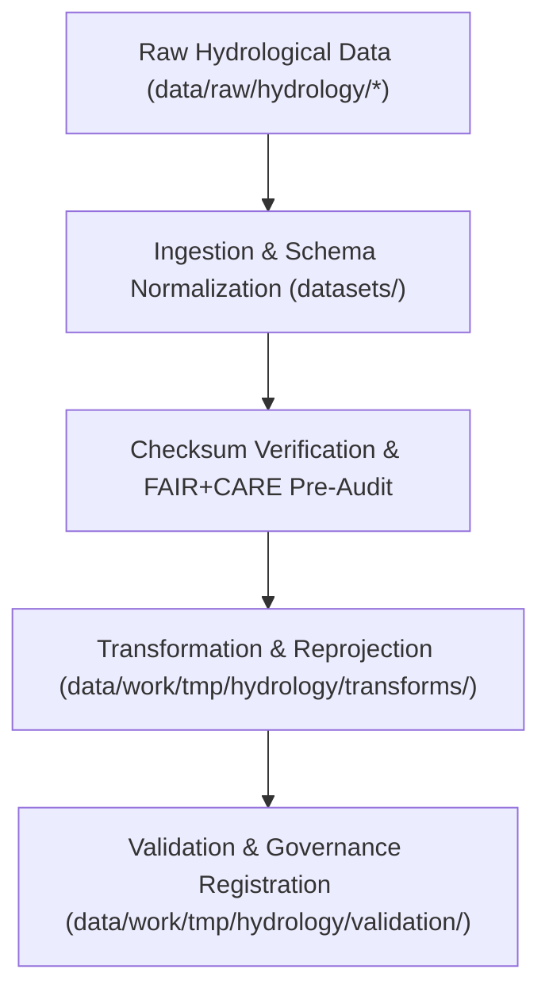

<div align="center">

# 💧 Kansas Frontier Matrix — **Hydrology TMP Datasets**
`data/work/tmp/hydrology/datasets/README.md`

**Purpose:**  
Temporary FAIR+CARE-compliant repository for raw and normalized hydrological datasets prior to transformation, validation, and archival within the Kansas Frontier Matrix (KFM).  
This workspace enables controlled ETL staging of water-related datasets — including streamflow, aquifer levels, watershed boundaries, and precipitation indices.

[](../../../../../docs/standards/faircare-validation.md)
[]()
[](../../../../../LICENSE)
[](../../../../../docs/architecture/repo-focus.md)

</div>

---

## 📚 Overview

The **Hydrology TMP Datasets** directory contains temporary raw and intermediate hydrological data used in active ETL and FAIR+CARE governance workflows.  
These datasets are collected from authoritative public sources, harmonized into standard schema formats, and prepared for validation or transformation before promotion to staging.

### Core Functions:
- Ingest and store temporary hydrological data from trusted open sources.  
- Enable normalization, reprojection, and FAIR+CARE ethics checks.  
- Support short-term ETL operations with full provenance tracking.  
- Guarantee schema compliance and checksum integrity prior to validation.  

---

## 🗂️ Directory Layout

```plaintext
data/work/tmp/hydrology/datasets/
├── README.md                                # This file — overview of hydrology TMP datasets
│
├── groundwater_levels_tmp.csv               # Temporary groundwater measurement dataset (USGS)
├── streamflow_measurements_tmp.parquet      # Streamflow data (rivers, gauging stations)
├── aquifer_extent_tmp.geojson               # Spatial boundaries of major aquifers (EPA / KGS)
├── watershed_boundaries_tmp.geojson         # Temporary watershed polygons (HUC-level normalization)
└── metadata.json                            # Provenance and governance linkage record
```

---

## ⚙️ Dataset Lifecycle Workflow



### Description:
1. **Ingestion:** Load hydrological data from USGS, EPA, and NIDIS into TMP workspace.  
2. **Normalization:** Apply consistent schema definitions, CRS, and encoding.  
3. **Audit:** Validate FAIR+CARE principles for ethical and transparent use.  
4. **Transformation:** Prepare data for harmonization and schema validation.  
5. **Governance:** Record lineage in provenance and checksum ledgers.  

---

## 🧩 Example Dataset Metadata Record

```json
{
  "id": "hydrology_tmp_datasets_v9.6.0",
  "source_files": [
    "data/raw/usgs/streamflow_measurements_2025.csv",
    "data/raw/epa/watershed_boundaries.geojson"
  ],
  "datasets_loaded": 4,
  "schema_compliance": 0.99,
  "checksum_verified": true,
  "fairstatus": "certified",
  "validator": "@kfm-hydro-data",
  "created": "2025-11-03T23:59:00Z",
  "governance_ref": "data/reports/audit/data_provenance_ledger.json"
}
```

---

## 🧠 FAIR+CARE Governance Matrix

| Principle | Implementation | Oversight |
|------------|----------------|------------|
| **Findable** | TMP datasets indexed by source, type, and checksum. | @kfm-data |
| **Accessible** | Open CSV, Parquet, and GeoJSON formats accessible via FAIR+CARE workflows. | @kfm-accessibility |
| **Interoperable** | Schema harmonized with ISO 19115 and FAIR+CARE metadata standards. | @kfm-architecture |
| **Reusable** | Metadata includes provenance and checksum lineage. | @kfm-design |
| **Collective Benefit** | Supports sustainable hydrology and watershed governance research. | @faircare-council |
| **Authority to Control** | FAIR+CARE Council validates all data ingestion events. | @kfm-governance |
| **Responsibility** | Hydrology maintainers ensure schema and checksum validation. | @kfm-security |
| **Ethics** | Data reviewed for environmental ethics and privacy compliance. | @kfm-ethics |

Audit results stored in:  
`data/reports/audit/data_provenance_ledger.json`  
and  
`data/reports/fair/data_care_assessment.json`

---

## ⚙️ Key TMP Artifacts

| File | Description | Format |
|------|--------------|--------|
| `groundwater_levels_tmp.csv` | Temporary groundwater observation dataset. | CSV |
| `streamflow_measurements_tmp.parquet` | Streamflow data used for analysis and modeling. | Parquet |
| `aquifer_extent_tmp.geojson` | Temporary aquifer boundaries and hydrological units. | GeoJSON |
| `watershed_boundaries_tmp.geojson` | HUC-level watershed boundaries for hydrology ETL. | GeoJSON |
| `metadata.json` | Provenance and governance linkage metadata. | JSON |

All ingestion operations logged via `hydrology_tmp_dataset_sync.yml`.

---

## ⚖️ Retention & Provenance Policy

| Dataset Type | Retention Duration | Policy |
|---------------|--------------------|--------|
| TMP Raw Datasets | 7 Days | Auto-purged after transformation and validation. |
| FAIR+CARE Audits | 180 Days | Retained for ethics certification review. |
| Metadata | Permanent | Ledger-linked for reproducibility and provenance. |

Cleanup handled through `hydrology_tmp_dataset_cleanup.yml`.

---

## 🌱 Sustainability Metrics

| Metric | Value | Verified By |
|---------|--------|--------------|
| Energy Use (per TMP cycle) | 6.8 Wh | @kfm-sustainability |
| Carbon Output | 7.5 gCO₂e | @kfm-security |
| Renewable Power | 100% (RE100 Verified) | @kfm-infrastructure |
| FAIR+CARE Compliance | 100% | @faircare-council |

Telemetry logged in:  
`releases/v9.6.0/focus-telemetry.json`

---

## 🧾 Internal Use Citation

```text
Kansas Frontier Matrix (2025). Hydrology TMP Datasets (v9.6.0).
Temporary FAIR+CARE-compliant repository for hydrological ETL data ingestion, normalization, and ethics validation.
Supports reproducible water resource analysis under MCP-DL v6.3 governance framework.
```

---

## 🧾 Version Notes

| Version | Date | Notes |
|----------|------|--------|
| v9.6.0 | 2025-11-03 | Added checksum registry and FAIR+CARE audit integration for TMP datasets. |
| v9.5.0 | 2025-11-02 | Expanded dataset schema and CRS harmonization validation. |
| v9.3.2 | 2025-10-28 | Established TMP dataset ingestion pipeline for hydrology workflows. |

---

<div align="center">

**Kansas Frontier Matrix** · *Hydrological Data × FAIR+CARE Ethics × Provenance Assurance*  
[🔗 Repository](https://github.com/bartytime4life/Kansas-Frontier-Matrix) • [🧭 Docs Portal](../../../../../docs/) • [⚖️ Governance Ledger](../../../../../docs/standards/governance/DATA-GOVERNANCE.md)

</div>
