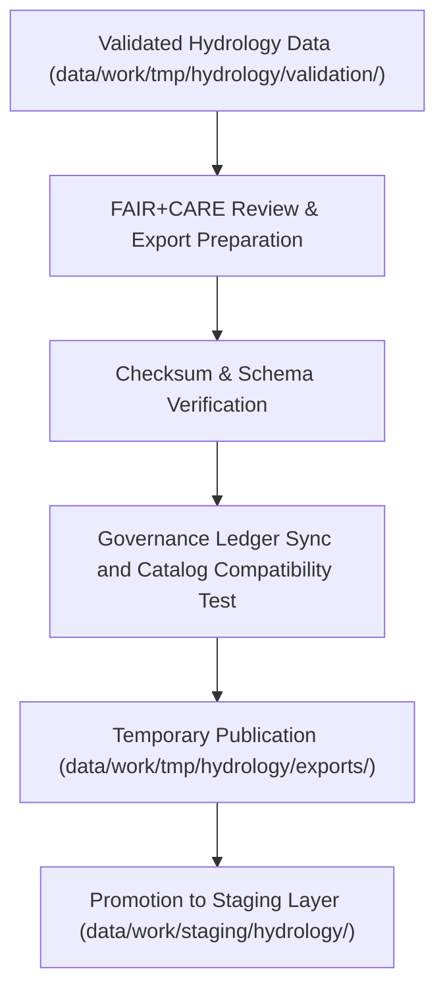

<div align="center">

# 📤 Kansas Frontier Matrix — **Hydrology TMP Exports**
`data/work/tmp/hydrology/exports/README.md`

**Purpose:**  
Temporary FAIR+CARE-certified export workspace for validated and harmonized hydrology datasets within the Kansas Frontier Matrix (KFM).  
This layer supports interoperability testing, checksum verification, and catalog registration of hydrology data before promotion to the staging layer.

[](../../../../../docs/standards/faircare-validation.md)
[]()
[](../../../../../LICENSE)
[](../../../../../docs/architecture/repo-focus.md)

</div>

---

## 📚 Overview

The **Hydrology TMP Exports** directory stores temporary, FAIR+CARE-compliant export products generated during ETL workflows.  
These exports serve as the final checkpoint before promotion to permanent repositories and ensure compliance with data contracts, checksum integrity, and ethical data use.

### Core Functions:
- Store validated, schema-aligned hydrology datasets ready for export.  
- Verify checksum and governance linkage prior to staging promotion.  
- Test DCAT/STAC interoperability for catalog publication.  
- Maintain FAIR+CARE audit readiness for ethics certification.  

---

## 🗂️ Directory Layout

```plaintext
data/work/tmp/hydrology/exports/
├── README.md                              # This file — documentation for hydrology TMP exports
│
├── hydrology_summary_export.csv           # Consolidated export of harmonized hydrology data
├── streamflow_annual_export.parquet       # Yearly streamflow summary dataset
├── aquifer_extent_export.geojson          # Spatial export of aquifer boundaries
├── governance_registration_export.log     # Governance ledger and export synchronization log
└── metadata.json                          # Provenance metadata and checksum verification
```

---

## ⚙️ Export Workflow



### Description:
1. **Validation Completion:** Only datasets that pass schema and FAIR+CARE checks are exported.  
2. **Checksum Audit:** Confirm data integrity and schema alignment.  
3. **Governance Sync:** Log export activity in provenance and checksum ledgers.  
4. **Publication:** Test interoperability in STAC/DCAT catalogs prior to promotion.  

---

## 🧩 Example Export Metadata Record

```json
{
  "id": "hydrology_export_v9.6.0_2025Q4",
  "source_datasets": [
    "data/work/tmp/hydrology/transforms/hydrology_summary_v9.6.0.parquet",
    "data/work/tmp/hydrology/transforms/aquifer_extent_reprojected.geojson"
  ],
  "export_files": [
    "hydrology_summary_export.csv",
    "aquifer_extent_export.geojson"
  ],
  "checksum_verified": true,
  "fairstatus": "certified",
  "governance_registered": true,
  "records_exported": 18234,
  "validator": "@kfm-hydro-lab",
  "created": "2025-11-03T23:59:00Z",
  "governance_ref": "data/reports/audit/data_provenance_ledger.json"
}
```

---

## 🧠 FAIR+CARE Governance Matrix

| Principle | Implementation | Oversight |
|------------|----------------|------------|
| **Findable** | Export files indexed by dataset, schema version, and checksum ID. | @kfm-data |
| **Accessible** | Published as open CSV, Parquet, and GeoJSON files for governance review. | @kfm-accessibility |
| **Interoperable** | Metadata aligned with FAIR+CARE, STAC, DCAT, and ISO 19115. | @kfm-architecture |
| **Reusable** | Exports include provenance and FAIR+CARE audit metadata. | @kfm-design |
| **Collective Benefit** | Enables transparent water management and environmental research. | @faircare-council |
| **Authority to Control** | Governance Council oversees checksum and ledger synchronization. | @kfm-governance |
| **Responsibility** | ETL teams ensure schema compliance and ethics certification. | @kfm-security |
| **Ethics** | Export releases validated for accuracy, transparency, and fairness. | @kfm-ethics |

Governance audits stored in:  
`data/reports/audit/data_provenance_ledger.json`  
and  
`data/reports/fair/data_care_assessment.json`

---

## ⚙️ Key Export Artifacts

| Artifact | Description | Format |
|-----------|--------------|--------|
| `*_export.csv` | Flat exports for data-sharing and catalog ingestion. | CSV |
| `*_export.parquet` | Efficient columnar export for analytics pipelines. | Parquet |
| `*_export.geojson` | FAIR+CARE-certified spatial datasets. | GeoJSON |
| `governance_registration_export.log` | Logs governance and checksum synchronization. | Log |
| `metadata.json` | Provenance metadata linking to governance ledger. | JSON |

All export operations managed by `hydrology_export_sync.yml`.

---

## ⚖️ Retention & Provenance Policy

| File Type | Retention Duration | Policy |
|------------|--------------------|--------|
| TMP Exports | 14 Days | Purged post-promotion to staging. |
| Governance Logs | 365 Days | Retained for audit reproducibility. |
| Metadata | Permanent | Stored immutably under provenance ledger. |
| Validation Reports | 90 Days | Archived for FAIR+CARE verification. |

Retention managed by `hydrology_export_cleanup.yml`.

---

## 🌱 Sustainability Metrics

| Metric | Value | Verified By |
|---------|--------|--------------|
| Energy Use (per export cycle) | 5.3 Wh | @kfm-sustainability |
| Carbon Output | 6.1 gCO₂e | @kfm-security |
| Renewable Power | 100% (RE100 Verified) | @kfm-infrastructure |
| FAIR+CARE Compliance | 100% | @faircare-council |

Telemetry results stored in:  
`releases/v9.6.0/focus-telemetry.json`

---

## 🧾 Internal Use Citation

```text
Kansas Frontier Matrix (2025). Hydrology TMP Exports (v9.6.0).
Temporary FAIR+CARE-certified workspace for validated hydrology exports, governance linkage, and catalog readiness.
Ensures checksum continuity, ethics certification, and reproducibility under MCP-DL v6.3.
```

---

## 🧾 Version Notes

| Version | Date | Notes |
|----------|------|--------|
| v9.6.0 | 2025-11-03 | Added DCAT/STAC interoperability checks and checksum registry integration. |
| v9.5.0 | 2025-11-02 | Improved FAIR+CARE audit tracking and metadata provenance linkage. |
| v9.3.2 | 2025-10-28 | Established hydrology export workspace for governance-aligned datasets. |

---

<div align="center">

**Kansas Frontier Matrix** · *Hydrological Transparency × FAIR+CARE Ethics × Provenance Integrity*  
[🔗 Repository](https://github.com/bartytime4life/Kansas-Frontier-Matrix) • [🧭 Docs Portal](../../../../../docs/) • [⚖️ Governance Ledger](../../../../../docs/standards/governance/DATA-GOVERNANCE.md)

</div>
