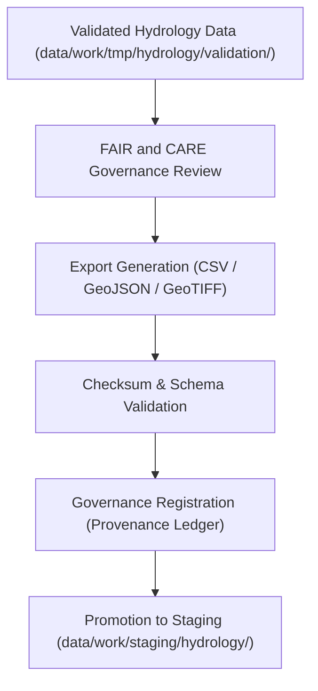

<div align="center">

# 📤 Kansas Frontier Matrix — **Hydrology TMP Exports**
`data/work/tmp/hydrology/exports/README.md`

**Purpose:**  
Governed workspace for **temporary hydrologic data exports** during ETL and validation workflows within the Kansas Frontier Matrix (KFM).  
This layer ensures interoperability testing, checksum validation, and FAIR+CARE ethics certification prior to dataset promotion to staging or public catalogs.

[](../../../../../docs/standards/faircare-validation.md)
[](../../../../../LICENSE)
[](../../../../../docs/architecture/repo-focus.md)

</div>

---

## 📚 Overview

The `data/work/tmp/hydrology/exports/` directory hosts **temporary export files and governance test outputs** generated from the hydrologic ETL pipeline.  
It serves as an intermediate environment for FAIR+CARE-validated hydrology datasets awaiting audit sign-off and catalog promotion.

### Core Responsibilities
- Manage temporary hydrology data exports for schema and checksum validation.  
- Test interoperability across DCAT, STAC, and ISO metadata standards.  
- Register provenance and FAIR+CARE certification results in governance ledgers.  
- Support Focus Mode testing for interactive dashboards and AI-driven visualizations.  

---

## 🗂️ Directory Layout

```plaintext
data/work/tmp/hydrology/exports/
├── README.md                              # This file — documentation of hydrology TMP export workspace
│
├── hydrology_summary_2025.csv             # Aggregated hydrologic statistics for FAIR+CARE review
├── hydrology_tileset_2025.tif             # Spatially gridded hydrology data for QA testing
├── watershed_flow_network.geojson         # Hydrologic flow network export for interoperability checks
└── metadata.json                          # Provenance metadata and governance registration
```

---

## ⚙️ Export Workflow



### Workflow Description
1. **Validation:** Only FAIR+CARE-verified hydrology data proceed to export generation.  
2. **Export Generation:** Data prepared in interoperable formats for catalog integration.  
3. **Checksum Verification:** File integrity and schema consistency checked automatically.  
4. **Governance Registration:** Metadata and checksum recorded in governance ledger.  
5. **Promotion:** Certified exports transferred to staging for publication or archival.

---

## 🧩 Example Export Metadata Record

```json
{
  "id": "hydrology_exports_v9.5.0_2025Q4",
  "export_files": [
    "hydrology_summary_2025.csv",
    "watershed_flow_network.geojson",
    "hydrology_tileset_2025.tif"
  ],
  "records_exported": 192347,
  "export_formats": ["CSV", "GeoJSON", "GeoTIFF"],
  "checksum_verified": true,
  "fairstatus": "certified",
  "governance_registered": true,
  "telemetry_ref": "releases/v9.5.0/focus-telemetry.json",
  "governance_ref": "reports/audit/ai_hydrology_ledger.json",
  "created": "2025-11-02T21:15:00Z",
  "validator": "@kfm-hydrology"
}
```

---

## 🧠 FAIR+CARE Governance Integration

| Principle | Implementation |
|------------|----------------|
| **Findable** | Export files indexed with versioned metadata and manifest entries. |
| **Accessible** | Stored in open FAIR-compliant formats for reproducibility. |
| **Interoperable** | Schema aligned with DCAT 3.0, STAC 1.0, and ISO 19115 standards. |
| **Reusable** | Metadata includes checksums, provenance, and FAIR+CARE ethics tags. |
| **Collective Benefit** | Promotes transparent water data stewardship and reproducibility. |
| **Authority to Control** | FAIR+CARE Council validates export certification before promotion. |
| **Responsibility** | Validators ensure proper schema and checksum verification. |
| **Ethics** | Ensures ethical, open, and equitable dissemination of hydrology data. |

Audit and validation reports stored in:  
`reports/audit/ai_hydrology_ledger.json` • `reports/fair/hydrology_exports_summary.json`

---

## ⚙️ Export Artifacts & Validation Files

| File | Description | Format |
|------|--------------|--------|
| `hydrology_summary_2025.csv` | Hydrologic statistics for FAIR+CARE validation. | CSV |
| `hydrology_tileset_2025.tif` | Raster export of gridded hydrologic data. | GeoTIFF |
| `watershed_flow_network.geojson` | Spatial network of hydrologic flow paths. | GeoJSON |
| `metadata.json` | Governance linkage and checksum metadata. | JSON |

Automation governed by `hydrology_exports_sync.yml`.

---

## 🧾 Retention Policy

| File Type | Retention Duration | Policy |
|------------|--------------------|--------|
| TMP Exports | 14 days | Deleted after staging or governance approval. |
| Validation Logs | 90 days | Archived for reproducibility and audit review. |
| Metadata | 365 days | Retained for governance linkage and FAIR+CARE certification. |
| Provenance Records | Permanent | Stored indefinitely under KFM audit registry. |

Cleanup automation handled via `hydrology_exports_cleanup.yml`.

---

## 🧾 Internal Use Citation

```text
Kansas Frontier Matrix (2025). Hydrology TMP Exports (v9.5.0).
Temporary FAIR+CARE-certified hydrology export workspace ensuring ethical governance, checksum verification, and open-science reproducibility.
Includes schema-validated CSV, GeoTIFF, and GeoJSON datasets prepared for catalog integration.
```

---

## 🧾 Version Notes

| Version | Date | Notes |
|----------|------|--------|
| v9.5.0 | 2025-11-02 | Added checksum manifest integration and governance synchronization. |
| v9.3.2 | 2025-10-28 | Expanded FAIR+CARE export governance and validation linkage. |
| v9.3.0 | 2025-10-26 | Established hydrology TMP export workspace under FAIR+CARE compliance. |

---

<div align="center">

**Kansas Frontier Matrix** · *Water Data Integrity × FAIR+CARE Ethics × Provenance Assurance*  
[🔗 Repository](https://github.com/bartytime4life/Kansas-Frontier-Matrix) • [🧭 Docs Portal](../../../../../docs/) • [⚖️ Governance Ledger](../../../../../docs/standards/governance/)

</div>