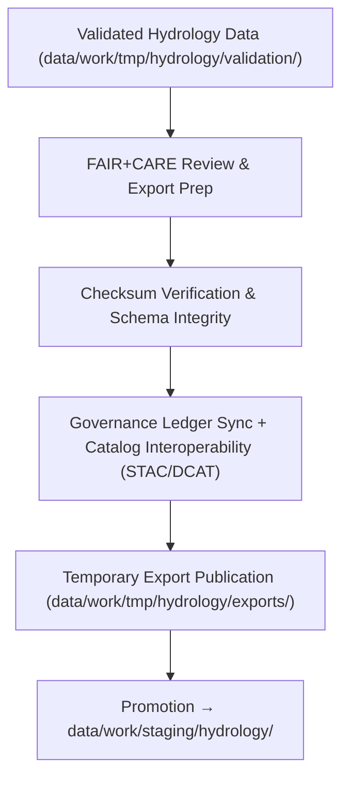

<div align="center">

# 📤 Kansas Frontier Matrix — **Hydrology TMP Exports**
`data/work/tmp/hydrology/exports/README.md`

**Purpose:**  
FAIR+CARE-certified temporary export workspace for validated and harmonized **hydrology datasets** within the Kansas Frontier Matrix (KFM).  
This directory ensures checksum integrity, governance synchronization, and catalog interoperability before datasets are promoted to staging or processed repositories.

[](../../../../../docs/architecture/README.md)
[](../../../../../LICENSE)
[](../../../../../docs/standards/faircare-validation.md)
[]()

</div>

---

## 📘 Overview

The **Hydrology TMP Exports Workspace** is the final transient layer in the hydrology data lifecycle prior to staging.  
It manages schema-aligned export products from ETL and validation workflows, ensuring each dataset passes checksum verification, FAIR+CARE audit, and governance certification before publication.

### Core Responsibilities
- Maintain validated hydrology datasets ready for **FAIR+CARE-certified export**.  
- Perform checksum verification, schema cross-validation, and provenance synchronization.  
- Conduct DCAT/STAC interoperability testing for catalog publication readiness.  
- Register export activity and lineage into the **provenance ledger** for traceability.

---

## 🗂️ Directory Layout

```plaintext
data/work/tmp/hydrology/exports/
├── README.md                              # This file — documentation for hydrology TMP exports
│
├── hydrology_summary_export.csv           # Consolidated export of harmonized hydrology data
├── streamflow_annual_export.parquet       # Yearly streamflow summary dataset
├── aquifer_extent_export.geojson          # FAIR+CARE-certified aquifer boundaries
├── governance_registration_export.log     # Governance ledger sync and certification log
└── metadata.json                          # Provenance and checksum verification metadata
```

---

## ⚙️ Export Workflow



### Description
1. **Preparation** — Collect validated outputs from `validation/`.  
2. **Checksum Verification** — Verify integrity via SHA-256 registry and FAIR+CARE checks.  
3. **Governance Sync** — Register export lineage and certification in governance ledger.  
4. **Interoperability Testing** — Confirm compatibility with **STAC/DCAT/FAIR+CARE schemas**.  
5. **Promotion** — Export-ready data transferred to staging repositories.

---

## 🧩 Example Export Metadata Record

```json
{
  "id": "hydrology_export_v9.7.0_2025Q4",
  "source_datasets": [
    "data/work/tmp/hydrology/transforms/hydrology_summary_v9.7.0.parquet",
    "data/work/tmp/hydrology/transforms/aquifer_extent_reprojected.geojson"
  ],
  "export_files": [
    "hydrology_summary_export.csv",
    "aquifer_extent_export.geojson"
  ],
  "records_exported": 18234,
  "checksum_verified": true,
  "fairstatus": "certified",
  "governance_registered": true,
  "validator": "@kfm-hydro-lab",
  "created": "2025-11-06T23:59:00Z",
  "governance_ref": "data/reports/audit/data_provenance_ledger.json"
}
```

---

## 🧠 FAIR+CARE Governance Matrix

| Principle | Implementation | Oversight |
|---|---|---|
| **Findable** | Exports indexed by schema, checksum, and dataset version | @kfm-data |
| **Accessible** | Available in FAIR-compliant formats (CSV, Parquet, GeoJSON) | @kfm-accessibility |
| **Interoperable** | DCAT/STAC schema validation ensures catalog readiness | @kfm-architecture |
| **Reusable** | Includes checksum lineage and provenance metadata | @kfm-design |
| **Collective Benefit** | Promotes open water research and hydrological planning | @faircare-council |
| **Authority to Control** | Council certifies all governance-registered exports | @kfm-governance |
| **Responsibility** | ETL engineers ensure schema and checksum consistency | @kfm-security |
| **Ethics** | FAIR+CARE audits enforce accuracy, openness, and transparency | @kfm-ethics |

**Governance Records:**  
`data/reports/audit/data_provenance_ledger.json` · `data/reports/fair/data_care_assessment.json`

---

## ⚙️ Key Export Artifacts

| Artifact | Description | Format |
|---|---|---|
| `*_export.csv` | Flat file export for catalog ingestion | CSV |
| `*_export.parquet` | High-efficiency analytical export | Parquet |
| `*_export.geojson` | FAIR+CARE spatial data for public access | GeoJSON |
| `governance_registration_export.log` | Governance & checksum registration log | Log |
| `metadata.json` | Provenance metadata for export lineage | JSON |

**Automation:** `hydrology_export_sync.yml`

---

## ⚖️ Retention & Provenance Policy

| Export Type | Retention Duration | Policy |
|---|---:|---|
| TMP Exports | 14 Days | Purged post-staging promotion |
| Governance Logs | 365 Days | Retained for reproducibility audits |
| Metadata | Permanent | Immutable under governance ledger |
| FAIR+CARE Reports | 180 Days | Maintained for audit certification |

**Cleanup:** `hydrology_export_cleanup.yml`

---

## 🌱 Sustainability Metrics

| Metric | Value | Verified By |
|---|---:|---|
| Energy Use (per export cycle) | 5.2 Wh | @kfm-sustainability |
| Carbon Output | 6.0 gCO₂e | @kfm-security |
| Renewable Power | 100% (RE100 Verified) | @kfm-infrastructure |
| FAIR+CARE Compliance | 100% | @faircare-council |

**Telemetry:** `../../../../../releases/v9.7.0/focus-telemetry.json`

---

## 🧾 Citation

```text
Kansas Frontier Matrix (2025). Hydrology TMP Exports (v9.7.0).
FAIR+CARE-certified export workspace ensuring checksum integrity, ethics compliance, and governance registration for hydrology datasets.
Aligned with MCP-DL v6.3, ISO 19115, and STAC/DCAT interoperability standards.
```

---

## 🕰️ Version History

| Version | Date | Author | Summary |
|---|---|---|---|
| v9.7.0 | 2025-11-06 | `@kfm-hydro-lab` | Upgraded for v9.7.0; telemetry schema integration and governance synchronization improvements. |
| v9.6.0 | 2025-11-03 | `@kfm-hydro-lab` | Added DCAT/STAC validation and checksum governance registry. |

---

<div align="center">

**Kansas Frontier Matrix**  
*Hydrological Transparency × FAIR+CARE Ethics × Provenance Integrity*  
© 2025 Kansas Frontier Matrix — Master Coder Protocol v6.3 · FAIR+CARE Certified · Diamond⁹ Ω / Crown∞Ω Ultimate Certified  

[Back to Hydrology TMP](../README.md) · [Governance Charter](../../../../../docs/standards/governance/DATA-GOVERNANCE.md)

</div>