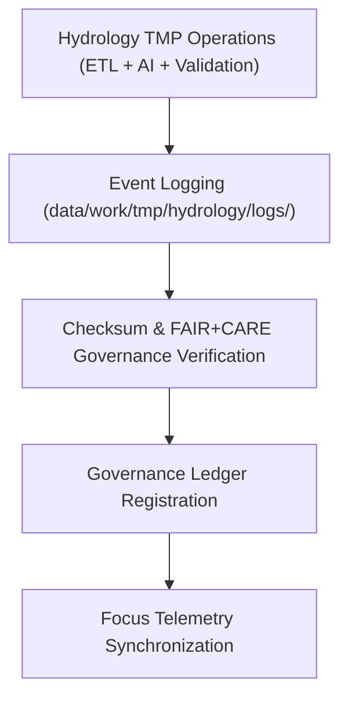

<div align="center">

# 🧾 Kansas Frontier Matrix — **Hydrology TMP Logs**
`data/work/tmp/hydrology/logs/README.md`

**Purpose:**  
Centralized FAIR+CARE-certified logging environment for hydrologic ETL, validation, AI modeling, and governance workflows within the Kansas Frontier Matrix (KFM).  
Provides full transparency, reproducibility, and lineage assurance across temporary hydrology operations.

[](../../../../docs/standards/faircare-validation.md)
[](../../../../LICENSE)
[](../../../../docs/architecture/repo-focus.md)

</div>

---

## 📚 Overview

The `data/work/tmp/hydrology/logs/` directory serves as the **operational trace hub** for all hydrologic data processing within the TMP layer.  
It captures detailed logs across ETL pipelines, FAIR+CARE validation, AI water-model reasoning, and governance synchronization events to guarantee auditability and open-science reproducibility.

### Core Responsibilities
- Log hydrologic ETL processes (Extract, Transform, Load, Validation).  
- Record checksum, schema, and FAIR+CARE audit outcomes.  
- Capture AI modeling explainability and performance metrics.  
- Synchronize governance and provenance reports under KFM standards.  

---

## 🗂️ Directory Layout

```plaintext
data/work/tmp/hydrology/logs/
├── README.md                               # This file — documentation for hydrology TMP logs
│
├── etl/                                    # ETL extract, transform, load logs and summaries
│   ├── extract/                            # Raw hydrologic data ingestion and source logs
│   ├── transform/                          # Schema normalization, harmonization, and reprojection logs
│   ├── load/                               # Data publication and staging promotion logs
│   ├── lineage/                            # Provenance dependency and flow tracking
│   └── summaries/                          # Aggregated ETL performance and audit summaries
│
├── validation/                             # FAIR+CARE validation, schema QA, and checksum logs
├── ai/                                     # Focus Mode hydrologic AI modeling and explainability logs
├── manifests/                              # Checksum manifests and telemetry linkage records
├── system/                                 # Internal workflow automation and process logs
└── metadata.json                           # Provenance metadata and governance linkage
```

---

## ⚙️ Logging Workflow



### Workflow Description
1. **Event Logging:** Captures ETL process details and runtime telemetry.  
2. **Checksum Verification:** Validates file and log integrity.  
3. **Governance Sync:** Registers lineage metadata into audit and governance ledgers.  
4. **Telemetry Update:** Links logs to Focus Mode AI model performance metrics.  

---

## 🧩 Example Log Metadata Record

```json
{
  "id": "hydrology_tmp_logs_v9.5.0_2025Q4",
  "log_categories": ["etl", "ai", "validation", "system"],
  "records_logged": 15283,
  "checksum_verified": true,
  "fairstatus": "compliant",
  "governance_synced": true,
  "telemetry_ref": "releases/v9.5.0/focus-telemetry.json",
  "governance_ref": "reports/audit/ai_hydrology_ledger.json",
  "created": "2025-11-02T21:00:00Z",
  "validator": "@kfm-etl-ops"
}
```

---

## 🧠 FAIR+CARE Governance Matrix

| Principle | Implementation |
|------------|----------------|
| **Findable** | Hydrology logs indexed by ETL phase, domain, and governance record ID. |
| **Accessible** | Logs stored in open text and JSON formats for transparency and auditability. |
| **Interoperable** | Follows ISO 19115 lineage, DCAT 3.0, and KFM MCP-DL schemas. |
| **Reusable** | Each log includes checksums, provenance metadata, and ethics certification. |
| **Collective Benefit** | Promotes ethical, transparent, and sustainable hydrologic data management. |
| **Authority to Control** | FAIR+CARE Council reviews log compliance before archival. |
| **Responsibility** | Validators document hydrologic QA and AI modeling integrity. |
| **Ethics** | Logs exclude sensitive geographic or proprietary water infrastructure data. |

All governance results stored in:  
`reports/audit/ai_hydrology_ledger.json` • `reports/fair/hydrology_logs_summary.json`

---

## ⚙️ Validation & QA Artifacts

| File / Folder | Description | Format |
|----------------|--------------|--------|
| `etl/` | ETL process logging (extract, transform, load, lineage). | JSON / Text |
| `validation/` | FAIR+CARE schema validation and checksum audit logs. | JSON |
| `ai/` | Focus Mode AI modeling and explainability records. | JSON |
| `manifests/` | Checksum manifests linking telemetry and governance metadata. | JSON |
| `system/` | Internal runtime and automation system logs. | Text |
| `metadata.json` | Provenance metadata for all hydrologic TMP operations. | JSON |

Logging synchronized via `hydrology_logs_sync.yml`.

---

## 🧾 Retention Policy

| Log Type | Retention Duration | Policy |
|-----------|--------------------|--------|
| ETL Logs | 90 days | Archived post-validation cycle. |
| AI Logs | 180 days | Retained for explainability and audit reviews. |
| Validation Logs | 365 days | Stored for FAIR+CARE governance reviews. |
| System Logs | 30 days | Auto-purged after QA verification. |
| Metadata | Permanent | Retained for provenance and ledger traceability. |

Retention automation handled by `hydrology_logs_cleanup.yml`.

---

## 🧾 Internal Use Citation

```text
Kansas Frontier Matrix (2025). Hydrology TMP Logs (v9.5.0).
Centralized FAIR+CARE-certified log workspace for hydrologic ETL, validation, and AI analysis pipelines.
Maintains checksum integrity, provenance traceability, and governance alignment under MCP-DL v6.3.
```

---

## 🧾 Version Notes

| Version | Date | Notes |
|----------|------|--------|
| v9.5.0 | 2025-11-02 | Integrated telemetry schema v2 and lineage audit synchronization. |
| v9.3.2 | 2025-10-28 | Added checksum governance and expanded FAIR+CARE validation coverage. |
| v9.3.0 | 2025-10-26 | Established hydrology TMP log workspace under FAIR+CARE compliance. |

---

<div align="center">

**Kansas Frontier Matrix** · *Hydrologic Transparency × FAIR+CARE Ethics × Provenance Integrity*  
[🔗 Repository](https://github.com/bartytime4life/Kansas-Frontier-Matrix) • [🧭 Docs Portal](../../../../docs/) • [⚖️ Governance Ledger](../../../../docs/standards/governance/)

</div>